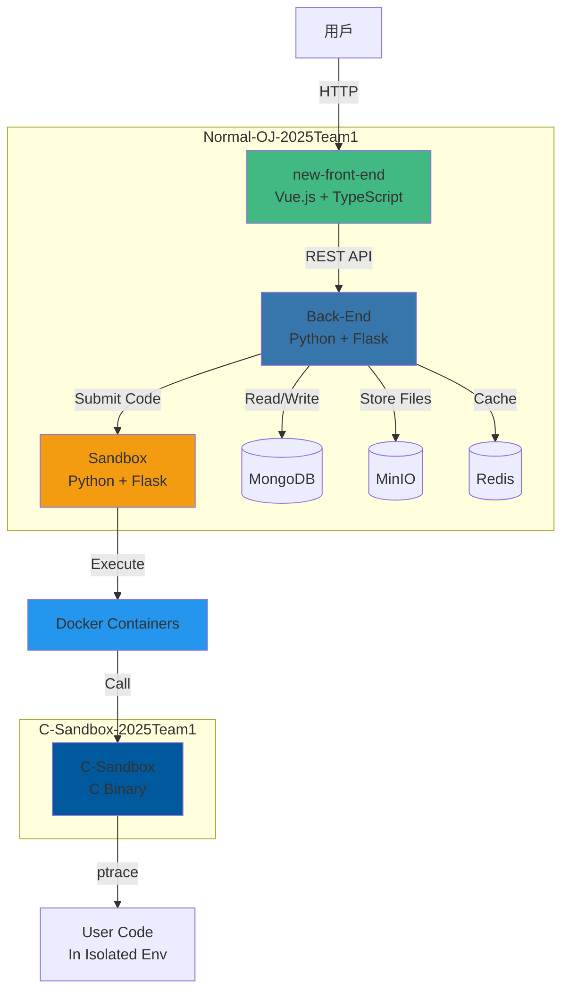

# 專案架構說明

本文檔詳細說明 Normal-OJ 線上評測系統的完整專案架構。

## 📋 目錄

- [專案概覽](#專案概覽)
- [Normal-OJ-2025Team1 主專案](#normal-oj-2025team1-主專案)
- [C-Sandbox-2025Team1 子專案](#c-sandbox-2025team1-子專案)
- [專案關係圖](#專案關係圖)
- [開發工作流程](#開發工作流程)

---

## 專案概覽

本倉庫包含兩個主要專案：

### 1. **Normal-OJ-2025Team1** (主專案)
完整的線上評測系統，採用 Git Submodules 管理三大核心子模組。

### 2. **C-Sandbox-2025Team1** (獨立專案)
底層的 C 語言沙箱執行器，被 Sandbox 子模組調用。

---

## Normal-OJ-2025Team1 主專案

### 🏗️ 整體架構

```
Normal-OJ-2025Team1/
├── Back-End/              # 後端服務 (Git Submodule)
├── new-front-end/         # 前端介面 (Git Submodule)
├── Sandbox/               # 沙箱服務 (Git Submodule)
├── MongoDB/               # 資料庫資料目錄
├── .secret/               # 機密配置（本地）
├── .secret.example/       # 機密配置範例
├── docker-compose.yml     # Docker 組合配置
├── docker-compose.override.yml  # 本地開發覆蓋配置
├── docker-compose.prod.yml      # 生產環境配置
├── deploy.sh              # 部署腳本
├── backup.py              # 備份腳本
├── submissions/           # 提交資料存儲
└── redis-data/            # Redis 資料目錄
```

### 📦 三大核心子模組

#### 1️⃣ Back-End (後端服務)

**Repository:** `https://github.com/2025-NTNU-Software-Engineering-Team-1/Back-End-2025Team1.git`

**技術棧:**
- Python (Flask/Gunicorn)
- Poetry (依賴管理)
- MongoDB (資料庫)
- MinIO (物件存儲)

**核心結構:**
```
Back-End/
├── app.py                 # 應用程式入口
├── model/                 # 資料模型
├── mongo/                 # MongoDB 操作
├── migrations/            # 資料庫遷移
├── tests/                 # 測試程式碼
├── pyproject.toml         # Poetry 配置
├── Dockerfile             # Docker 映像定義
├── gunicorn.conf.py       # Gunicorn 配置
└── .config/               # 配置文件
```

**主要職責:**
- 提供 RESTful API
- 處理用戶認證與授權
- 管理題目、提交記錄
- 與資料庫和沙箱服務通訊
- 處理檔案上傳（MinIO）

---

#### 2️⃣ new-front-end (前端介面)

**Repository:** `https://github.com/2025-NTNU-Software-Engineering-Team-1/new-front-end-2025Team1.git`

**技術棧:**
- Vue.js 3
- TypeScript
- Vite (建構工具)
- Tailwind CSS
- pnpm (套件管理)

**核心結構:**
```
new-front-end/
├── src/
│   ├── components/        # Vue 元件
│   ├── views/             # 頁面視圖
│   ├── router/            # 路由配置
│   ├── store/             # 狀態管理
│   └── assets/            # 靜態資源
├── public/                # 公開資源
├── tests/                 # 測試（Playwright）
├── index.html             # HTML 入口
├── vite.config.ts         # Vite 配置
├── tailwind.config.js     # Tailwind 配置
├── package.json           # npm 配置
└── Dockerfile             # Docker 映像定義
```

**主要職責:**
- 提供用戶介面
- 與後端 API 互動
- 題目瀏覽與提交
- 使用者管理介面

**部署方式:**
- 本地開發：運行於 `http://localhost:8080`
- 生產環境：部署於 Cloudflare Pages

---

#### 3️⃣ Sandbox (沙箱服務)

**Repository:** `https://github.com/2025-NTNU-Software-Engineering-Team-1/Sandbox-2025Team1.git`

**技術棧:**
- Python (Flask/Gunicorn)
- Docker (隔離執行環境)
- C-Sandbox (底層執行器)

**核心結構:**
```
Sandbox/
├── app.py                 # 應用程式入口
├── dispatcher/            # 任務分發器
├── problem/               # 題目處理邏輯
├── runner/                # 執行器封裝
├── tests/                 # 測試程式碼
├── .config/               # 配置文件
├── Dockerfile             # Sandbox 服務映像
├── c_cpp_dockerfile       # C/C++ 執行環境
├── python3_dockerfile     # Python3 執行環境
├── build.sh               # 建構腳本
├── Spec.md                # 規格說明
└── submissions/           # 提交代碼存儲
```

**主要職責:**
- 接收後端提交的程式碼
- 編譯與執行使用者程式
- 資源限制（時間、記憶體、輸出）
- 返回執行結果給後端

**執行流程:**
1. 接收後端的提交請求
2. 根據語言選擇 Docker 環境
3. 調用 C-Sandbox 執行程式
4. 收集結果並回報

---

### 🔧 基礎設施

#### Docker Compose 架構

```yaml
services:
  backend:       # 後端服務
  frontend:      # 前端服務（僅本地開發）
  sandbox:       # 沙箱服務
  mongodb:       # 資料庫
  redis:         # 快取
  minio:         # 物件存儲
```

#### 配置文件

| 文件 | 用途 |
|------|------|
| `docker-compose.yml` | 基礎服務定義 |
| `docker-compose.override.yml` | 本地開發覆蓋（自動合併） |
| `docker-compose.prod.yml` | 生產環境配置 |

#### CI/CD

- `.drone.yml` - Drone CI 配置
- `.github/` - GitHub Actions 工作流程

---

## C-Sandbox-2025Team1 子專案

### 🏗️ 架構

```
C-Sandbox-2025Team1/
├── sandbox.c              # 主要沙箱實現
├── sandbox                # 編譯後的執行檔
├── rule.h                 # 系統呼叫規則
├── lang.h                 # 語言定義
├── makefile               # 建構配置
├── dockerfile             # Docker 映像
├── test/                  # 測試案例
│   └── e2e/               # 端對端測試
├── main.c                 # 測試入口（C）
└── main.py                # 測試入口（Python）
```

### 🔑 核心功能

**C-Sandbox** 是一個基於 Linux 的安全執行環境，主要功能包括：

1. **資源限制**
   - 時間限制 (time_limit)
   - 記憶體限制 (memory_limit)
   - 輸出限制 (output_limit)
   - 行程限制 (process_limit)

2. **安全隔離**
   - 使用 `ptrace` 監控系統呼叫
   - 白名單機制（`rule.h` 定義允許的系統呼叫）
   - 防止危險操作（檔案存取、網路、行程創建等）

3. **多語言支援**
   - C/C++ (lang_id 定義)
   - Python
   - 其他語言可擴展

### 📝 使用方式

```bash
./sandbox lang_id compile file_stdin file_stdout file_stderr \
          time_limit memory_limit large_stack output_limit \
          process_limit file_result
```

**參數說明：**
- `lang_id`: 語言 ID
- `compile`: 是否需要編譯
- `file_stdin`: 標準輸入檔案
- `file_stdout`: 標準輸出檔案
- `file_stderr`: 標準錯誤檔案
- `time_limit`: 時間限制（ms）
- `memory_limit`: 記憶體限制（KB）
- `large_stack`: 是否使用大堆疊
- `output_limit`: 輸出限制（bytes）
- `process_limit`: 行程數限制
- `file_result`: 結果輸出檔案

---

## 專案關係圖



### 資料流向

1. **提交流程:**
   ```
   用戶 → Frontend → Backend → Sandbox → Docker → C-Sandbox → 執行結果
   ```

2. **檔案存儲:**
   ```
   程式碼 → Backend → MinIO (物件存儲)
   提交記錄 → Backend → MongoDB
   ```

3. **快取機制:**
   ```
   常用資料 → Backend → Redis
   ```

---

## 開發工作流程

### 🚀 初始化專案

```bash
# 1. Clone 主專案（含所有子模組）
git clone --recurse-submodules https://github.com/2025-NTNU-Software-Engineering-Team-1/Normal-OJ-2025Team1.git

# 2. 進入專案目錄
cd Normal-OJ-2025Team1

# 3. 確保所有子模組在 main 分支
git submodule foreach --recursive git checkout main

# 4. 建立必要目錄
mkdir -p ./Back-End/minio/data

# 5. 建構 Sandbox Docker 映像
cd Sandbox
./build.sh
cd ..

# 6. 設定 Sandbox 工作目錄
# 編輯 Sandbox/.config/submission.json
# 將 working_dir 設為 /path/to/Normal-OJ-2025Team1/Sandbox/submissions

# 7. 啟動所有服務
docker compose up -d
```

### 🛠️ 開發模式

#### 本地開發（推薦）

各子模組可獨立開發，詳見各自的 README.md：

- **Backend**: `cd Back-End && poetry install && poetry run python app.py`
- **Frontend**: `cd new-front-end && pnpm install && pnpm dev`
- **Sandbox**: `cd Sandbox && python app.py`

#### Docker 開發

```bash
# 啟動所有服務
docker compose up -d

# 重建並啟動
docker compose up --build -d

# 重啟特定服務
docker compose restart backend

# 查看日誌
docker compose logs -f backend

# 停止所有服務
docker compose stop

# 完全移除
docker compose down
```

### 🧪 測試

```bash
# Backend 測試
cd Back-End
poetry run pytest

# Frontend 測試
cd new-front-end
pnpm test

# Sandbox 測試
cd Sandbox
pytest

# C-Sandbox 測試
cd C-Sandbox-2025Team1/test/e2e
# 運行測試腳本
```

### 📦 MinIO 設定（本地開發）

如需開發題目或提交相關功能，需設定 MinIO：

1. 開啟 http://localhost:9001
2. 使用 `docker-compose.override.yml` 中的帳密登入
3. 建立 bucket（名稱見配置檔）
4. 建立 Access Key 和 Secret Key

### 🌐 訪問應用

- **本地開發**: http://localhost:8080
- **預設管理員帳號**:
  - Username: `first_admin`
  - Password: `firstpasswordforadmin`

### 📝 Git Submodule 管理

```bash
# 更新所有子模組
git submodule update --remote --recursive

# 更新特定子模組
git submodule update --remote Back-End

# 提交子模組變更
cd Back-End
git add .
git commit -m "Update backend"
git push
cd ..
git add Back-End
git commit -m "Update Back-End submodule reference"
git push
```

---

## 關鍵配置文件

### Backend

| 文件 | 用途 |
|------|------|
| `pyproject.toml` | Poetry 依賴管理 |
| `gunicorn.conf.py` | Gunicorn 伺服器配置 |
| `.config/` | 應用程式配置 |

### Frontend

| 文件 | 用途 |
|------|------|
| `package.json` | npm 依賴管理 |
| `vite.config.ts` | Vite 建構配置 |
| `tailwind.config.js` | Tailwind CSS 配置 |
| `playwright.config.ts` | E2E 測試配置 |

### Sandbox

| 文件 | 用途 |
|------|------|
| `requirements.txt` | Python 依賴 |
| `.config/submission.json` | 提交配置 |
| `Spec.md` | API 規格說明 |

### C-Sandbox

| 文件 | 用途 |
|------|------|
| `makefile` | 編譯配置 |
| `rule.h` | 系統呼叫規則 |
| `lang.h` | 語言定義 |

---

## 技術棧總覽

| 層級 | 技術 |
|------|------|
| 前端 | Vue.js 3, TypeScript, Tailwind CSS, Vite |
| 後端 | Python, Flask, Gunicorn |
| 沙箱 | Python, C, Docker, ptrace |
| 資料庫 | MongoDB |
| 快取 | Redis |
| 存儲 | MinIO (S3-compatible) |
| 容器化 | Docker, Docker Compose |
| CI/CD | GitHub Actions, Drone CI |
| 套件管理 | Poetry (Python), pnpm (Node.js), make (C) |

---

## 安全性考量

### C-Sandbox 安全機制

1. **系統呼叫過濾** (`rule.h`)
   - 白名單機制
   - 阻擋危險的系統呼叫（如 `fork`, `execve`, `socket`）

2. **資源限制**
   - CPU 時間限制
   - 記憶體使用限制
   - 輸出大小限制
   - 行程數量限制

3. **隔離環境**
   - Docker 容器隔離
   - 無網路存取
   - 受限的檔案系統存取

### 應用層安全

- 用戶認證與授權 (Backend)
- 輸入驗證與清理
- SQL Injection 防護 (使用 ORM)
- CORS 配置
- 機密資訊使用環境變數 (`.secret/`)

---

## 部署

### 本地開發
```bash
docker compose up -d
```

### 生產環境
```bash
docker compose -f docker-compose.yml -f docker-compose.prod.yml up -d
```

或使用部署腳本：
```bash
./deploy.sh
```

### 備份
```bash
python backup.py
```

---

## 疑難排解

### 常見問題

**Q: Submodule 沒有正確初始化？**
```bash
git submodule update --init --recursive
```

**Q: Docker 容器啟動失敗？**
```bash
# 查看日誌
docker compose logs [service_name]

# 重建映像
docker compose up --build -d
```

**Q: MinIO 連接失敗？**
- 確認 `.secret/` 中的配置正確
- 確認已在 MinIO 控制台建立 bucket 和 access key

**Q: Sandbox 執行失敗？**
- 確認 `Sandbox/.config/submission.json` 中的 `working_dir` 正確
- 確認已執行 `Sandbox/build.sh`
- 檢查 Docker 映像是否成功建立

---

## 相關連結

- [Normal-OJ 組織](https://github.com/Normal-OJ)
- [Backend Repository](https://github.com/2025-NTNU-Software-Engineering-Team-1/Back-End-2025Team1)
- [Frontend Repository](https://github.com/2025-NTNU-Software-Engineering-Team-1/new-front-end-2025Team1)
- [Sandbox Repository](https://github.com/2025-NTNU-Software-Engineering-Team-1/Sandbox-2025Team1)

---

## 授權

請參考各子專案的 LICENSE 文件。

---

**最後更新:** 2025-11-26

**維護者:** 2025 NTNU Software Engineering Team 1
