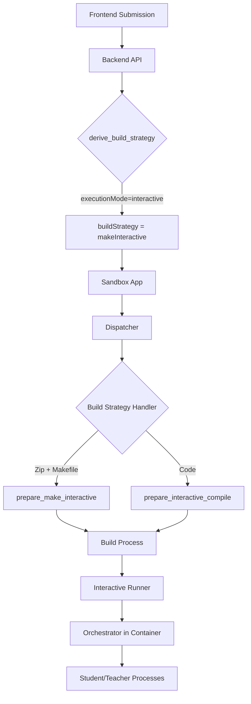
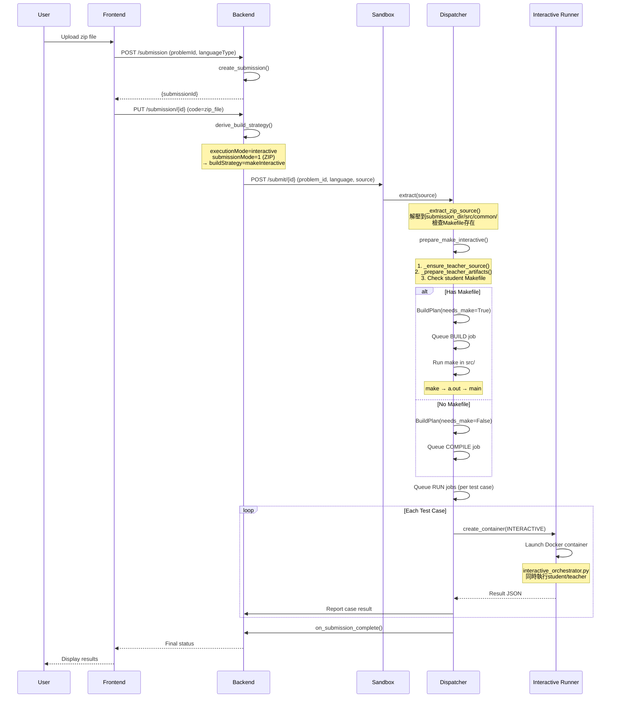
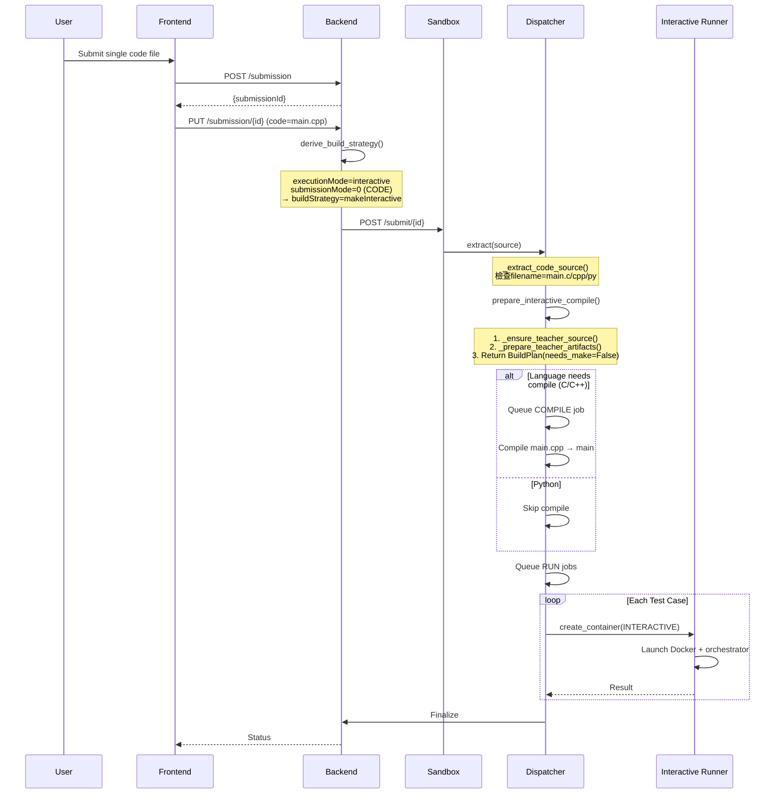
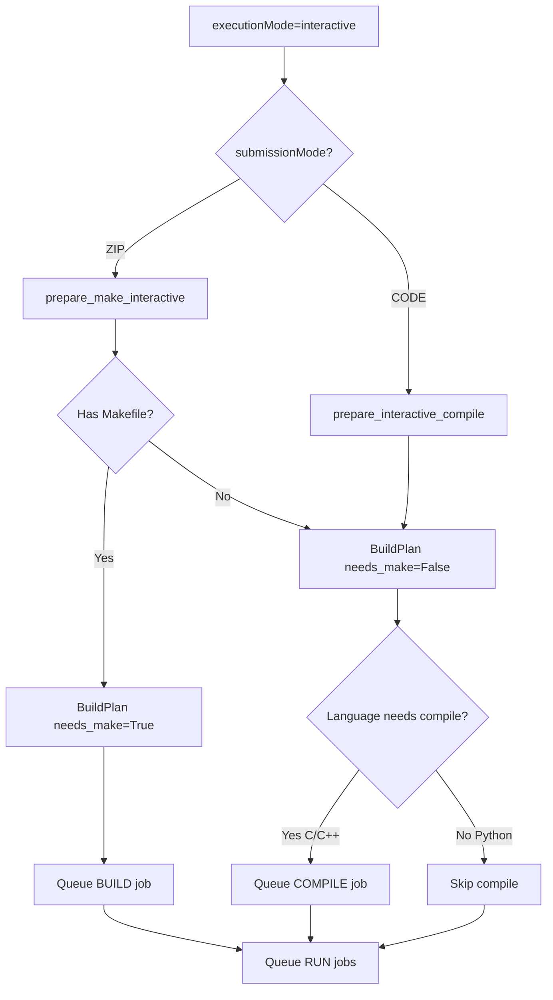

# Interactive題目完整架構分析

> 本文檔全面檢視Normal-OJ的Interactive題目架構，特別聚焦於zip和code兩種submission format的處理流程。

## 📋 目錄
- [系統概覽](#系統概覽)
- [Backend：策略決策層](#backend策略決策層)
- [Sandbox：執行層](#sandbox執行層)
- [Zip Submission Flow](#zip-submission-flow)
- [Code Submission Flow](#code-submission-flow)
- [關鍵差異對照](#關鍵差異對照)
- [常見問題與注意事項](#常見問題與注意事項)

---

## 系統概覽

Interactive題目允許學生程式與教師程式進行互動式執行，系統支援兩種submission format：
- **Code模式**：單一source file (`main.c/cpp/py`)
- **Zip模式**：包含多個file的zip檔案，需要Makefile

### 核心組件關係



---

## Backend：策略決策層

### 1. Build Strategy Derivation

**文件位置**: `Back-End/model/utils/problem_utils.py`

```python
def derive_build_strategy(problem: Problem, submission_mode: int,
                          execution_mode: str) -> str:
    """Decide build strategy based on submission/testcase mode and executionMode."""
    exec_mode = execution_mode or 'general'
    is_zip = submission_mode == 1
    
    if exec_mode == 'functionOnly':
        return 'makeFunctionOnly'
    if exec_mode == 'interactive':
        return 'makeInteractive'  # ⭐ Interactive的策略
    # general (legacy zip -> makeNormal)
    if is_zip:
        return 'makeNormal'
    return 'compile'
```

**關鍵邏輯**：
- 當`executionMode == 'interactive'`時，**無論是否為zip**，都返回`'makeInteractive'`
- 這個策略會傳遞給Sandbox的`meta.buildStrategy`

### 2. Problem Asset Setup

**文件位置**: `Back-End/mongo/problem/problem.py`

Teacher_file的上傳與驗證：
```python
# In update_assets()
resource_files = {
    'Teacher_file': ('teacher_file', 'Teacher_file'),
    'makefile.zip': ('makefile', 'makefile.zip'),
    # ...
}

# Validation
if execution_mode == 'interactive' and 'teacher_file' not in asset_paths:
    raise ValueError('interactive mode requires Teacher_file')
```

> [!IMPORTANT]
> Interactive模式**必須**要有`Teacher_file`，否則無法創建/更新題目

---

## Sandbox：執行層

### Phase 1: File Extraction

**文件位置**: `Sandbox/dispatcher/file_manager.py`

#### Zip Mode Extraction
```python
def _extract_zip_source(code_dir: Path, source, language_id: int):
    with ZipFile(source) as zf:
        zf.extractall(code_dir)
    
    if language_id == int(Language.PY):
        main_py = code_dir / 'main.py'
        if not main_py.exists():
            raise ValueError('main.py not found in submission archive')
        return
    
    # C/C++必須有Makefile
    makefile = code_dir / 'Makefile'
    if not makefile.exists():
        raise ValueError('Makefile not found in submission archive')
```

#### Code Mode Extraction
```python
def _extract_code_source(code_dir: Path, source, language_id: int):
    with ZipFile(source) as zf:
        zf.extractall(code_dir)
    
    files = [*code_dir.iterdir()]
    language_type = ['.c', '.cpp', '.py'][language_id]
    
    for _file in files:
        if _file.stem != 'main':
            raise ValueError('none main')
        if _file.suffix != language_type:
            raise ValueError('data type is not match')
```

> [!NOTE]
> Code模式下，檔案名稱**必須**是`main.c/cpp/py`

---

### Phase 2: Build Strategy Preparation

**文件位置**: `Sandbox/dispatcher/build_strategy.py`

#### 2.1 `prepare_make_interactive` (Zip模式)

```python
def prepare_make_interactive(
    problem_id: int,
    meta: Meta,
    submission_dir: Path,
) -> BuildPlan:
    # Step 1: 獲取並準備teacher source
    _ensure_teacher_source(problem_id=problem_id,
                           meta=meta,
                           submission_dir=submission_dir)
    
    # Step 2: 編譯teacher程式
    _prepare_teacher_artifacts(meta=meta, submission_dir=submission_dir)
    
    # Step 3: 檢查學生是否提供Makefile (zip mode)
    src_dir = submission_dir / "src" / "common"
    if (src_dir / "Makefile").exists():
        return _build_plan_for_student_artifacts(
            language=meta.language,
            src_dir=src_dir,
        )
    
    # Code mode or Zip without Makefile -> default compile
    return BuildPlan(needs_make=False)
```

**關鍵流程**：
1. **Teacher Source準備** (`_ensure_teacher_source`)：
   - 從Backend的MinIO獲取`teacher_file`
   - 解壓到`submission_dir/teacher/`
   - 依據language創建`main.c/cpp/py`

2. **Teacher Compilation** (`_prepare_teacher_artifacts`)：
   ```python
   def _prepare_teacher_artifacts(meta: Meta, submission_dir: Path):
       teacher_dir = submission_dir / "teacher"
       teacher_lang = _resolve_teacher_lang(meta=meta, teacher_dir=teacher_dir)
       
       if teacher_lang == Language.PY:
           # Python不需編譯
           return
       
       # C/C++需編譯
       compile_res = SubmissionRunner.compile_at_path(
           src_dir=str(teacher_dir.resolve()),
           lang=_lang_key(teacher_lang),
       )
       
       if compile_res.get("Status") != "AC":
           raise BuildStrategyError(f"teacher compile failed: {err_msg}")
       
       # 確保binary存在
       binary = teacher_dir / "Teacher_main"
       if not binary.exists():
           raise BuildStrategyError("teacher binary missing after compile")
   ```

3. **Student Build Plan決定**：
   - **有Makefile**：返回`needs_make=True`，後續會執行make
   - **無Makefile**：返回`needs_make=False`，直接compile

#### 2.2 `prepare_interactive_compile` (Code模式)

```python
def prepare_interactive_compile(
    problem_id: int,
    meta: Meta,
    submission_dir: Path,
) -> BuildPlan:
    """Interactive + code-upload: fetch teacher source and build it once."""
    _ensure_teacher_source(problem_id=problem_id,
                           meta=meta,
                           submission_dir=submission_dir)
    _prepare_teacher_artifacts(meta=meta, submission_dir=submission_dir)
    return BuildPlan(needs_make=False)
```

**特點**：
- Teacher的準備流程相同
- 但學生code不需要make，直接compile即可

---

### Phase 3: Compilation & Build

**文件位置**: `Sandbox/dispatcher/dispatcher.py`

```python
def handle(self, submission_id: str, problem_id: int):
    # ...
    build_plan = self._prepare_with_build_strategy(
        submission_id, problem_id, meta, submission_path
    )
    
    if build_plan.needs_make:
        # Zip模式 with Makefile
        self.queue.put(
            Job(
                jtype=JobType.BUILD,
                submission_id=submission_id,
                problem_id=problem_id,
                lang=language,
            )
        )
    elif self.compile_need(language):
        # Code模式或Python
        self.queue.put(
            Job(
                jtype=JobType.COMPILE,
                submission_id=submission_id,
                problem_id=problem_id,
                lang=language,
            )
        )
```

---

### Phase 4: Interactive Execution

**文件位置**: `Sandbox/runner/interactive_runner.py`, `interactive_orchestrator.py`

#### 4.1 Job Creation

```python
def create_container(
    self,
    submission_id: str,
    case_no: str,
    mem_limit: int,
    time_limit: int,
    case_in_path: str,
    case_out_path: str,
    lang: Language,
    execution_mode: ExecutionMode,
    teacher_first: bool = False,
):
    if execution_mode == ExecutionMode.INTERACTIVE:
        # Interactive專用runner
        runner = InteractiveRunner(
            submission_id=submission_id,
            time_limit=time_limit,
            mem_limit=mem_limit,
            case_in_path=case_in_path,
            teacher_first=teacher_first,
            lang_key=_LANG_KEYS[lang],
            teacher_lang_key=teacher_lang_key,
        )
        result_json = runner.run()
        # ...
```

#### 4.2 InteractiveRunner執行

```python
class InteractiveRunner:
    def run(self) -> dict:
        # 1. 啟動Docker container
        container = client.create_container(
            image=interactive_image,
            command=[
                "python3", "/app/interactive_orchestrator.py",
                "--workdir", str(container_workdir),
                "--student-lang", self.lang_key,
                "--teacher-lang", teacher_lang,
                "--time-limit", str(self.time_limit),
                "--mem-limit", str(self.mem_limit),
                # ...
            ],
            volumes={
                str(to_host(submission_path)): {
                    'bind': str(container_workdir),
                    'mode': 'rw',
                }
            },
        )
        
        # 2. 啟動並等待結果
        client.start(container)
        client.wait(container)
        logs = client.logs(container)
        
        # 3. 解析結果JSON
        payload = json.loads(logs.strip().splitlines()[-1])
        return payload
```

#### 4.3 Orchestrator（Container內部）

**文件位置**: `Sandbox/runner/interactive_orchestrator.py`

在container內部同時執行student和teacher processes：

```python
def orchestrate(args):
    # 1. Setup pipes (FIFO or /dev/fd)
    pipe_bundle = _setup_pipes(tmpdir, mode=args.pipe_mode)
    
    # 2. 準備兩個sandbox commands
    student_cmd = [
        "sandbox_interactive",
        str(LANG_IDS[student_lang]),
        "0",  # task_index
        pipe_bundle["student"]["stdin"],
        pipe_bundle["student"]["stdout"],
        # ...
    ]
    
    teacher_cmd = [
        "sandbox_interactive",
        str(LANG_IDS[teacher_lang]),
        "0",
        pipe_bundle["teacher"]["stdin"],
        pipe_bundle["teacher"]["stdout"],
        # ...
    ]
    
    # 3. 依序或同時啟動processes
    if args.teacher_first:
        procs["teacher"] = subprocess.Popen(teacher_cmd, ...)
        time.sleep(0.05)
        procs["student"] = subprocess.Popen(student_cmd, ...)
    else:
        # 同時啟動
        procs["student"] = subprocess.Popen(student_cmd, ...)
        procs["teacher"] = subprocess.Popen(teacher_cmd, ...)
    
    # 4. 等待結果並判定
    for side in ["student", "teacher"]:
        procs[side].wait()
    
    # 5. 讀取Check_Result
    check_result_path = workdir / "teacher" / "Check_Result"
    if check_result_path.exists():
        check_result = check_result_path.read_text().strip()
    
    # 6. 依據sandbox結果和Check_Result決定最終Status
    final_status = determine_final_status(
        student_result, teacher_result, check_result
    )
```

---

## Zip Submission Flow

### 完整流程圖



### 關鍵檔案結構

```
submission_dir/
├── meta.json
├── src/
│   └── common/             # 學生code & build artifacts
│       ├── Makefile
│       ├── main.cpp
│       ├── utils.cpp
│       └── utils.h
├── teacher/               # Teacher code
│   ├── main.cpp
│   ├── Teacher_main       # 編譯後的binary
│   └── main               # 軟連結到Teacher_main
└── testcase/
    ├── 00/
    │   ├── 00.in
    │   └── 00.out
    └── ...
```

---

## Code Submission Flow

### 完整流程圖



### 關鍵檔案結構

```
submission_dir/
├── meta.json
├── src/
│   └── common/             # 學生code
│       └── main.cpp
├── teacher/               # Teacher code
│   ├── main.cpp
│   ├── Teacher_main
│   └── main
└── testcase/
    └── ...
```

---

## 關鍵差異對照

| 特性 | Zip Mode | Code Mode |
|------|----------|-----------|
| **Submit Format** | `.zip` file | Single `.c/.cpp/.py` |
| **File Count** | Multiple files | Single `main.*` file |
| **Makefile** | C/C++ **必須**有；Python不需要 | **不需要** |
| **Build Strategy Function** | `prepare_make_interactive` | `prepare_interactive_compile` |
| **BuildPlan.needs_make** | `True` (if Makefile exists) | `False` |
| **Compilation** | `make` → `a.out` → `main` | `compile` → `main` |
| **File Extraction** | `_extract_zip_source` | `_extract_code_source` |
| **Student Dir Structure** | 可包含多個`.cpp/.h`檔案 | 只有`main.cpp` |

### Build Strategy決策樹



---

## 常見問題與注意事項

### ⚠️ Critical Issues

> [!WARNING]
> **Zip Mode - Makefile Required for C/C++**
> - C/C++ zip submission **必須**包含`Makefile`
> - Python zip submission **必須**包含`main.py`
> - 缺少會導致extraction失敗

> [!WARNING]
> **Code Mode - Filename Restriction**
> - 檔案名稱**必須**是`main.c`, `main.cpp`, 或`main.py`
> - 任何其他名稱都會被reject

> [!IMPORTANT]
> **Teacher_file Requirement**
> - Interactive模式的題目**必須**上傳`Teacher_file`
> - Backend會在`update_assets()`時驗證
> - 缺少無法創建或編輯Interactive題目

### 🔍 Debugging Tips

1. **Submission Stuck in Pending**
   - 檢查Dispatcher thread是否正常運行
   - 查看Sandbox logs: `/var/log/sandbox/dispatcher.log`
   - 確認teacher compile沒有失敗

2. **Teacher Compile Failed**
   - Teacher source可能有語法錯誤
   - 檢查teacher language設定是否正確
   - 查看`_prepare_teacher_artifacts()`的錯誤訊息

3. **Student Makefile Issues**
   - Makefile必須產生`a.out`
   - 確保編譯後只有一個executable
   - Python不需要Makefile

### 📝 Best Practices

1. **Zip Submission Makefile範例**：
   ```makefile
   CC = g++
   CFLAGS = -std=c++17 -O2
   
   all: a.out
   
   a.out: main.cpp utils.cpp
       $(CC) $(CFLAGS) -o a.out main.cpp utils.cpp
   
   clean:
       rm -f a.out
   ```

2. **Teacher_file設定**：
   - 依題目需求選擇teacher language
   - 如果teacher和student language不同，設定`assetPaths.teacherLang`
   - Teacher code中寫入`Check_Result`來判定AC/WA

3. **測試流程**：
   ```python
   # 1. 先測試teacher compile
   # 2. 測試單一test case
   # 3. 確認pipe communication正常
   # 4. 批量測試所有cases
   ```

---

## 總結

Interactive題目的架構設計支援了靈活的submission方式：
- **Zip模式**適合複雜專案，可包含多個檔案
- **Code模式**適合簡單題目，單一檔案即可

核心流程：
1. **Backend決定策略** → `derive_build_strategy()` → `makeInteractive`
2. **Sandbox準備teacher** → `_ensure_teacher_source()` + `_prepare_teacher_artifacts()`
3. **Build student code** → 依Makefile決定make或compile
4. **Interactive execution** → `InteractiveRunner` → `orchestrator` → student/teacher processes
5. **判定結果** → sandbox errors優先，否則依`Check_Result`

這個架構確保了teacher和student程式能夠安全、穩定地進行互動，同時支援多種語言和submission格式。
