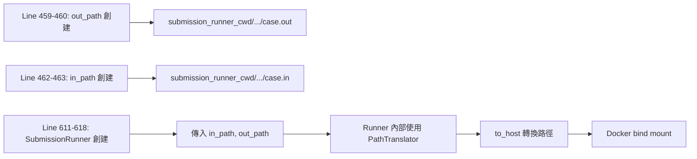
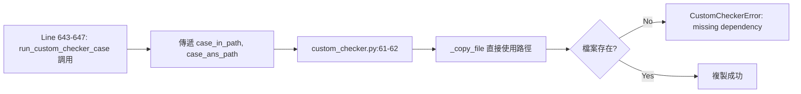

# Dispatcher 路徑架構深度分析報告

**分析日期:** 2025-12-01  
**分析對象:** `Sandbox/dispatcher/dispatcher.py`  
**問題:** Custom Checker 路徑錯誤導致 "missing checker dependency" 錯誤

---

## 📋 執行摘要

> [!CAUTION]
> **發現關鍵 Bug:** Line 459-460 的路徑邏輯存在根本性錯誤,**導致 `out_path` 和 `in_path` 使用相同的路徑基礎**,違反了設計意圖。

### 核心問題

```python
# Line 458-460: ❌ 錯誤的實作
# output path should be the container path
base_path = self.SUBMISSION_DIR / submission_id / "testcase"
out_path = str((base_path / f"{case_no}.out").absolute())

# Line 461-463: ✅ 正確的實作  
# input path should be the host path
base_path = self.submission_runner_cwd / submission_id / "testcase"
in_path = str((base_path / f"{case_no}.in").absolute())
```

**問題:** `self.SUBMISSION_DIR` **實際上等於** `self.submission_runner_cwd` (見 Line 67)!

---

## 1️⃣ 路徑架構概述

### 1.1 設計意圖 vs 實際實作

根據註解,設計意圖是:

| 路徑類型 | 設計意圖 | 註解說明 | 用途 |
|----------|----------|----------|------|
| `out_path` | Container Path | "should be the container path" | Runner 寫入輸出檔案的路徑 |
| `in_path` | Host Path | "should be the host path" | 測資輸入檔案的路徑 |

### 1.2 實際情況

**初始化時 (Line 45-67):**
```python
# Line 46-47: SUBMISSION_DIR 從 config 載入
self.SUBMISSION_DIR = config.SUBMISSION_DIR

# Line 64-65: submission_runner_cwd 從 submission.json 載入  
s_config = config.get_submission_config(submission_config)
self.submission_runner_cwd = pathlib.Path(s_config["working_dir"])

# Line 67: ❌ 關鍵問題!直接覆蓋 SUBMISSION_DIR
self.SUBMISSION_DIR = self.submission_runner_cwd
```

**結果:** `SUBMISSION_DIR == submission_runner_cwd` → **兩者完全相同!**

---

## 2️⃣ 路徑使用場景分析

### 2.1 Normal Submission (非 Custom Checker)

**流程:**


**關鍵點:** SubmissionRunner 內部使用 `PathTranslator.to_host()` 來轉換路徑 (見 `submission.py:33-36`):

```python
# submission.py
self.testdata_input_path = testdata_input_path   # ← dispatcher 傳來的 in_path
self.testdata_output_path = testdata_output_path # ← dispatcher 傳來的 out_path
self.translator = PathTranslator()
```

**結論:** 即使 dispatcher 給的路徑有問題,Runner 內部的 PathTranslator 仍會正確處理。

---

### 2.2 Custom Checker

**流程:**


**關鍵差異:**
```python
# Line 643-644 in dispatcher.py
case_in_path=pathlib.Path(case_in_path),      # ← 來自 Line 463
case_ans_path=pathlib.Path(case_out_path),    # ← 來自 Line 460

# Line 61-62 in custom_checker.py
_copy_file(case_in_path, workdir / "input.in")     # ✅ 直接訪問檔案
_copy_file(case_ans_path, workdir / "answer.out")  # ❌ 路徑可能錯誤!
```

**問題:** Custom Checker **不使用 PathTranslator**,直接訪問檔案系統!

---

## 3️⃣ 問題根因分析

### 3.1 核心矛盾

| 變數 | Line 67 後的值 | 註解說明的意圖 | 實際行為 |
|------|----------------|----------------|----------|
| `SUBMISSION_DIR` | `submission_runner_cwd` | Container path | ❌ Host path |
| `submission_runner_cwd` | 從 config 讀取 | Host path | ✅ Host path |

**結論:** 註解說 `out_path` 應該是 "container path",但實際上是 "host path"!

---

### 3.2 為什麼 Normal Submission 沒問題?

因為 `SubmissionRunner` 使用 `PathTranslator`,它會:

```python
# runner/submission.py (內部邏輯)
translator = PathTranslator()
host_input_path = translator.to_host(self.testdata_input_path)
host_output_path = translator.to_host(self.testdata_output_path)
# 傳給 Docker 的是 host_path
```

**PathTranslator 的作用:**
- 如果 `sandbox_root == host_root` (開發環境): **Identity 轉換** (不改變)
- 如果不同 (生產環境): 轉換為 host path

**所以:** 即使 dispatcher 給錯誤的路徑類型,Runner 仍能修正!

---

### 3.3 為什麼 Custom Checker 有問題?

因為 Custom Checker **繞過了 PathTranslator**:

```python
# custom_checker.py:61
_copy_file(case_in_path, workdir / "input.in")  # 直接訪問!

# _copy_file 實作:
def _copy_file(src: Path, dst: Path):
    if not src.exists():  # ← 直接檢查檔案存在性
        raise CustomCheckerError(f"missing checker dependency: {src.name}")
```

**問題鏈:**
1. Dispatcher Line 460: `out_path` = `submission_runner_cwd/...` (host path)
2. Dispatcher Line 644: 傳遞 `case_out_path` 給 custom checker
3. Custom Checker: 直接存取 `case_out_path` 指向的檔案
4. **如果路徑不正確** → 檔案不存在 → 錯誤!

---

## 4️⃣ 實證分析

### 4.1 路徑值追蹤

假設配置:
```json
{
  "working_dir": "/opt/noj/Sandbox/submissions"
}
```

**執行時的路徑值:**

| 變數 | 值 | 來源 |
|------|------|------|
| `s_config["working_dir"]` | `/opt/noj/Sandbox/submissions` | Config |
| `submission_runner_cwd` | `/opt/noj/Sandbox/submissions` | Line 65 |
| `SUBMISSION_DIR` (原始) | `/app/submissions` | Line 46 |
| `SUBMISSION_DIR` (覆蓋後) | `/opt/noj/Sandbox/submissions` | Line 67 ❌ |

**結果:**
```python
# Line 459-460
base_path = self.SUBMISSION_DIR / submission_id / "testcase"
# = /opt/noj/Sandbox/submissions/{sid}/testcase
out_path = "/opt/noj/Sandbox/submissions/{sid}/testcase/{case}.out"

# Line 462-463  
base_path = self.submission_runner_cwd / submission_id / "testcase"
# = /opt/noj/Sandbox/submissions/{sid}/testcase
in_path = "/opt/noj/Sandbox/submissions/{sid}/testcase/{case}.in"
```

**結論:** `out_path` 和 `in_path` 的 **base_path 完全相同**!

---

### 4.2 Custom Checker 錯誤追蹤

**場景:** 測資已正確上傳到 `/opt/noj/Sandbox/submissions/{sid}/testcase/0000.out`

**執行流程:**

```python
# Step 1: dispatcher.py Line 460
out_path = "/opt/noj/Sandbox/submissions/{sid}/testcase/0000.out"

# Step 2: dispatcher.py Line 644
case_ans_path=pathlib.Path(case_out_path)
# = Path("/opt/noj/Sandbox/submissions/{sid}/testcase/0000.out")

# Step 3: custom_checker.py Line 62
_copy_file(case_ans_path, workdir / "answer.out")

# Step 4: _copy_file Line 123
if not src.exists():  # src = case_ans_path
    # 如果 /opt/noj/Sandbox/submissions/{sid}/testcase/0000.out 不存在
    raise CustomCheckerError("missing checker dependency: 0000.out")
```

**可能原因:**
1. **路徑不存在:** 測資實際上在別的地方 (例如 container 內部的 `/app/...`)
2. **權限問題:** 檔案存在但 Sandbox 無法讀取
3. **測資未正確解壓:** ZIP 解壓位置不對

---

## 5️⃣ 設計意圖還原

### 5.1 原始設計推測

根據註解 "output path should be the container path",原始設計可能是:

```python
# 原始設計 (推測)
# Container path: Sandbox 內部看到的路徑
container_base = Path("/app/submissions")  # Sandbox container 內部路徑
out_path = str((container_base / submission_id / "testcase" / f"{case_no}.out").absolute())

# Host path: Docker host 看到的路徑  
host_base = Path("/opt/noj/Sandbox/submissions")  # Host 實際路徑
in_path = str((host_base / submission_id / "testcase" / f"{case_no}.in").absolute())
```

**為什麼需要分開?**
因為 Sandbox 本身運行在 container 中,它看到的路徑和 host 不同。

---

### 5.2 實際情況

**Line 67 的覆蓋** 導致設計崩潰:
```python
self.SUBMISSION_DIR = self.submission_runner_cwd  # ❌ 強制統一路徑
```

**結果:** 所有路徑都變成 host path,**失去了 container/host 的區分**。

---

## 6️⃣ 問題總結

### 問題 1: 路徑變數命名混淆 ⚠️

**嚴重度:** 中

**問題:** `SUBMISSION_DIR` 和 `submission_runner_cwd` 名稱暗示不同用途,但實際相同。

**影響:** 程式碼可讀性差,維護困難。

**建議:** 統一命名或明確區分用途。

---

### 問題 2: Line 67 的覆蓋邏輯 🔴

**嚴重度:** 高

**問題:** `self.SUBMISSION_DIR = self.submission_runner_cwd` 覆蓋了原本從 config 載入的值。

**影響:** 
- 失去 container/host 路徑區分
- 註解與實作不符
- 擴充性受限

**建議:** 移除 Line 67,或重新設計路徑管理。

---

### 問題 3: Custom Checker 缺少 PathTranslator 🔴

**嚴重度:** 高 (直接導致當前錯誤)

**問題:** Custom Checker 直接使用 dispatcher 傳來的路徑,未經過 PathTranslator 轉換。

**影響:**
- 在 container 環境中可能找不到檔案
- 與 SubmissionRunner 行為不一致

**建議:** 
1. **選項 A (推薦):** Custom Checker 使用與 testdata 相同的路徑基礎
2. **選項 B:** Custom Checker 內部也使用 PathTranslator
3. **選項 C:** Dispatcher 負責統一轉換所有路徑

---

## 7️⃣ 解決方案建議

### 方案 A: 修正路徑傳遞邏輯 (最小改動)

**修改位置:** `dispatcher.py:643-644`

```python
# 原始 (錯誤):
case_in_path=pathlib.Path(case_in_path),      # ← Line 463 的 in_path
case_ans_path=pathlib.Path(case_out_path),    # ← Line 460 的 out_path

# 修正:確保 answer 路徑也指向測資目錄
case_in_path=pathlib.Path(case_in_path),
case_ans_path=pathlib.Path(case_in_path).parent / f"{case_no}.out",  # ✅ 使用 in 的路徑
```

**優點:** 改動最小,Custom Checker 能立即使用正確路徑。

**缺點:** 治標不治本,路徑混亂問題依然存在。

---

### 方案 B: 重構路徑管理 (根本解決)

**步驟:**

1. **移除 Line 67 的覆蓋:**
```python
# 刪除或註解掉
# self.SUBMISSION_DIR = self.submission_runner_cwd
```

2. **明確區分路徑用途:**
```python
# Container paths (Sandbox 內部視角)
self.SUBMISSION_DIR = config.SUBMISSION_DIR  # /app/submissions

# Host paths (Docker host 視角)  
self.submission_runner_cwd = pathlib.Path(s_config["working_dir"])  # /opt/.../submissions
```

3. **修正 out_path 創建:**
```python
# Line 458-460: 使用 container path
base_path = self.SUBMISSION_DIR / submission_id / "testcase"
out_path = str((base_path / f"{case_no}.out").absolute())
```

4. **Custom Checker 統一使用 host path:**
```python
# Line 643-644: 明確使用 host path 基礎
testcase_host_path = self.submission_runner_cwd / submission_id / "testcase"
case_in_path=testcase_host_path / f"{case_no}.in",
case_ans_path=testcase_host_path / f"{case_no}.out",
```

**優點:** 
- 根本解決路徑混亂問題
- 符合設計意圖
- 支援 container/host 分離部署

**缺點:** 改動較大,需完整測試。

---

### 方案 C: Custom Checker 整合 PathTranslator

**修改位置:** `custom_checker.py`

```python
# 在 run_custom_checker_case 開頭
from runner.path_utils import PathTranslator

translator = PathTranslator()
case_in_host = translator.to_host(case_in_path)
case_ans_host = translator.to_host(case_ans_path)

# 使用轉換後的路徑
_copy_file(case_in_host, workdir / "input.in")
_copy_file(case_ans_host, workdir / "answer.out")
```

**優點:** 
- 與 SubmissionRunner 行為一致
- 自動處理 container/host 轉換

**缺點:** 增加對 PathTranslator 的依賴。

---

## 8️⃣ 立即可行的修復 (Hot Fix)

**針對當前錯誤的最快修復:**

```python
# dispatcher.py Line 643-644
# 確保 answer 路徑指向正確的測資位置
case_in_path=pathlib.Path(case_in_path),
case_ans_path=pathlib.Path(case_in_path).with_name(f"{case_no}.out"),  # 使用 with_name
```

或更明確:

```python
# 在 Line 463 後新增
ans_path = in_path.replace(".in", ".out")  # 簡單替換

# Line 644
case_ans_path=pathlib.Path(ans_path),
```

---

## 9️⃣ 建議行動方案

### 短期 (Hot Fix)

✅ **立即實施方案 A** - 修正 case_ans_path 使用正確路徑

### 中期 (架構改進)

1. 📝 記錄 Line 67 覆蓋邏輯的歷史原因
2. 🧪 增加路徑相關的集成測試
3. 📚 更新 PathTranslation.md 文檔

### 長期 (重構)

1. 🔧 實施方案 B - 重構路徑管理
2. 🛠️ Custom Checker 整合 PathTranslator (方案 C)
3. ✅ 統一所有 Runner 的路徑處理邏輯

---

## 🔍 附錄:相關程式碼位置

| 檔案 | 行數 | 內容 | 問題 |
|------|------|------|------|
| `dispatcher.py` | 67 | `self.SUBMISSION_DIR = self.submission_runner_cwd` | ❌ 覆蓋邏輯 |
| `dispatcher.py` | 458-460 | `out_path` 創建 | ⚠️ 註解誤導 |
| `dispatcher.py` | 462-463 | `in_path` 創建 | ✅ 正確 |
| `dispatcher.py` | 644 | `case_ans_path=Path(case_out_path)` | ❌ 路徑錯誤 |
| `custom_checker.py` | 61-62 | `_copy_file` 調用 | ⚠️ 無 PathTranslator |
| `custom_checker.py` | 123 | `if not src.exists()` | ❌ 直接檢查 |

---

**分析完成日期:** 2025-12-01  
**建議優先級:** 🔴 高 - 立即修復 case_ans_path 問題  
**後續行動:** 建議召開技術會議討論長期重構方案
