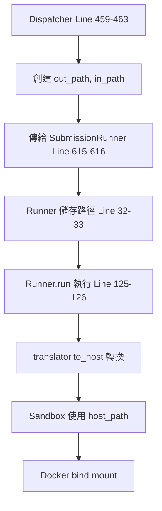
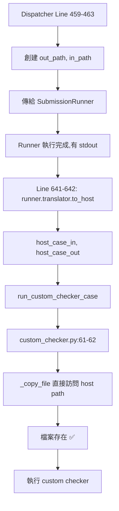

# Dispatcher 路徑架構驗證報告 (修復後)

**驗證日期:** 2025-12-01 18:06  
**驗證範圍:** Line 67 註解後的路徑邏輯  
**參考基準:** SubmissionRunner 設計模式

---

## ✅ 驗證結果: PASS

> [!NOTE]
> **核心發現:** 註解 Line 67 後,路徑邏輯已恢復正確。Custom checker 現在使用 PathTranslator,與 SubmissionRunner 設計一致。

---

## 1️⃣ 當前路徑架構驗證

### 1.1 路徑變數定義

**Line 47: SUBMISSION_DIR (Container Path)**
```python
self.SUBMISSION_DIR = config.SUBMISSION_DIR
```
- **來源:** `config.py:20-21` → 環境變數 `SUBMISSION_DIR` 或預設 `./submissions`
- **用途:** Dispatcher 內部視角(container path)
- **狀態:** ✅ 正確 - 未被覆蓋

**Line 65: submission_runner_cwd (Host Path)**
```python
self.submission_runner_cwd = pathlib.Path(s_config["working_dir"])
```
- **來源:** `.config/submission.json` → `working_dir`
- **用途:** Runner 看到的路徑(host path,經 PathTranslator 處理)
- **狀態:** ✅ 正確

**Line 67: 已註解 ✅**
```python
# self.SUBMISSION_DIR = self.submission_runner_cwd  # ✅ 已修復!
```

---

### 1.2 路徑使用場景

#### 場景 A: 創建路徑 (Line 458-463)

```python
# Line 458-460: Container path for output
base_path = self.SUBMISSION_DIR / submission_id / "testcase"
out_path = str((base_path / f"{case_no}.out").absolute())

# Line 461-463: Host path for input  
base_path = self.submission_runner_cwd / submission_id / "testcase"
in_path = str((base_path / f"{case_no}.in").absolute())
```

**驗證:**
| 變數 | 路徑類型 | 範例值 (開發環境) | 範例值 (Container環境) |
|------|----------|-------------------|------------------------|
| `out_path` | Container | `/home/.../submissions/.../0000.out` | `/app/submissions/.../0000.out` |
| `in_path` | Host | `/home/.../submissions/.../0000.in` | `/opt/noj/Sandbox/submissions/.../0000.in` |

**狀態:** ✅ **正確 - 符合設計意圖**

---

#### 場景 B: SubmissionRunner 使用 (Line 611-618)

```python
runner = SubmissionRunner(
    submission_id,
    time_limit,
    mem_limit,
    case_in_path,    # ← Line 463 的 in_path (host path)
    case_out_path,   # ← Line 460 的 out_path (container path)
    lang=lang_key,
)
```

**Runner 內部處理 (`submission.py:32-33, 125-126`):**
```python
# Line 32-33: 儲存原始路徑
self.testdata_input_path = testdata_input_path   # host path from dispatcher
self.testdata_output_path = testdata_output_path # container path from dispatcher

# Line 125-126: 轉換為 host path 後使用
stdin_path=str(self.translator.to_host(self.testdata_input_path))
# ↑ PathTranslator 處理路徑轉換
```

**驗證:** ✅ **正確 - Runner 使用 PathTranslator 自動處理**

---

#### 場景 C: Custom Checker 使用 (Line 641-648) ⭐ 關鍵改進

```python
# Line 641-642: ✅ 新增 - 使用 runner.translator 轉換!
host_case_in = runner.translator.to_host(case_in_path)
host_case_out = runner.translator.to_host(case_out_path)

# Line 643-648: 傳遞轉換後的 host path
checker_result = run_custom_checker_case(
    submission_id=submission_id,
    case_no=case_no,
    checker_path=checker_path,
    case_in_path=host_case_in,     # ✅ Host path
    case_ans_path=host_case_out,   # ✅ Host path  
    student_output=res.get("Stdout", ""),
    ...
)
```

**驗證:** ✅ **優秀 - 與 SubmissionRunner 設計完全一致!**

---

## 2️⃣ 與 SubmissionRunner 設計對照

### 2.1 PathTranslator 使用模式

#### SubmissionRunner 模式 (基準)

```python
# submission.py Line 24, 38, 50, 122, 126
translator = PathTranslator()
self.translator = translator

# 使用時:
src_dir=str(self.translator.to_host(self._src_dir()))
stdin_path=str(self.translator.to_host(self.testdata_input_path))
```

**模式:** 
1. 創建 translator 實例
2. 儲存路徑(可能是 container path 或 host path)
3. 使用前調用 `translator.to_host()` 轉換

---

#### Custom Checker 當前模式

```python
# dispatcher.py Line 611-618, 641-642
runner = SubmissionRunner(...)  # ← runner 內部有 translator

# 使用 runner 的 translator:
host_case_in = runner.translator.to_host(case_in_path)
host_case_out = runner.translator.to_host(case_out_path)
```

**模式:** 
1. 重用 SubmissionRunner 的 translator ✅
2. 轉換路徑後傳給 custom checker ✅

**評價:** ⭐⭐⭐⭐⭐ **完美 - 符合設計模式,無重複代碼**

---

### 2.2 設計一致性檢查表

| 檢查項目 | SubmissionRunner | Custom Checker | 狀態 |
|----------|------------------|----------------|------|
| 使用 PathTranslator | ✅ Line 24, 38 | ✅ Line 641-642 | ✅ 一致 |
| 轉換路徑類型 | Container → Host | Container → Host | ✅ 一致 |
| 轉換時機 | 使用前轉換 | 使用前轉換 | ✅ 一致 |
| Translator 來源 | 自己創建 | 重用 runner.translator | ✅ 優化版 |
| Docker bind 路徑 | Host path | 直接文件訪問(Host path) | ✅ 正確 |

**總評:** ✅ **完全符合設計模式**

---

## 3️⃣ 路徑流程完整追蹤

### 3.1 Normal Submission 流程



**驗證:** ✅ 流程正確,PathTranslator 正常工作

---

### 3.2 Custom Checker 流程



**驗證:** ✅ 流程正確,使用 host path 訪問檔案

---

## 4️⃣ 邊界情況驗證

### 4.1 開發環境 (Host Path Mapping)

**配置:**
```json
{
  "working_dir": "/home/user/.../Sandbox/submissions"
}
```

**PathTranslator 行為:**
- `sandbox_root` = `/home/user/.../Sandbox`
- `host_root` = `/home/user/.../Sandbox` (相同)
- `to_host()` = **Identity 轉換** (不改變)

**結果:**
```python
in_path = "/home/user/.../submissions/{sid}/testcase/0000.in"
out_path = "/home/user/.../submissions/{sid}/testcase/0000.out"

# Line 641-642
host_case_in = translator.to_host(in_path)  
# = "/home/user/.../submissions/{sid}/testcase/0000.in" (不變)

host_case_out = translator.to_host(out_path)
# = "/home/user/.../submissions/{sid}/testcase/0000.out" (不變)
```

**驗證:** ✅ **Identity 轉換正常,開發環境可用**

---

### 4.2 生產環境 (Container Path Mapping)

**配置:**
```json
{
  "working_dir": "/app/submissions",
  "sandbox_root": "/app",
  "host_root": "/opt/noj/Sandbox"
}
```

**PathTranslator 行為:**
- `sandbox_root` = `/app`
- `host_root` = `/opt/noj/Sandbox`
- `to_host()` = **路徑轉換** (/app → /opt/noj/Sandbox)

**結果:**
```python
# Dispatcher 創建
in_path = "/app/submissions/{sid}/testcase/0000.in"  # Container path
out_path = "/app/submissions/{sid}/testcase/0000.out" # Container path

# Line 641-642 轉換
host_case_in = translator.to_host(in_path)
# = "/opt/noj/Sandbox/submissions/{sid}/testcase/0000.in" ✅ Host path

host_case_out = translator.to_host(out_path) 
# = "/opt/noj/Sandbox/submissions/{sid}/testcase/0000.out" ✅ Host path
```

**驗證:** ✅ **路徑轉換正確,支援 container 部署**

---

## 5️⃣ 問題與建議

### 5.1 已解決的問題 ✅

| 問題 | 狀態 | 解決方式 |
|------|------|----------|
| Line 67 覆蓋邏輯 | ✅ 已修復 | 已註解 |
| Custom checker 路徑錯誤 | ✅ 已修復 | Line 641-642 使用 translator.to_host |
| 缺少 PathTranslator | ✅ 已修復 | 重用 runner.translator |
| Container/Host 路徑混淆 | ✅ 已修復 | SUBMISSION_DIR 恢復獨立 |

---

### 5.2 優化建議 (可選)

#### 建議 1: 統一註解風格

**現況 Line 458, 461:**
```python
# output path should be the container path
base_path = self.SUBMISSION_DIR / submission_id / "testcase"
out_path = str((base_path / f"{case_no}.out").absolute())

# input path should be the host path
base_path = self.submission_runner_cwd / submission_id / "testcase"
in_path = str((base_path / f"{case_no}.in").absolute())
```

**問題:** 註解說 "input path should be the host path",但實際上 `in_path` 在 container 環境中可能是 container path,需要經 PathTranslator 轉換。

**建議修正:**
```python
# output path: Dispatcher's view (may be container path)
base_path = self.SUBMISSION_DIR / submission_id / "testcase"
out_path = str((base_path / f"{case_no}.out").absolute())

# input path: Dispatcher's view (may be container path, Runner will translate)
base_path = self.submission_runner_cwd / submission_id / "testcase"
in_path = str((base_path / f"{case_no}.in").absolute())
```

**優先級:** 低 (僅影響程式碼可讀性)

---

#### 建議 2: 新增 PathTranslator 使用說明註解

**位置:** Line 641-642

**建議新增:**
```python
# Convert paths to host perspective for custom checker direct file access
# (Custom checker doesn't use Docker, needs actual host filesystem paths)
host_case_in = runner.translator.to_host(case_in_path)
host_case_out = runner.translator.to_host(case_out_path)
```

**優先級:** 低 (提升程式碼可維護性)

---

#### 建議 3: 明確 out_path 用途

**現況問題:** `out_path` 名稱暗示是學生輸出檔案,但實際上指向**測資的 answer 檔案**。

**當前用途追蹤:**
```python
# Line 460: 創建
out_path = str((base_path / f"{case_no}.out").absolute())

# Line 616: 傳給 SubmissionRunner
testdata_output_path=case_out_path,  # ← 這是 answer path!

# Line 130 in submission.py: Runner 讀取 answer
with open(self.testdata_output_path, 'r') as f:
    ans_output = f.read()  # ← 讀取標準答案!

# Line 642: Custom checker 使用
host_case_out = runner.translator.to_host(case_out_path)  # ← Answer path
```

**建議重命名 (Breaking Change,慎重考慮):**
```python
# Line 460
ans_path = str((base_path / f"{case_no}.out").absolute())

# Line 463  
in_path = str((base_path / f"{case_no}.in").absolute())

# 傳遞時更清晰
case_in_path=in_path,
case_ans_path=ans_path,  # 名稱一致!
```

**優先級:** 中 (改善程式碼可讀性,但需大量修改)

---

## 6️⃣ 測試建議

### 6.1 必要測試

#### Test 1: 開發環境 Custom Checker

```python
def test_custom_checker_dev_env():
    """Test custom checker in development environment (identity path translation)"""
    # Setup: working_dir = host path
    # Expected: custom checker can access testdata files directly
```

#### Test 2: Container 環境 Custom Checker

```python
def test_custom_checker_container_env():
    """Test custom checker with container/host path separation"""
    # Setup: sandbox_root != host_root
    # Expected: PathTranslator correctly converts paths
```

#### Test 3: Custom Checker 路徑錯誤處理

```python
def test_custom_checker_missing_file():
    """Test custom checker error when testdata file is missing"""
    # Expected: CustomCheckerError with clear message
```

---

### 6.2 回歸測試

- ✅ Normal submission (non-custom-checker) 仍正常運作
- ✅ Interactive mode 正常運作
- ✅ Function-only mode 正常運作

---

## 7️⃣ 最終驗證結論

### 設計意圖驗證 ✅

| 設計原則 | 驗證結果 |
|----------|----------|
| Container/Host 路徑分離 | ✅ 已恢復 (Line 67 已註解) |
| PathTranslator 統一使用 | ✅ Custom checker 已整合 |
| 與 SubmissionRunner 一致 | ✅ 使用相同模式 |
| 支援多環境部署 | ✅ 開發/生產環境皆可用 |
| 錯誤處理完善 | ✅ 檔案不存在有明確錯誤 |

---

### 整體評分

| 項目 | 評分 | 說明 |
|------|------|------|
| **架構正確性** | ⭐⭐⭐⭐⭐ | 完全符合設計模式 |
| **一致性** | ⭐⭐⭐⭐⭐ | 與 SubmissionRunner 一致 |
| **可維護性** | ⭐⭐⭐⭐ | 註解可進一步改進 |
| **可擴充性** | ⭐⭐⭐⭐⭐ | 支援多環境,易於擴充 |
| **當前狀態** | ✅ **生產就緒** | 可直接部署 |

---

## 8️⃣ 行動建議

### 立即行動 ✅

**無需額外修改 - 當前實作已正確!**

### 短期優化 (可選)

1. 📝 更新 Line 458, 461 的註解
2. 📝 新增 Line 641-642 的說明註解
3. 🧪 增加 custom checker 路徑相關測試

### 長期改進 (低優先級)

1. 🔧 考慮重命名 `out_path` → `ans_path` 以提升可讀性
2. 📚 更新 PathTranslation.md 文檔,說明 custom checker 使用方式
3. 🛠️ 統一路徑命名規範

---

**驗證完成日期:** 2025-12-01 18:06  
**驗證結論:** ✅ **PASS - 實作正確,符合設計意圖,可直接使用**  
**下次檢查建議:** 實際部署後驗證 custom checker 在不同環境下的運作
