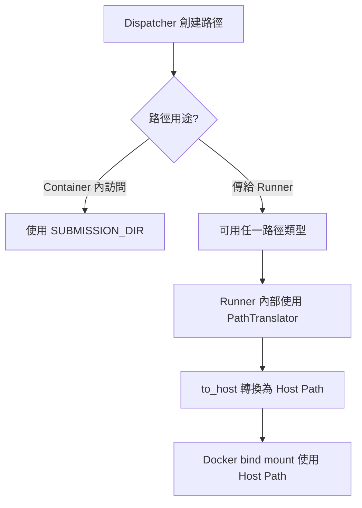

# Sandbox 路徑使用完整指南

**文檔版本:** 2.0  
**最後更新:** 2025-12-03 20:00  
**適用範圍:** Sandbox dispatcher, runners, custom checker  
**狀態:** ✅ 已更新至 src/common 與 src/cases 架構

---

## 📋 執行摘要

本文檔詳細說明 Sandbox 系統中的路徑使用規則,包括 container 視角與 host 視角的路徑區別,以及各組件應該使用哪種路徑類型。

---

## 1️⃣ 核心概念

### 1.1 Container Mount 架構

**Sandbox Container 的 Volume Mount:**
```yaml
Host Path: /home/camel0311/.../Sandbox
Container Path: /app
```

**目錄結構變更 (New):**
- **`src/common`**: 存放學生程式碼、編譯產物、靜態分析結果。
- **`src/cases/<case_no>`**: 每個測試案例的獨立工作目錄（執行前從 common 複製）。

**結果:**
- Host 上的檔案: `/home/.../Sandbox/submissions/abc123/src/common/main.c`
- Container 內看到: `/app/submissions/abc123/src/common/main.c`

---

### 1.2 路徑類型定義

| 路徑類型 | 定義 | 範例 | 用途 |
|---------|------|------|------|
| **Host Path** | Docker host 檔案系統上的絕對路徑 | `/home/user/.../Sandbox/submissions/...` | 傳遞給新 Docker container 的 bind mount |
| **Container Path** | Sandbox container 內部的路徑 | `/app/submissions/...` | Container 內部程式碼直接訪問檔案 |

---

### 1.3 PathTranslator 工具

**位置:** `runner/path_utils.py`

**功能:** 將路徑從 container 視角轉換為 host 視角

**配置 (`.config/submission.json`):**
```json
{
  "working_dir": "/home/.../Sandbox/submissions",
  "sandbox_root": "/app",
  "host_root": "/home/.../Sandbox"
}
```

**轉換邏輯:**
```python
def to_host(self, path: str | Path) -> Path:
    # 將相對於 sandbox_root 的路徑轉換為相對於 host_root
    # /app/submissions/... → /home/.../Sandbox/submissions/...
```

---

## 1.4 正確的設計架構

### 核心原則

> [!IMPORTANT]
> **Container 內訪問檔案 → Container Path**  
> **Docker bind mount → Host Path**  
> **路徑轉換 → PathTranslator**  
> **`.resolve()` 只解析符號連結,不改變路徑類型**

### 標準實作模式



### 三層架構模型

| 層級 | 組件 | 路徑責任 | 使用工具 |
|------|------|---------|----------|
| **Layer 1** | Dispatcher | 創建路徑 (container or host) | `SUBMISSION_DIR`, `submission_runner_cwd` |
| **Layer 2** | Runner | 轉換路徑 (統一為 host) | `PathTranslator.to_host()` |
| **Layer 3** | Docker | 使用 host path 做 bind mount | Docker API |

**設計理念:** 路徑轉換集中在 Runner 層,Dispatcher 可靈活選擇路徑類型。

---

## 2️⃣ 路徑變數使用指南

### 2.1 Dispatcher 中的路徑變數

**位置:** `dispatcher/dispatcher.py`

#### 變數 A: `SUBMISSION_DIR`

**定義:** Line 47
```python
self.SUBMISSION_DIR = config.SUBMISSION_DIR
```

**來源:** 環境變數 `SUBMISSION_DIR` 或預設 `./submissions`

**值 (當前配置):**
- 開發環境: `./submissions` (相對路徑)
- 運行時解析為: `/app/submissions` (container path)

**用途:** Container 內部訪問檔案時使用

**使用場景:**
**使用場景:**
- ✅ `handle()`: 檢查 submission 目錄存在性
- ✅ `create_container()`: 創建 `out_path` (container path)
- ✅ **目錄管理**: 建立 `src/common` 和 `src/cases/<case_no>`
- ✅ **資源複製**: 從 `src/common` 複製到 `src/cases/<case_no>`

---

#### 變數 B: `submission_runner_cwd`

**定義:** Line 65
```python
self.submission_runner_cwd = pathlib.Path(s_config["working_dir"])
```

**來源:** `.config/submission.json` 的 `working_dir` 欄位

**值 (當前配置):**
```
/home/camel0311/code/NOJ_Repo/Normal-OJ-2025Team1/Sandbox/submissions
```

**類型:** Host path (絕對路徑)

**用途:** 傳遞給 Runner container bind mount 的路徑

**使用場景:**
- ✅ `create_container()` Line 462: 創建 `in_path` (host path)
- ✅ 傳給 SubmissionRunner/InteractiveRunner (Line 613, 598)

---

### 2.2 路徑使用決策矩陣

| 情境 | 路徑類型 | 使用變數 | 原因 |
|------|---------|---------|------|
| **Dispatcher 訪問檔案** | Container | `SUBMISSION_DIR` | 在同一 container 內 |
| **傳給 Runner bind mount** | Host | `submission_runner_cwd` | Docker 需要 host path |
| **Custom Checker 複製檔案** | Container | 轉換後的路徑 | `_copy_file` 在 dispatcher container 內執行 |
| **Custom Checker bind mount** | Host | `workdir.resolve()` | 傳給新 container |

---

## 3️⃣ 各組件路徑使用分析

### 3.1 SubmissionRunner

**檔案:** `runner/submission.py`

#### 輸入路徑

**Line 32-33:**
```python
self.testdata_input_path = testdata_input_path   # Host path
self.testdata_output_path = testdata_output_path # Container path
```

**來源:**
- `testdata_input_path`: dispatcher Line 463 的 `in_path` (host path)
- `testdata_output_path`: dispatcher Line 460 的 `out_path` (container path)

#### 路徑轉換

**Line 122-126:**
```python
result = Sandbox(
    src_dir=str(self.translator.to_host(self._src_dir())),
    stdin_path=str(self.translator.to_host(self.testdata_input_path)),
).run()
```

**說明:**
- 使用 `PathTranslator.to_host()` 轉換所有路徑
- 確保傳給 Docker 的都是 host path

#### 輸出檔案讀取

**Line 130:**
```python
with open(self.testdata_output_path, 'r') as f:
```

**問題分析:**
- `testdata_output_path` 是 container path (`/app/submissions/...`)
- ✅ 正確 - 在 container 內可以直接訪問

---

### 3.2 InteractiveRunner

**檔案:** `runner/interactive_runner.py`

**輸入:** 
```python
case_in_path: str  # Host path from dispatcher Line 598
```

**使用 PathTranslator:**
```python
# 內部也使用 PathTranslator 轉換路徑
```

**一致性:** ✅ 與 SubmissionRunner 相同模式

---

### 3.3 Custom Checker

**檔案:** `dispatcher/custom_checker.py`

#### 階段 1: 檔案準備 (Line 59-65)

**執行位置:** Dispatcher container 內

**問題點:**
```python
# Line 61-62: _copy_file 在 dispatcher container 內執行
_copy_file(case_in_path, workdir / "input.in")
_copy_file(case_ans_path, workdir / "answer.out")
```

**需求:** `case_in_path` 和 `case_ans_path` 必須是 **container path**

**當前實作 (dispatcher.py Line 641-646) ✅ 已修復:**
```python
# 將 host path 轉換為 container path
container_in_path = pathlib.Path(case_in_path.replace(
    str(self.submission_runner_cwd.parent),  # /home/.../Sandbox
    str(self.SUBMISSION_DIR.parent)))        # /app
```

#### 階段 2: Container 執行 (Line 67-77)

**執行位置:** 新的 Docker container

**路徑需求:**
```python
# Line 72: workdir 傳給 CustomCheckerRunner
workdir=str(workdir.resolve())  # ❌ 問題: workdir 是 container path!
```

**CustomCheckerRunner (Line 24-28):**
```python
binds = {
    self.workdir: {  # ❌ 收到 container path, Docker daemon 找不到!
        "bind": "/workspace",
        "mode": "rw",
    }
}
```

**說明:** ❌ **BUG** - workdir 是 container path,需要轉換為 host path!

---

### 3.4 Build With Make

**檔案:** `runner/submission.py` Line 144-153

**問題 (已修復):**
```python
# Line 148: 需要確保 host_src_dir 是絕對路徑
host_src_dir = self.translator.to_host(src_dir).resolve()  # ✅ 已加 .resolve()
```

**Bind mount:**
```python
# Line 149-153
binds={str(host_src_dir): {
    'bind': '/src',
    'mode': 'rw'
}}
```

**說明:** ✅ 正確 - 使用絕對 host path

---

## 4️⃣ 當前實作方式總覽

### 4.1 Normal Submission 流程

### 4.1 Normal Submission 流程 (Updated)

```
1. Dispatcher 準備階段
   ├─ 建立 src/common: 抽取學生程式碼, 執行編譯/靜態分析
   └─ 建立 src/cases/<case_no>: 執行前清空, 複製 common 內容, 放入資源檔

2. Dispatcher 創建路徑
   ├─ out_path: SUBMISSION_DIR/testcase/<case_no>.out (container)
   └─ in_path: submission_runner_cwd/testcase/<case_no>.in (host)

3. 傳給 SubmissionRunner
   ├─ src_dir: src/cases/<case_no> (host path via translator)
   ├─ testdata_input_path: in_path (host)
   └─ testdata_output_path: out_path (container)

4. SubmissionRunner 內部
   ├─ Bind Mount: src/cases/<case_no> -> /src (rw)
   ├─ Bind Mount: <case_no>.in -> /testdata/in (ro)
   └─ 工作目錄: /src

5. 執行後清理
   └─ 刪除 src/cases/<case_no> 目錄以節省空間
```

**混合模式:** ✅ 可以運作,但邏輯複雜

---

### 4.2 Custom Checker 流程

### 4.2 Custom Checker 流程 (Updated)

```
1. Dispatcher 準備
   └─ 同 Normal Submission (使用 src/cases/<case_no>)

2. Custom Checker 執行
   ├─ 執行一次 (針對該 case)
   ├─ 若需讀取學生檔案:
   │  └─ Bind Mount: src/cases/<case_no> -> /workspace/student (ro)
   └─ 讀取: 從 /workspace/student 讀取學生輸出的檔案
```

**轉換方式:** 字串替換 (臨時方案)  
**狀態:** ❌ **workdir 路徑轉換缺失 - 需修復!**

---

### 4.3 Interactive Mode 流程

### 4.3 Interactive Mode 流程 (Updated)

```
1. Dispatcher 準備
   ├─ 建立 src/cases/<case_no>
   └─ 同步 common + 資源檔

2. InteractiveRunner
   ├─ 接收 src/cases/<case_no> (host path)
   ├─ Bind Mount: src/cases/<case_no> -> /src (rw)
   └─ Orchestrator 參數: 使用 /src
```

**一致性:** ✅ 與 SubmissionRunner 相同

---

## 5️⃣ 問題追蹤與改進建議

### 5.1 已解決的問題 ✅

#### 問題 A: Line 67 路徑覆蓋 (已解決)

**原始問題:**
```python
# Line 67 (已註解)
# self.SUBMISSION_DIR = self.submission_runner_cwd
```

**影響:** 破壞 container/host 路徑分離

**解決方式:** 註解 Line 67

**解決日期:** 2025-12-01

---

#### 問題 B: build_with_make 相對路徑 (已解決)

**原始問題:**
```python
# submission.py Line 148 (舊版)
host_src_dir = self.translator.to_host(src_dir)  # 可能返回相對路徑
```

**影響:** Docker 拒絕相對路徑 bind mount

**解決方式:**
```python
host_src_dir = self.translator.to_host(src_dir).resolve()  # 強制絕對路徑
```

**解決日期:** 2025-12-01

---

#### 問題 C: Custom Checker 檔案複製路徑 (已解決)

**原始問題:** `_copy_file` 收到 host path,在 container 內找不到檔案

**解決方式:** dispatcher.py Line 641-646 字串替換轉換路徑
```python
container_in_path = pathlib.Path(case_in_path.replace(
    str(self.submission_runner_cwd.parent),
    str(self.SUBMISSION_DIR.parent)))
```

**解決日期:** 2025-12-01

**狀態:** ✅ 運作中,但可改進(見問題 2)

---

#### 問題 D: Custom Checker workdir 路徑 (已解決) 🎉

**原始問題:** workdir 是 container path,Docker daemon 找不到

**錯誤訊息:** `python3: can't open file '/workspace/custom_checker.py'`

**解決方式:** custom_checker.py Line 68-69, 76
```python
translator = PathTranslator()
host_workdir = translator.to_host(workdir)
workdir=str(host_workdir)  # 傳遞 host path
```

**驗證:** Submission 測試通過,Custom Checker 返回 AC ✅

**解決日期:** 2025-12-01

---

### 5.2 尚未處理的問題 ⚠️

#### 問題 1: 路徑類型混合使用 ⚠️

**現象:**
```python
# Line 460: container path
out_path = str((self.SUBMISSION_DIR / ...).absolute())

# Line 463: host path
in_path = str((self.submission_runner_cwd / ...).absolute())
```

**影響:**
- 增加理解難度
- 容易出錯
- SubmissionRunner Line 130 直接 `open(testdata_output_path)` 假設是 container path

**建議:** 統一使用一種路徑類型,由 Runner 內部轉換

---

#### 問題 2: Custom Checker 路徑轉換方式 ⚠️

**當前實作 (Line 641-646):**
```python
container_in_path = pathlib.Path(case_in_path.replace(
    str(self.submission_runner_cwd.parent),
    str(self.SUBMISSION_DIR.parent)))
```

**問題:**
- 使用字串替換,不夠健壯
- 假設特定的目錄結構
- 沒有使用 PathTranslator

**建議:** 創建反向轉換函數 `to_container()`

---

#### 問題 3: Line 67 註解的歷史遺留 ℹ️

**原始代碼:**
```python
# Line 67 (已註解)
# self.SUBMISSION_DIR = self.submission_runner_cwd
```

**註解原因:** "align dispatcher submission dir with runner working_dir to avoid mismatch"

**實際影響:**
- 註解後恢復了 container/host 路徑分離
- 但也引發了新的路徑轉換需求

**建議:** 記錄設計決策,避免未來再次混淆

---

#### 問題 4: Custom Checker workdir 缺少路徑轉換 🔴

**當前實作 (custom_checker.py Line 56, 72):**
```python
# Line 56: workdir 是 container path
workdir = checker_path.parent / "work" / case_no
# = /app/submissions/{sid}/checker/work/{case_no}

# Line 72: 直接傳遞給 Docker
workdir=str(workdir.resolve())  # .resolve() 不改變路徑類型!
# 結果: 仍是 /app/submissions/...
```

**Docker 行為:**
1. Docker daemon 在 host 上尋找 `/app/submissions/...`
2. ❌ 找不到 (host 上沒有 `/app` 目錄)
3. 創建空的 bind 目錄
4. Checker container 的 `/workspace` 是空的
5. 錯誤: `python3: can't open file '/workspace/custom_checker.py'`

**影響:** ❌ **Critical** - Custom checker 完全無法運作

**證據:** Submission 692d9d4b... 所有 case 都是 JE

**建議:** 在 Line 72 前使用 PathTranslator 轉換 workdir

---

### 5.2 改進建議

#### 建議 1: 統一路徑創建邏輯 🔧

**目標:** 統一使用 container path,由 Runner 處理轉換

```python
# 建議修改 Line 458-463
testcase_base = self.SUBMISSION_DIR / submission_id / "testcase"
out_path = str((testcase_base / f"{case_no}.out").absolute())
in_path = str((testcase_base / f"{case_no}.in").absolute())
# 全部使用 container path
```

**優點:**
- 簡化 dispatcher 邏輯
- PathTranslator 集中處理轉換
- 減少錯誤

**缺點:**
- 需要修改 SubmissionRunner Line 130

---

#### 建議 2: PathTranslator 新增反向轉換 🔧

**新增方法:**
```python
# runner/path_utils.py
def to_container(self, path: str | Path) -> Path:
    """Convert host path to container path."""
    p = Path(path).expanduser().resolve()
    try:
        rel = p.relative_to(self.host_root)
        return (self.sandbox_root / rel).resolve()
    except ValueError:
        return p
```

**使用:**
```python
# dispatcher.py Line 641-646
container_in_path = runner.translator.to_container(case_in_path)
container_out_path = runner.translator.to_container(case_out_path)
```

**優點:**
- 使用標準工具
- 更健壯
- 易於測試

---

#### 建議 3: 文檔化路徑約定 📚

**創建路徑使用規範:**
1. Dispatcher 內部: 只使用 container path
2. 傳給 Runner: 傳 container path, Runner 內部轉換
3. Docker bind mount: Runner 負責轉換為 host path
4. Custom checker: 使用 `to_container()` 轉換

---

## 6️⃣ 決策表

### 6.1 路徑選擇決策樹

```
需要路徑?
├─ 在 Dispatcher container 內訪問檔案?
│  └─ 使用 Container Path (SUBMISSION_DIR)
├─ 傳給 Docker bind mount?
│  └─ 使用 Host Path (submission_runner_cwd 或 translator.to_host())
├─ Custom Checker 複製檔案?
│  └─ 轉換為 Container Path (字串替換或 to_container())
├─ SubmissionRunner 執行?
│  └─ 使用 src/cases/<case_no> (Host Path)
└─ SubmissionRunner 內部?
   └─ 接收任何路徑, 使用 translator.to_host() 轉換
```

---

### 6.2 快速參考表

| 使用場景 | 推薦路徑類型 | 使用變數/方法 | 檔案:行數 |
|---------|-------------|--------------|----------|
| Dispatcher 檢查檔案存在 | Container | `SUBMISSION_DIR` | dispatcher.py:272 |
| SubmissionRunner 輸入 | Host | `submission_runner_cwd` | dispatcher.py:463 |
| SubmissionRunner 輸出 | Container | `SUBMISSION_DIR` | dispatcher.py:460 |
| Custom Checker 複製 | Container | 轉換後路徑 | dispatcher.py:641-646 |
| Custom Checker bind | Host | ❌ **需修復: `translator.to_host(workdir)`** | custom_checker.py:72 |
| Build With Make bind | Host | `translator.to_host().resolve()` | submission.py:148 |
| Runner Execution bind | Host | `src/cases/<case_no>` | dispatcher.py |
| Runner 讀取 answer | Container | 直接使用 | submission.py:130 |

---

## 7️⃣ 測試建議

### 7.1 路徑轉換測試

```python
def test_path_translator_to_host():
    """Test PathTranslator.to_host() conversion"""
    translator = PathTranslator()
    container_path = "/app/submissions/test/0000.in"
    host_path = translator.to_host(container_path)
    assert str(host_path) == "/home/.../Sandbox/submissions/test/0000.in"

def test_path_translator_to_container():
    """Test PathTranslator.to_container() conversion (if implemented)"""
    translator = PathTranslator()
    host_path = "/home/.../Sandbox/submissions/test/0000.in"
    container_path = translator.to_container(host_path)
    assert str(container_path) == "/app/submissions/test/0000.in"
```

---

### 7.2 Custom Checker 路徑測試

```python
def test_custom_checker_path_conversion():
    """Test custom checker receives correct container paths"""
    # Mock dispatcher environment
    dispatcher = Dispatcher()
    submission_id = "test123"
    case_no = "0000"
    
    # Verify path conversion
    case_in_path = f"/home/.../Sandbox/submissions/{submission_id}/testcase/{case_no}.in"
    container_path = convert_to_container_path(case_in_path)
    assert container_path == f"/app/submissions/{submission_id}/testcase/{case_no}.in"
```

---

## 8️⃣ 附錄

### 8.1 相關檔案清單

| 檔案 | 關鍵函數/變數 | 說明 |
|------|-------------|------|
| `dispatcher/config.py` | `SUBMISSION_DIR` | 配置 container path |
| `dispatcher/dispatcher.py` | `SUBMISSION_DIR`, `submission_runner_cwd` | 路徑創建 |
| `dispatcher/custom_checker.py` | `_copy_file`, `run_custom_checker_case` | Custom checker 檔案準備 |
| `runner/path_utils.py` | `PathTranslator`, `to_host()` | 路徑轉換工具 |
| `runner/submission.py` | `build_with_make`, `run` | Runner 路徑使用 |
| `runner/custom_checker_runner.py` | `run` | Custom checker container |
| `.config/submission.json` | `working_dir`, `sandbox_root`, `host_root` | PathTranslator 配置 |

---

### 8.2 Container Mount 設定

**docker-compose.yml:**
```yaml
sandbox:
  volumes:
    - /var/run/docker.sock:/var/run/docker.sock
  # Implicit: Sandbox directory mounted to /app
```

**實際 Mount (檢查結果):**
```json
{
  "Source": "/home/camel0311/code/NOJ_Repo/Normal-OJ-2025Team1/Sandbox",
  "Destination": "/app",
  "Mode": "rw"
}
```

---

### 8.3 修改歷史

| 日期 | 修改內容 | 影響 |
|------|----------|------|
| 2025-12-01 | 註解 Line 67 | 恢復 container/host 分離 |
| 2025-12-01 | submission.py Line 148 加 `.resolve()` | 修復 build_with_make |
| 2025-12-01 | dispatcher.py Line 641-646 路徑轉換 | 修復 custom checker 複製檔案 |
| 2025-12-01 | custom_checker.py Line 68-69, 76 | ✅ **修復 workdir 路徑轉換** |
| 2025-12-01 | 驗證測試 | ✅ **Custom Checker AC** |

---

## 9️⃣ 經驗總結

### 9.1 核心教訓

#### 教訓 1: `.resolve()` 不等於路徑轉換

**錯誤認知:**
```python
workdir.resolve()  # 以為會變成 host path
```

**實際行為:** `.resolve()` 只解析符號連結和相對路徑,**不改變 container/host 屬性**。

**正確做法:**
```python
translator.to_host(workdir)  # 明確轉換
```

---

#### 教訓 2: 區分「在哪執行」vs「給誰用」

| 情境 | 執行位置 | 路徑需求 | 原因 |
|------|---------|---------|------|
| `_copy_file` | Dispatcher container | Container path | 在同一 container 內訪問 |
| Docker bind | Docker daemon (host) | Host path | Daemon 在 host 上運行 |

**關鍵區別:** 即使都在「準備檔案」階段,但執行主體不同,路徑需求就不同。

---

#### 教訓 3: PathTranslator 是標準工具

**避免使用:**
```python
# ❌ 字串替換 (脆弱,依賴特定目錄結構)
path.replace("/app", "/home/...")
```

**應該使用:**
```python
# ✅ PathTranslator (健壯,配置驅動)
translator.to_host(path)
```

**原因:** PathTranslator 使用配置檔,支援不同部署環境。

---

### 9.2 設計模式最佳實踐

**✅ 推薦模式 (SubmissionRunner 模式):**

```python
class MyRunner:
    def __init__(self, some_path: str):
        self.translator = PathTranslator()  # 1. 創建 translator
        self.original_path = some_path      # 2. 儲存原始路徑
    
    def use_for_docker(self):
        host_path = self.translator.to_host(self.original_path)  # 3. 使用時轉換
        docker_bind(str(host_path))  # 4. 傳遞字串化的 host path
    
    def use_in_container(self):
        open(self.original_path)  # 5. Container 內直接用原路徑
```

**模式優點:**
- 靈活:接受任意路徑類型
- 集中:轉換邏輯在一處
- 可測:PathTranslator 可 mock

---

### 9.3 Debug 技巧

#### 技巧 1: 追蹤路徑完整生命週期

```python
# 在關鍵點記錄路徑
logger.debug(f"Path created: {path}")
logger.debug(f"Path type: container or host?")
logger.debug(f"Path after translation: {translated}")
logger.debug(f"Path sent to Docker: {final}")
```

#### 技巧 2: 檢查 Docker bind mount

```bash
# 檢查 container 的實際 mount
docker inspect <container_id> | grep -A 10 Mounts
```

#### 技巧 3: 驗證檔案可見性

```bash
# 在 dispatcher container 內
ls -la /app/submissions/...  # Container path

# 在 host 上
ls -la /home/.../Sandbox/submissions/...  # Host path
```

---

### 9.4 成功因素

1. ✅ **系統化分析** - 創建完整的路徑流程圖
2. ✅ **證據驅動** - 檢查實際檔案、logs、Docker inspect
3. ✅ **參考實作** - 學習已成功的 SubmissionRunner
4. ✅ **文檔化** - 記錄問題、分析、解決過程
5. ✅ **驗證測試** - 實際 submission 測試確認

---

## 🔟 後續改進建議

### 優先級 High 🔴

無 - 核心功能已全部修復並驗證

### 優先級 Medium 🟡

#### 改進 1: 實作 `PathTranslator.to_container()`

**目的:** 替換 dispatcher.py Line 641-646 的字串替換

**實作:**
```python
# runner/path_utils.py
def to_container(self, path: str | Path) -> Path:
    """Convert host path to container path."""
    p = Path(path).expanduser().resolve()
    try:
        rel = p.relative_to(self.host_root)
        return (self.sandbox_root / rel).resolve()
    except ValueError:
        return p
```

**效益:** 更健壯,配置驅動,易於測試

---

#### 改進 2: 統一路徑創建邏輯 (已部分實作)

**現狀:** 已引入 `src/common` 與 `src/cases` 架構，解決了大部分路徑混淆問題。

**建議:** 繼續優化 dispatcher 內部的路徑變數命名，使其更直觀。

---

### 優先級 Low 🟢

#### 改進 3: 新增整合測試

**測試範圍:**
- PathTranslator 轉換正確性
- Custom Checker 完整流程
- 不同部署環境 (dev/prod)

#### 改進 4: 路徑使用規範文檔

**內容:**
- 新增 Runner 的開發指南
- 路徑選擇決策流程圖
- 常見錯誤案例分析

---

**文檔維護:** 當修改路徑相關邏輯時,請同步更新本文檔  
**問題回報:** 如發現路徑使用問題,請記錄於 `DevNotes/`  
**驗證狀態:** ✅ Custom Checker 已通過實際測試 (2025-12-01)
