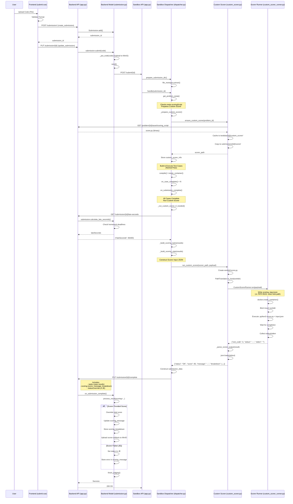

# Custom Scorer Flow



## Key Steps for Custom Scorer

### 1. Preparation Phase (Dispatcher)
- **Trigger**: `meta.scoringScript == true` detected during `handle()`
- **Action**: Call `_prepare_custom_scorer()`
  - Fetch `scoring_script` asset from Backend
  - Cache to `testdata/{problem_id}/custom_scorer/score.py`
  - Copy to `submissions/{submission_id}/scorer/score.py`
  - Store `scorer_path` in `custom_scorer_info`

### 2. Execution Phase (Normal Flow)
- Build submission (if needed)
- Execute all test cases
- Collect results in `self.result[submission_id]`

### 3. Scoring Phase (After All Cases Complete)
- **Trigger**: `on_submission_complete()` detects `custom_scorer_info[submission_id]["enabled"] == true`
- **Action**: Call `_run_custom_scorer_if_needed()`

#### 3.1 Fetch Late Penalty
- Call Backend API: `GET /submission/{id}/late-seconds?token=...`
- Backend calculates `lateSeconds` based on homework deadlines
- Returns `-1` if no homework or not late

#### 3.2 Build Scorer Input
- `_build_scoring_tasks()`: Convert case results to scorer format
  ```json
  {
    "tasks": [[{"status": "AC", "execTime": 123, "memoryUsage": 1024}, ...]],
    "stats": {"maxRunTime": 500, "avgRunTime": 250, ...},
    "lateSeconds": 0,
    "staticAnalysis": {...},
    "checker": {...}
  }
  ```

#### 3.3 Execute Scorer
- `custom_scorer.run_custom_scorer()`:
  - Create `workdir` (WSL path)
  - Copy `score.py` to workdir
  - **⚠️ BUG**: Translate workdir to host path, pass to runner
  - Runner writes `scoring_input.json` using host path ❌ (fails in WSL)
  - Launch Docker container with Python
  - Container reads JSON from stdin, executes `score.py`
  - Collect stdout (JSON result) and stderr

#### 3.4 Parse Result
- `_parse_scorer_output()`: Parse JSON from stdout
  ```json
  {
    "score": 85,
    "message": "Task 1: 2/2 → 30 pts | Time Bonus: +5 pts",
    "breakdown": {"taskScores": [30, 40, 15], "timeBonus": 5}
  }
  ```
- If exit_code != 0 or JSON invalid: Return JE

### 4. Reporting Phase
- Construct `scoring` payload for Backend
- Include `score`, `message`, `breakdown`, `artifacts` (stdout/stderr)
- Send to Backend: `PUT /submission/{id}/complete`

### 5. Backend Processing
- `BackendModel.process_result(scoring=...)`:
  - Override `self.score` with `scoring["score"]`
  - Store `scoring_message` and `scoring_breakdown`
  - Upload scorer artifacts (stdout/stderr) to MinIO
  - If `scoring_status == "JE"`: Override submission status

## Data/Field Mapping

### Sandbox ➜ Backend
**Payload**: `PUT /submission/{id}/complete`
```json
{
  "tasks": [...],
  "scoring": {
    "status": "OK" | "JE",
    "score": 85,
    "message": "Partial credit: ...",
    "breakdown": {"taskScores": [30, 40, 15]},
    "artifacts": {"stdout": "...", "stderr": "..."}
  },
  "statusOverride": "JE"  // if scorer failed
}
```

### Backend Storage
- `score`: Overridden by `scoring.score`
- `scoring_message`: Scorer's message
- `scoring_breakdown`: JSON dict of score details
- `scorer_artifacts_path`: MinIO path to uploaded stdout/stderr

### Frontend Display
- Show custom score instead of default score
- Display `scoringMessage` in submission details
- Provide breakdown visualization (if available)


## Comparison with Custom Checker

| Feature | Custom Checker | Custom Scorer |
|---------|----------------|---------------|
| **Trigger** | `meta.customChecker == true` | `meta.scoringScript == true` |
| **Execution Timing** | Per-case (during execution) | After all cases complete |
| **Input** | Case-specific files (input.in, answer.out, student.out) | All case results + stats (JSON) |
| **Output** | STATUS + MESSAGE | score + message + breakdown (JSON) |
| **File Writing** | All files written before translation ✅ | `scoring_input.json` written after translation ❌ |
| **Backend Integration** | Updates case status | Overrides total score |
