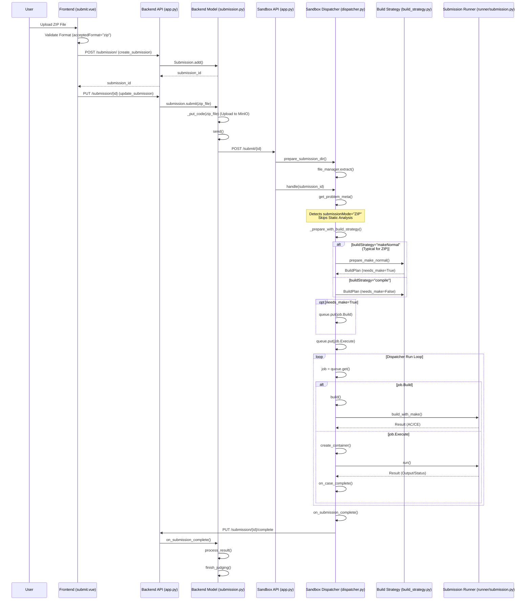

# ZIP Mode Submission Flow

## Key Differences from Function Only
1.  **Frontend**: Validates `acceptedFormat="zip"`.
2.  **Sandbox**:
    *   **Skips Static Analysis**: `is_zip_mode` is True.
    *   **Build Strategy**: Typically uses `makeNormal` (expects a `Makefile` in the ZIP) or `compile` (if the ZIP contains just source files, though less common for "ZIP mode" which implies custom build).
    *   **No Function Wrapping**: Does not wrap code into `function.h` or `student_impl.py`.
