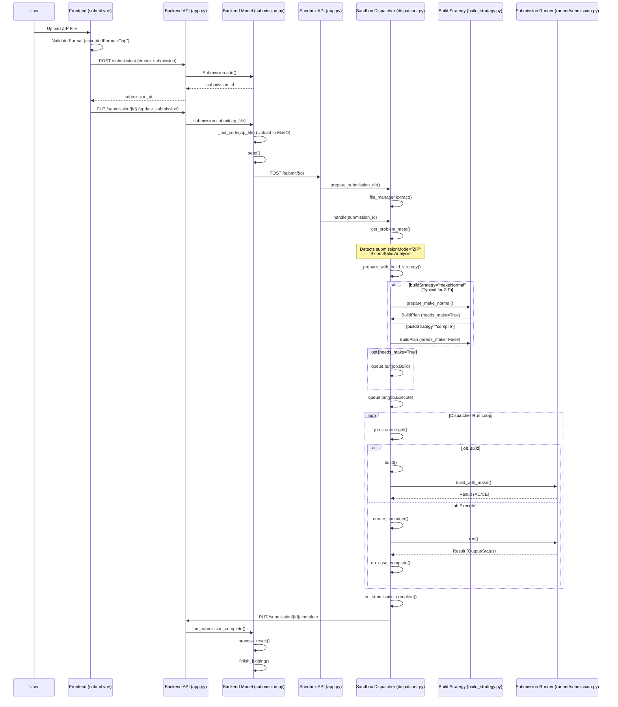

# File Control & Asset Caching Guide

## 1. Student File Control (ZIP Mode)

### Overview
ZIP Mode allows students to submit a compressed archive containing multiple source files, headers, and a Makefile. This mode is essential for complex projects that require custom build processes or multiple modules.

### Submission Flow



### Key Differences from Function Only
1.  **Frontend**: Validates `acceptedFormat="zip"`.
2.  **Sandbox**:
    *   **Skips Static Analysis**: `is_zip_mode` is True.
    *   **Build Strategy**: Typically uses `makeNormal` (expects a `Makefile` in the ZIP) or `compile`.
    *   **Directory Structure**: Build operations occur in `src/common`.
    *   **No Function Wrapping**: Does not wrap code into `function.h` or `student_impl.py`.

---

## 2. Asset Caching

### Overview

This section explains how to implement the Redis cache mechanism for various Sandbox assets (checker, scorer, teacher, etc.) to ensure asset update timeliness and consistency.

### Current Implementation

#### Testdata Caching (Reference Implementation)

Testdata caching implements a complete Redis checksum mechanism:

```python
def ensure_testdata(problem_id: int):
    """
    Ensure the testdata of problem is up to date
    """
    client = get_redis_client()
    key = f"problem-{problem_id}-checksum"
    lock_key = f"{key}-lock"
    
    with client.lock(lock_key, timeout=60):
        curr_checksum = client.get(key)
        if curr_checksum is not None:
            curr_checksum = curr_checksum.decode()
            checksum = get_checksum(problem_id)
            if secrets.compare_digest(curr_checksum, checksum):
                logger().debug(f"testdata is up to date [problem_id: {problem_id}]")
                return
        
        logger().info(f"refresh testdata [problem_id: {problem_id}]")
        testdata = fetch_testdata(problem_id)
        problem_root = get_problem_root(problem_id)
        if problem_root.exists():
            shutil.rmtree(problem_root)
        with ZipFile(io.BytesIO(testdata)) as zf:
            zf.extractall(problem_root)
        meta = fetch_problem_meta(problem_id)
        checksum = calc_checksum(testdata + meta.encode())
        client.setex(key, 600, checksum)
```

**Key Mechanisms**:
1. **Redis Key**: `problem-{id}-checksum` (TTL: 600s)
2. **Concurrency Control**: Redis lock prevents duplicate downloads
3. **Checksum Verification**: Compares with backend checksum to decide whether to update
4. **Atomicity**: Check, download, and update completed within the lock

### Asset Checksum Caching (New Implementation)
> Update Note: Uses natural expiration. Backend does not need to manually clear Redis when updating assets; Sandbox calls `/asset-checksum` to compare the latest checksum on every submission, and re-downloads immediately if different.

Sandbox now implements a robust checksum-based caching mechanism for all assets (checkers, scorers, teacher files, etc.), similar to testdata caching.

#### Architecture

```
┌─────────────────────────────────────────────────────────────┐
│ ensure_custom_asset(problem_id, asset_type)                 │
│                                                              │
│  1. Redis Lock: problem-{id}-{asset_type}-lock              │
│  2. Check Redis: problem-{id}-{asset_type}-checksum         │
│  3. Compare with Backend: GET /problem/{id}/asset-checksum  │
│  4. If changed: Download & update cache                     │
│  5. Update Redis checksum (TTL: 600s)                       │
└─────────────────────────────────────────────────────────────┘
```

#### Backend API Extension

Added API endpoint to support asset checksum query:

```python
# Back-End/model/problem.py
@problem_api.route('/<int:problem_id>/asset-checksum', methods=['GET'])
@Request.args('token: str', 'asset_type: str')
def get_asset_checksum(token: str, problem_id: int, asset_type: str):
    # ... implementation details ...
    # Returns {'checksum': str} or {'checksum': None}
```

**Design Decisions**:
1. **Real-time Checksum Calculation**: Consistent with testdata API, reads from MinIO and calculates MD5 on every query.
2. **Natural Expiration Mechanism**: Backend does not actively delete Sandbox's Redis key, relying on TTL auto-expiration and checksum comparison.
3. **Reserved Interface**: `local_service` reserved for future use, currently returns `checksum: None`.

#### Sandbox Implementation

```python
# Sandbox/dispatcher/asset_cache.py
def ensure_custom_asset(problem_id: int, asset_type: str, filename: Optional[str] = None) -> Path:
    # ... implementation details ...
    # 1. Check Redis cache
    # 2. Get latest checksum from Backend
    # 3. If cache miss or outdated, download asset and update Redis
```

**Design Decisions**:
1. **Separation of Concerns**: `ensure_custom_asset` only manages caching, not copying to the submission directory.
2. **Filename Mapping**: Standard assets use a mapping table; special cases (like teacher_file) can be manually specified.
3. **Error Handling**: `checksum=None` raises `AssetNotFoundError` immediately.
4. **Natural Expiration**: Relies on Redis TTL (600s) and checksum comparison on every submission.

#### Asset Types
| Asset Type | Filename | Usage |
|------------|----------|-------|
| `checker` | `custom_checker.py` | Custom checker script |
| `scoring_script` | `score.py` | Custom scoring script |
| `makefile` | `makefile.zip` | Function-only mode Makefile |
| `teacher_file` | `Teacher_file.*` | Interactive mode teacher code (dynamic) |
| `local_service` | *(Reserved)* | Future local service support |
| `resource_data` | `resource_data.zip` | Resource files for problem |
