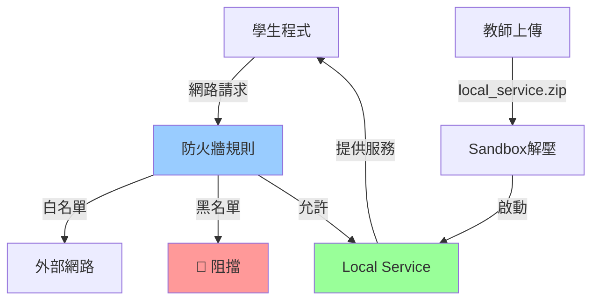
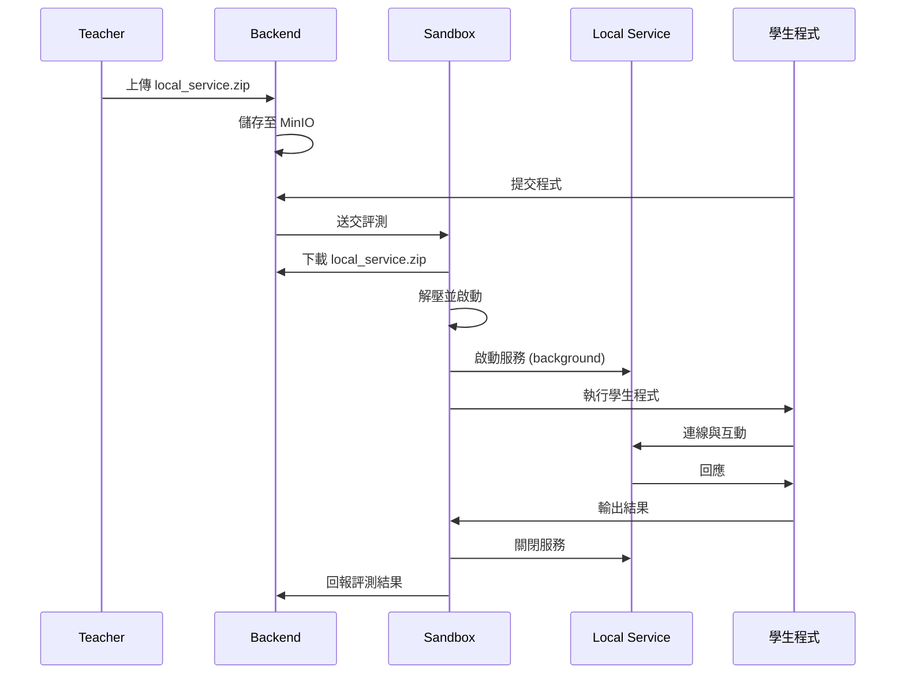

# 網路控制功能指南

本文檔說明 Normal-OJ 的網路存取控制機制，包括防火牆規則設定與 Local Service 部署。

## 📋 目錄

- [概述](#概述)
- [網路隔離架構](#網路隔離架構)
- [防火牆對外網控制](#防火牆對外網控制)
- [Local Service 連線](#local-service-連線)
- [設定方式](#設定方式)
- [使用案例](#使用案例)
- [安全性考量](#安全性考量)
- [疑難排解](#疑難排解)

---

## 概述

Normal-OJ 預設**完全禁止**所有使用者程式的網路存取，確保評測環境的安全性與隔離性。

但某些題目（如網路程式設計、API 練習）需要網路功能，因此提供了兩種可控的網路存取機制：

1. **防火牆對外網** - 允許存取特定的外部網域、IP 或 Port
2. **Local Service** - 提供題目專屬的本地服務供學生程式連線

> **重要：** 網路存取功能預設關閉，必須在題目設定中明確啟用。

---

## 網路隔離架構



### 隔離層級

1. **Docker 網路隔離** - 容器預設 `network_mode=none`
2. **iptables 防火牆** - 基於規則過濾封包
3. **Sandbox 監控** - 追蹤網路系統呼叫
4. **Local Service 生命週期** - 評測結束後自動關閉

---

## 防火牆對外網控制

### 功能說明

允許學生程式連線到指定的外部服務（如公開 API、資料庫）。

### 配置欄位

在題目的 `config.networkAccessRestriction` 中設定：

```json
{
  "enabled": true,
  "firewallExtranet": {
    "mode": "whitelist",
    "rules": [
      {
        "type": "domain",
        "value": "api.example.com",
        "action": "allow"
      },
      {
        "type": "ip",
        "value": "8.8.8.8",
        "action": "allow"
      },
      {
        "type": "port",
        "value": "80",
        "action": "allow"
      }
    ]
  }
}
```

### 規則類型

#### 1. Domain 規則

**說明：** 允許/拒絕特定網域名稱

**範例：**
```json
{
  "type": "domain",
  "value": "jsonplaceholder.typicode.com",
  "action": "allow"
}
```

**匹配方式：**
- 精確匹配：`api.example.com`
- 子網域匹配：`*.example.com`

#### 2. IP 規則

**說明：** 允許/拒絕特定 IP 位址或 IP 範圍

**範例：**
```json
{
  "type": "ip",
  "value": "140.113.0.0/16",
  "action": "allow"
}
```

**支援格式：**
- 單一 IP：`140.113.123.45`
- CIDR 範圍：`140.113.0.0/16`

#### 3. Port 規則

**說明：** 允許/拒絕特定 Port

**範例：**
```json
{
  "type": "port",
  "value": "443",
  "action": "allow"
}
```

**支援格式：**
- 單一 Port：`80`
- Port 範圍：`8000-9000`

### 模式選擇

#### Whitelist 模式（推薦）

**行為：** 預設拒絕所有，只允許規則中的目標

```json
{
  "mode": "whitelist",
  "rules": [
    {"type": "domain", "value": "api.github.com", "action": "allow"}
  ]
}
```

**適用場景：**
- 只需要存取少數已知服務
- 安全性要求較高
- 大部分網路程式題目

#### Blacklist 模式（不推薦）

**行為：** 預設允許所有，只拒絕規則中的目標

```json
{
  "mode": "blacklist",
  "rules": [
    {"type": "domain", "value": "malicious.com", "action": "deny"}
  ]
}
```

**適用場景：**
- 需要廣泛網路存取
- 僅排除特定危險目標

> ⚠️ **警告：** Blacklist 模式風險較高，學生可能存取未預期的外部資源

---

## Local Service 連線

### 功能說明

讓教師上傳自訂服務程式（如 HTTP Server、Database、Message Queue），在評測期間執行並供學生程式連線。

### 使用流程



### Local Service 檔案結構

**檔案名稱：** `local_service.zip`

**必要檔案：**
```
local_service.zip
├── start.sh          # 啟動腳本（必要）
├── server.py         # 服務程式（範例）
├── config.json       # 配置檔（可選）
└── requirements.txt  # Python 依賴（可選）
```

**start.sh 範例：**
```bash
#!/bin/bash

# 安裝依賴（如有）
if [ -f requirements.txt ]; then
    pip install -r requirements.txt
fi

# 啟動服務（背景執行）
python3 server.py &

# 記錄 PID 供 Sandbox 關閉
echo $! > service.pid
```

**server.py 範例：**
```python
#!/usr/bin/env python3
from http.server import HTTPServer, BaseHTTPRequestHandler

class SimpleHandler(BaseHTTPRequestHandler):
    def do_GET(self):
        self.send_response(200)
        self.send_header('Content-type', 'text/plain')
        self.end_headers()
        self.wfile.write(b'Hello from local service!')

if __name__ == '__main__':
    server = HTTPServer(('localhost', 8080), SimpleHandler)
    print('Server started on port 8080')
    server.serve_forever()
```

### 連線控制

在 `config.networkAccessRestriction.connectWithLocal` 中設定：

```json
{
  "enabled": true,
  "connectWithLocal": {
    "mode": "whitelist",
    "rules": [
      {
        "type": "ip",
        "value": "127.0.0.1",
        "action": "allow"
      },
      {
        "type": "port",
        "value": "8080",
        "action": "allow"
      }
    ]
  }
}
```

### 生命週期管理

**啟動時機：** Submission 評測開始前

**關閉時機：**
- 所有測試案例完成後
- 評測超時或異常時
- Sandbox 會確保服務被關閉並釋放資源

**Port 範圍：** 建議使用 `8000-9000`，避免與系統服務衝突

---

## 設定方式

### 透過題目編輯頁面

1. **開啟網路存取限制**
   - 在題目編輯頁 → Configuration Section
   - 啟用「Network Access Restriction」

2. **設定防火牆規則**
   ```json
   {
     "mode": "whitelist",
     "rules": [...]
   }
   ```

3. **上傳 Local Service（如需要）**
   - 在 Assets Section 上傳 `local_service.zip`
   - 系統會驗證 `start.sh` 是否存在

### 透過 API

```http
PUT /problem/<problem_id>/meta
Content-Type: application/json

{
  "token": "<JWT_TOKEN>",
  "config": {
    "networkAccessRestriction": {
      "enabled": true,
      "firewallExtranet": {
        "mode": "whitelist",
        "rules": [
          {"type": "domain", "value": "api.example.com", "action": "allow"}
        ]
      },
      "connectWithLocal": {
        "mode": "whitelist",
        "rules": [
          {"type": "ip", "value": "127.0.0.1", "action": "allow"},
          {"type": "port", "value": "8080", "action": "allow"}
        ]
      }
    },
    "assetPaths": {
      "local_service": "problems/123/local_service.zip"
    }
  }
}
```

---

## 使用案例

### 案例 1：HTTP API 練習

**題目需求：** 學生撰寫程式呼叫 GitHub API 取得特定使用者的 Repository 數量

**網路設定：**
```json
{
  "enabled": true,
  "firewallExtranet": {
    "mode": "whitelist",
    "rules": [
      {"type": "domain", "value": "api.github.com", "action": "allow"},
      {"type": "port", "value": "443", "action": "allow"}
    ]
  }
}
```

**學生程式範例（Python）：**
```python
import urllib.request
import json

username = input().strip()
url = f'https://api.github.com/users/{username}'

with urllib.request.urlopen(url) as response:
    data = json.loads(response.read())
    print(data['public_repos'])
```

---

### 案例 2：資料庫操作練習

**題目需求：** 學生程式連線到 Local PostgreSQL，執行 SQL 查詢

**Local Service：** `local_service.zip` 包含 PostgreSQL 啟動腳本

**start.sh:**
```bash
#!/bin/bash

# 初始化資料庫
initdb -D /tmp/pgdata

# 啟動 PostgreSQL
pg_ctl -D /tmp/pgdata -l logfile start

# 建立測試資料
psql -c "CREATE TABLE students (id INT, name TEXT);"
psql -c "INSERT INTO students VALUES (1, 'Alice'), (2, 'Bob');"

# 記錄 PID
pg_ctl -D /tmp/pgdata status | grep PID > service.pid
```

**網路設定：**
```json
{
  "enabled": true,
  "connectWithLocal": {
    "mode": "whitelist",
    "rules": [
      {"type": "ip", "value": "127.0.0.1", "action": "allow"},
      {"type": "port", "value": "5432", "action": "allow"}
    ]
  }
}
```

---

### 案例 3：Socket 通訊練習

**題目需求：** 學生實作 TCP Client 連線到 Echo Server

**Local Service：** 簡單的 Echo Server

**server.py:**
```python
import socket

server = socket.socket(socket.AF_INET, socket.SOCK_STREAM)
server.bind(('127.0.0.1', 9000))
server.listen(5)

while True:
    client, addr = server.accept()
    data = client.recv(1024)
    client.send(data)  # Echo back
    client.close()
```

**學生程式範例（C）：**
```c
#include <stdio.h>
#include <sys/socket.h>
#include <arpa/inet.h>
#include <string.h>

int main() {
    int sock = socket(AF_INET, SOCK_STREAM, 0);
    struct sockaddr_in server;
    server.sin_family = AF_INET;
    server.sin_port = htons(9000);
    server.sin_addr.s_addr = inet_addr("127.0.0.1");
    
    connect(sock, (struct sockaddr *)&server, sizeof(server));
    
    char message[100], response[100];
    scanf("%s", message);
    send(sock, message, strlen(message), 0);
    recv(sock, response, sizeof(response), 0);
    
    printf("%s\n", response);
    return 0;
}
```

---

## 安全性考量

### 防火牆規則

1. **最小權限原則**
   - 只開放必要的 Domain/IP/Port
   - 優先使用 Whitelist 模式
   - 避免使用 `*` 萬用字元

2. **避免敏感服務**
   - 不要允許存取內部網路（`10.0.0.0/8`, `192.168.0.0/16`）
   - 禁止存取 Metadata API（`169.254.169.254`）
   - 避免開放管理 Port（如 SSH `22`, RDP `3389`）

3. **DNS 欺騙防護**
   - Domain 規則會在執行時解析DNS，可能被欺騙
   - 關鍵服務建議使用 IP 規則

### Local Service 安全

1. **資源限制**
   - Service 執行時間有上限（與測試時間相關）
   - 記憶體使用受限
   - 磁碟寫入受限

2. **隔離性**
   - Service 執行在同一容器內，與學生程式共享資源
   - 避免在 Service 中執行危險指令
   - 不要在 Service 儲存敏感資料

3. **Port 衝突**
   - 多個 Submission 可能同時執行
   - Port 應設為動態分配或使用範圍（如 `8000-9000`）

4. **異常處理**
   - Service 啟動失敗會導致評測失敗（JE）
   - 確保 `start.sh` 有錯誤處理
   - 記錄 stderr 以便 debug

### 已知風險

> ⚠️ **注意：** 網路存取功能仍在開發中，以下風險需注意

1. **DDoS 攻擊** - 學生程式可能向外部服務發送大量請求
2. **資料洩漏** - 學生程式可能上傳測資或答案到外部
3. **惡意連線** - 透過允許的 Domain 作為跳板存取其他服務
4. **資源消耗** - Local Service 可能耗盡容器資源

**建議緩解措施：**
- 限制網路流量速率
- 監控異常連線行為
- 記錄所有網路請求
- 定期審查網路規則

---

## 疑難排解

### 防火牆問題

**Q: 學生程式無法連線到允許的網域**

A: 檢查事項：
1. 確認 `networkAccessRestriction.enabled = true`
2. 檢查規則是否正確（Domain、IP、Port）
3. 查看 Sandbox 日誌中的防火牆錯誤
4. 測試 DNS 解析是否正常

**Q: Whitelist 模式下所有連線都被拒絕**

A: 確保同時允許 Domain/IP **和** Port：
```json
{
  "rules": [
    {"type": "domain", "value": "api.example.com", "action": "allow"},
    {"type": "port", "value": "443", "action": "allow"}
  ]
}
```

### Local Service 問題

**Q: Local Service 啟動失敗**

A: 檢查項目：
1. `start.sh` 是否有執行權限
2. 依賴套件是否正確安裝
3. Port 是否已被佔用
4. 查看 Service 的 stderr 輸出

**Q: 學生程式無法連線到 Local Service**

A: 確認：
1. Service 已成功啟動（檢查 PID 檔案）
2. `connectWithLocal` 規則正確設定
3. 學生程式使用的 IP/Port 正確（通常是 `127.0.0.1`）

**Q: 評測結束後 Service 未關閉**

A: 確保：
1. `start.sh` 正確記錄 PID
2. Sandbox 能讀取並使用該 PID 關閉服務
3. 避免使用 `nohup` 或 `disown`，應使用背景執行 `&`

---

## 實作狀態

> ⚠️ **重要：** 根據 Sandbox/TODO.md，網路控制功能尚未完全實作

### 已完成
- ✅ Backend：`config.networkAccessRestriction` 資料結構定義
- ✅ Frontend：題目編輯頁面網路設定欄位

### 待完成
- ❌ Sandbox：解析 `networkAccessRestriction` 設定
- ❌ Sandbox：設定 iptables 防火牆規則
- ❌ Sandbox：Local Service 生命週期管理器
- ❌ Sandbox：與 `connectWithLocal` 規則整合

### 預計實作

請參考 `Sandbox/TODO.md` 的「網路控制（防火牆 + Local Service）」章節了解詳細實作規劃。

---

## 相關文檔

- [CONFIG_REFERENCE.md](CONFIG_REFERENCE.md) - 題目配置參考
- [SECURITY_GUIDE.md](SECURITY_GUIDE.md) - 安全性指南
- [Sandbox/Spec.md](../Sandbox/Spec.md) - Sandbox 規格說明

---

**最後更新：** 2025-11-29  
**維護者：** 2025 NTNU Software Engineering Team 1
