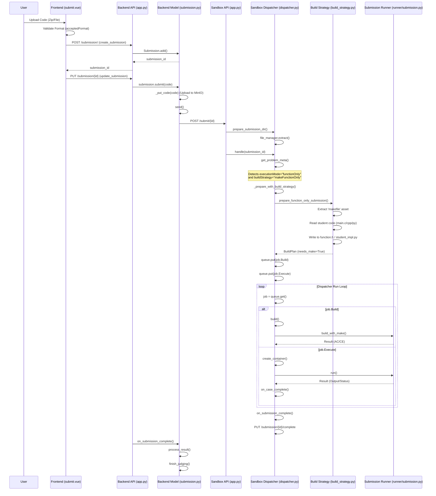

# Function Only Submission Flow

## Detailed Steps

1.  **Frontend (`submit.vue`)**:
    *   User uploads a file or zip.
    *   `submit()` function calls `api.Submission.create` to get an ID.
    *   `submit()` function calls `api.Submission.modify` to upload the code.

2.  **Backend (`Back-End/model/submission.py` & `mongo/submission.py`)**:
    *   `create_submission`: Validates request and creates a `Submission` document.
    *   `update_submission`: Receives the file, calls `submission.submit(code)`.
    *   `Submission.submit`: Uploads code to MinIO (`_put_code`), then calls `send()`.
    *   `Submission.send`: Sends a POST request to the Sandbox's `/submit/<id>` endpoint with the code and metadata.

3.  **Sandbox (`Sandbox/app.py` & `dispatcher/dispatcher.py`)**:
    *   `app.py`: Calls `DISPATCHER.prepare_submission_dir` to extract files.
    *   `app.py`: Calls `DISPATCHER.handle` to queue the job.
    *   `Dispatcher.handle`:
        *   Reads `meta.json` (created by `testdata.py` fetching from Backend).
        *   Identifies `buildStrategy` as `makeFunctionOnly`.
        *   Calls `_prepare_with_build_strategy` -> `prepare_function_only_submission`.
    *   `prepare_function_only_submission` (`dispatcher/build_strategy.py`):
        *   Fetches and extracts the `makefile` asset.
        *   Reads the student's `main.c`/`cpp`/`py`.
        *   Writes the content to `function.h` (C/C++) or `student_impl.py` (Python) in `src/common`.
        *   Returns a `BuildPlan` with `needs_make=True`.
    *   `Dispatcher.run`:
        *   Executes the build using `make`.
        *   Executes the test cases using `Runner`.
        *   Collects results and sends them back to the Backend via `PUT /submission/<id>/complete`.
