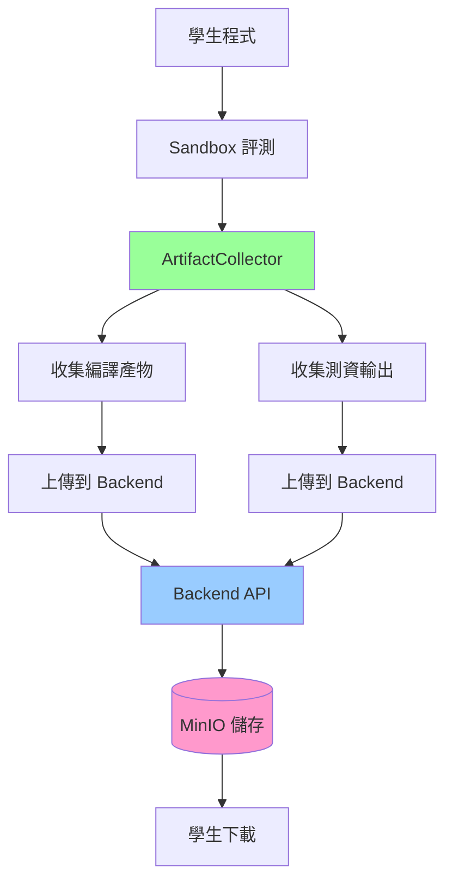
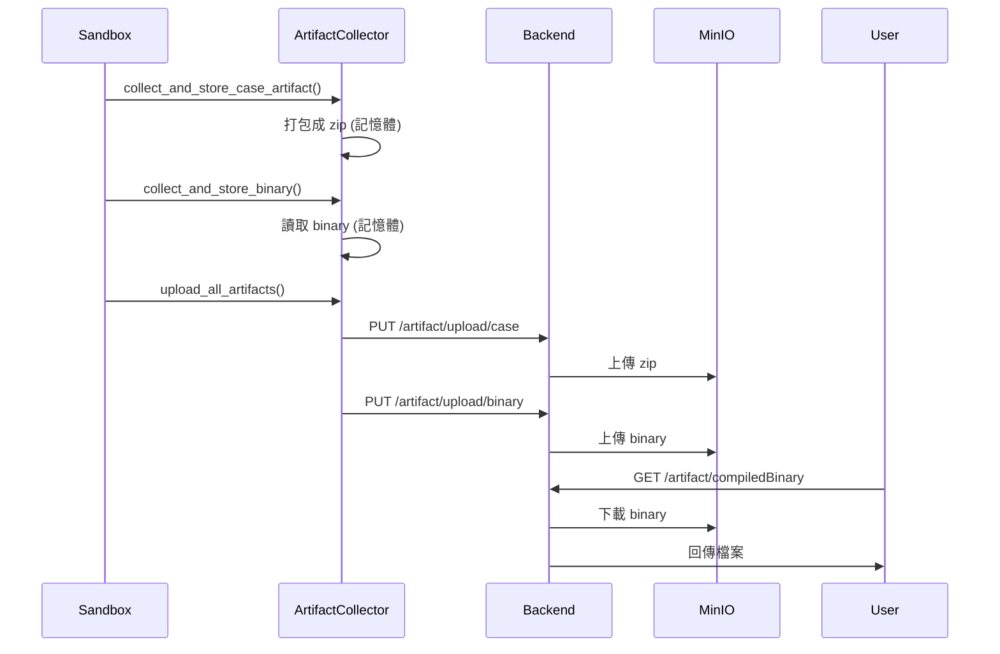

# Artifact Collection 完整指南

本文檔包含 Normal-OJ Artifact Collection（產物收集）機制的完整說明，包括概述、設計、實作規劃和使用指南。

## 📋 目錄

- [系統概述](#系統概述)
- [架構設計](#架構設計)
- [實作規劃](#實作規劃)
- [配置方式](#配置方式)
- [API 參考](#api-參考)
- [使用範例](#使用範例)
- [疑難排解](#疑難排解)

---

## 系統概述

### 功能說明

Artifact Collection 允許題目管理者決定學生可以下載哪些評測產生的檔案，用途包括：

- **編譯後執行檔**：讓學生下載自己編譯的程式，方便本地測試
- **測資輸出**：下載所有測試案例的輸出，幫助 debug
- **靜態分析報告**：查看詳細的程式碼分析結果

### 前端 UI 需求

基於 `submission/[id].vue`：

1. **Download Binary 按鈕**：當題目設定 `artifactCollection` 包含 `'compiledBinary'` 時顯示
   - API: `/submission/{id}/artifact/compiledBinary`
   
2. **Artifact 欄位（每個 Task）**：當題目設定 `artifactCollection` 包含 `'zip'` 時顯示
   - 每個 task 顯示一個 zip 下載按鈕
   - API: `/submission/{id}/artifact/zip/{taskIndex}`

### 系統架構流程



### 架構設計原則

> [!IMPORTANT]
> **統一由 Backend 處理 MinIO 存取，並優先復用既有產物**
>
> 所有 MinIO 操作（上傳、下載、路徑管理）統一由 Backend 處理。Sandbox 只負責：
> 1. 收集必要產物到本地或記憶體（僅在 stdout/stderr 以外有新增需求，或要收集 compiled binary 時）
> 2. 透過 callback API 將產物傳送給 Backend
> 3. Backend 負責上傳到 MinIO 並記錄路徑，並復用既有「每 case stdout/stderr」zip，再聚合成「每 subtask」zip 提供下載

---

## 架構設計

### 復用現有 stdout/stderr 產物

- 現況：Sandbox 回傳每個 case 的 `Stdout`/`Stderr`，Backend 在 `finish_judging` 會打包成 zip 並上傳 MinIO (`output_minio_path`)，下載 API 會將多個 case zip 再聚合為「每個 subtask 一個 zip」。
- ArtifactCollection 啟用 `"zip"` 且**只需要 stdout/stderr** 時，直接復用上述產物，Sandbox 不需重複打包/上傳。
- 只有在「需要額外檔案」或「compiled binary」時，Sandbox 才需收集並上傳。

### 職責分離

#### Sandbox 職責
- ✅（必要時）收集測試案例額外產生的檔案；stdout/stderr 盡量復用 Backend 既有 zip
- ✅ 收集編譯後的二進位檔案
- ✅ 打包成 zip（記憶體中）
- ✅ 透過 HTTP API 傳送給 Backend

#### Backend 職責
- ✅ 接收 Sandbox 上傳的產物
- ✅ 上傳到 MinIO 並記錄路徑
- ✅ 提供下載 API（含權限驗證）
- ✅ 管理產物生命週期

### 資料流程



---

## 實作規劃

### Sandbox 端實作

#### 新增模組：artifact_collector.py

建立 `dispatcher/artifact_collector.py`，自包含所有產物收集邏輯；當題目只需要 stdout/stderr 時可跳過收集並復用 Backend 已打好的 per-case zip：

**核心類別：`ArtifactCollector`**

```python
class ArtifactCollector:
    """
    自包含的產物收集模組
    負責：收集、暫存、上傳產物，不依賴 dispatcher 內部狀態
    """
    
    def __init__(self, backend_url: str, logger: logging.Logger = None):
        self.backend_url = backend_url
        self.logger = logger or logging.getLogger(__name__)
        self._artifacts = {}  # {submission_id: {task_no: {case_no: bytes}}}
        self._binaries = {}   # {submission_id: bytes}
```

**公開方法：**

| 方法 | 用途 |
|------|------|
| `collect_and_store_case_artifact()` | 收集「額外」測試案例產物並暫存（若只需 stdout/stderr 可不呼叫） |
| `collect_and_store_binary()` | 收集編譯產物並暫存 |
| `upload_all_artifacts()` | 上傳所有產物到 Backend |
| `cleanup()` | 清理暫存（評測失敗時） |
| `should_collect_artifacts()` (靜態) | 判斷是否收集 case artifacts |
| `should_collect_binary()` (靜態) | 判斷是否收集編譯產物 |

**內部方法：**

- `_collect_case_artifacts_zip()`: 打包 stdout/stderr/新檔案成 zip
- `_collect_compiled_binary()`: 讀取編譯產物（a.out/main）
- `_should_exclude_file()`: 判斷檔案是否排除（.c/.o/a.out 等）
- `_upload_binary()`: 上傳 binary 到 Backend
- `_upload_case_artifact()`: 上傳 case zip 到 Backend

**檔案收集規則（無白名單、快照差異、以 subtask 聚合）**

- 每個 case 執行前後對學生工作目錄做快照，收集「新增或被寫入」的檔案。
- 依模式決定工作目錄：
- 依模式決定工作目錄：
  - General / FunctionOnly：`submissions/<id>/src/cases/<case_no>` (for case artifacts), `submissions/<id>/src/common` (for binary)
  - Interactive：`submissions/<id>/src/cases/<case_no>` (學生端工作目錄)
- 不使用白名單；預設收集學生工作目錄中所有新增/被寫入的檔案（如需安全考量再額外排除）。
- stdout/stderr 繼續復用 Backend 已生成的 per-case zip。
- 額外檔案：對每個 subtask 聚合成一份 zip，路徑以 `task_<tt>/case_<cc>/filename` 命名，方便前端既有「每 subtask 一個 zip」的下載呼叫。

**檔案大小限制：**
- 單個檔案：5MB
- Case zip 總計：10MB
- Compiled binary：50MB
- 單個 submission 所有產物：100MB

#### 修改 dispatcher.py

**極簡化的整合**（不需新增輔助方法）：

```python
# 1. 初始化
self.artifact_collector = ArtifactCollector(
    backend_url=self.backend_url,
    logger=self.logger
)

# 2. on_case_complete() 中
meta = self.metas.get(submission_id)
# 啟用 zip 時：stdout/stderr 復用 backend 既有 zip；額外檔案以快照差異收集，之後按 subtask 聚合
if meta and ArtifactCollector.should_collect_artifacts(meta):
    self.artifact_collector.collect_and_store_case_artifact(...)

# 3. finalize() 中
if meta and ArtifactCollector.should_collect_binary(meta):
    self.artifact_collector.collect_and_store_binary(...)
self.artifact_collector.upload_all_artifacts(submission_id)

# 4. release() 中
self.artifact_collector.cleanup(submission_id)
```

---

### Backend 端實作

#### 新增 API 端點（內部上傳）

**1. 接收編譯產物**

```python
@submission_api.put('/<submission>/artifact/upload/binary')
def upload_compiled_binary(submission):
    """接收 Sandbox 上傳的編譯後二進位檔（內部 API）"""
    submission_obj = Submission(submission)
    binary_data = request.get_data()
    submission_obj.set_compiled_binary(binary_data)
    return HTTPResponse('binary uploaded', 200)
```

**2. 接收測試案例產物**

```python
@submission_api.put('/<submission>/artifact/upload/case')
def upload_case_artifact(submission):
    """接收 Sandbox 上傳的測試案例產物（內部 API）"""
    submission_obj = Submission(submission)
    task_no = int(request.args.get('task', 0))
    case_no = int(request.args.get('case', 0))
    artifact_data = request.get_data()
    submission_obj.set_case_artifact(task_no, case_no, artifact_data)
    return HTTPResponse('artifact uploaded', 200)
```

> 若題目只需要 stdout/stderr，可不呼叫此端點，直接復用 Backend 在 finish_judging 時上傳的 per-case zip。

#### 新增/修改下載 API 端點

**1. 下載編譯產物**

```python
@submission_api.get('/<submission>/artifact/compiledBinary')
@Request.login_required(RedirectType.Json)
def download_compiled_binary(submission):
    """下載編譯後的二進位檔"""
    user = g.user
    submission_obj = Submission(submission)
    
    # 權限檢查
    if not submission_obj.obj.permission(user, Submission.Permission.READ):
        raise Forbidden('you can not view this submission')
    
    # 檢查題目是否啟用
    problem = Problem(submission_obj.problem_id)
    if 'compiledBinary' not in problem.config.get('artifactCollection', []):
        raise NotFound('compiled binary not available')
    
    # 從 MinIO 取得檔案
    binary_data = submission_obj.get_compiled_binary()
    if not binary_data:
        raise NotFound('compiled binary not found')
    
    return send_file(
        io.BytesIO(binary_data),
        mimetype='application/octet-stream',
        as_attachment=True,
        download_name=f'submission_{submission}_binary'
    )
```

**2. 下載 Task Artifact Zip**

```python
@submission_api.get('/<submission>/artifact/zip/<int:task_index>')
@Request.login_required(RedirectType.Json)
def download_task_artifact_zip(submission, task_index):
    """下載指定 task 的所有 case artifacts 打包 zip"""
    user = g.user
    submission_obj = Submission(submission)
    
    # 權限檢查
    if not submission_obj.obj.permission(user, Submission.Permission.READ):
        raise Forbidden('you can not view this submission')
    
    # 檢查題目是否啟用
    problem = Problem(submission_obj.problem_id)
    if 'zip' not in problem.config.get('artifactCollection', []):
        raise NotFound('artifact zip not available')
    
    # 從 MinIO 取得所有 case artifacts 並打包
    artifact_zip = submission_obj.build_task_artifact_zip(task_index)
    
    return send_file(
        artifact_zip,
        mimetype='application/zip',
        as_attachment=True,
        download_name=f'submission_{submission}_task{task_index:02d}.zip'
    )
```

#### 新增 Submission 方法

```python
# mongo/submission.py

def set_case_artifact(self, task_no: int, case_no: int, artifact_data: bytes):
    """儲存單個測試案例的 artifact 到 MinIO"""
    minio_client = MinioClient()
    object_name = self._generate_output_minio_path(task_no, case_no)
    minio_client.upload_file_object(
        io.BytesIO(artifact_data),
        object_name,
        len(artifact_data),
        content_type='application/zip'
    )
    case = self.tasks[task_no].cases[case_no]
    case.output_minio_path = object_name
    self.save()

def get_compiled_binary(self) -> Optional[bytes]:
    """從 MinIO 取得編譯後的二進位檔"""
    if not self.compiled_binary_minio_path:
        return None
    minio_client = MinioClient()
    resp = minio_client.client.get_object(
        minio_client.bucket,
        self.compiled_binary_minio_path,
    )
    data = resp.read()
    resp.close()
    resp.release_conn()
    return data
```

#### 資料模型

確保以下欄位存在：

```python
# mongo/engine.py

class SubmissionTestCase(EmbeddedDocument):
    # ... 現有欄位
    output_minio_path = db.StringField(default=None)

class Submission(Document):
    # ... 現有欄位
    compiled_binary_minio_path = db.StringField(default=None)
```

---

## 配置方式

### 題目層級配置

在題目的 `config.artifactCollection` 中設定：

```json
{
  "config": {
    "artifactCollection": ["zip", "compiledBinary"]
  }
}
```

### 配置選項

| 選項 | 說明 |
|------|------|
| `"compiledBinary"` | 允許下載編譯後執行檔 |
| `"zip"` | 允許下載測資輸出 zip |

### 透過題目編輯頁面設定

1. 前往題目編輯頁 (`/course/:name/problem/:id/edit`)
2. 在 **Configuration** Section
3. 找到 **Artifact Collection** 區塊
4. 勾選要允許的產物類型

---

## API 參考

### 上傳 API（Sandbox → Backend）

#### 上傳編譯產物

```http
PUT /submission/{id}/artifact/upload/binary
Content-Type: application/octet-stream

[binary data]
```

**回應：** `200 OK` 或錯誤

#### 上傳測試案例產物

```http
PUT /submission/{id}/artifact/upload/case?task=0&case=1
Content-Type: application/zip

[zip data]
```

**回應：** `200 OK` 或錯誤

---

### 下載 API（Frontend → Backend）

#### 下載編譯產物

```http
GET /submission/{id}/artifact/compiledBinary
Authorization: Bearer {token}
```

**回應：** Binary 檔案下載

#### 下載 Task Outputs

```http
GET /submission/{id}/artifact/zip/{taskIndex}
Authorization: Bearer {token}
```

**回應：** Zip 檔案下載

**Zip 結構：**
```
submission_{id}_task00.zip
├── task_00/case_00/stdout.txt
├── task_00/case_00/stderr.txt
├── task_00/case_00/output.txt  (如果有)
├── task_00/case_01/stdout.txt
└── ...
```

---

## 使用範例

### 學生使用流程

#### 1. 提交程式碼

```http
POST /submission
{
  "problemId": 123,
  "languageType": 1
}

PUT /submission/<id>
Content-Type: multipart/form-data

code: [main.cpp file]
```

#### 2. 查看提交結果

在提交詳情頁面 (`/course/:name/submission/:id`)：
- 如果題目啟用 `compiledBinary`，顯示 "Download binary" 按鈕
- 如果題目啟用 `zip`，每個 task 顯示 "zip" 下載按鈕

#### 3. 下載產物

點擊按鈕即可下載，前端呼叫對應 API。

---

## 驗證計畫

### 自動化測試

#### 1. Sandbox 單元測試

```bash
cd Sandbox
pytest tests/test_artifact_collector.py -v
```

**測試案例：**
- `test_collect_case_artifacts_stdout_stderr()`
- `test_collect_case_artifacts_with_files()`
- `test_collect_compiled_binary_c()`
- `test_collect_compiled_binary_python()`
- `test_artifact_size_limit()`

#### 2. Backend 單元測試

```bash
cd Back-End
pytest tests/test_submission.py::test_upload_compiled_binary -v
pytest tests/test_submission.py::test_download_task_artifact_zip -v
```

### 手動驗證

#### 測試步驟 1：驗證 compiled binary

1. 建立題目，設定 `artifactCollection = ['compiledBinary']`
2. 提交 C 程式並評測完成
3. 檢查 MinIO：應有 `compiled_binaries/<submission_id>` 檔案
4. 點擊前端 "Download binary"，驗證能下載可執行檔

#### 測試步驟 2：驗證 task artifacts

1. 建立題目，設定 `artifactCollection = ['zip']`
2. 提交會產生 `output.txt` 的程式
3. 評測完成後，檢查 MinIO：應有 `submissions/task00_case00_*.zip`
4. 點擊 task 的 "zip" 按鈕，下載並解壓縮驗證

---

## 安全性考量

### 1. 權限驗證

- **擁有者限制**: 只有提交者本人可以下載
- **教師權限**: 教師可下載課程內所有學生的 artifacts
- **跨使用者隔離**: 防止透過猜測 submission_id 下載他人檔案

### 2. 檔案大小限制

- **Compiled Binary**: 限制 < 50 MB
- **Case Zip**: 限制 < 10 MB
- **總大小**: 單一 submission 所有 artifacts < 100 MB

### 3. 儲存成本

- **過期清理**: Artifacts 保留策略與 submission 資料一致
- **題目刪除**: 同步刪除相關產物

---

## 疑難排解

### Q: 為什麼看不到下載按鈕？

A: 檢查事項：
1. 題目是否開啟 `artifactCollection` 設定
2. 提交是否已完成評測
3. Sandbox 是否成功上傳 artifacts

### Q: 下載按鈕顯示 404

A: 可能原因：
1. Sandbox 未成功上傳 artifact
2. MinIO 路徑錯誤
3. 檔案已過期被清理

### Q: 可以下載其他人的 artifacts 嗎？

A: 不行，系統會驗證權限：
- 學生只能下載自己的
- 教師可下載課程內所有學生的

---

## 實作優先順序

1. **Phase 1: Sandbox 收集邏輯** (必要)
   - 實作 `artifact_collector.py`
   - 修改 `dispatcher.py` 的 `on_case_complete()` 和 `finalize()`
   
2. **Phase 2: Backend 上傳接收** (必要)
   - 新增 `/artifact/upload/binary` 和 `/artifact/upload/case` API
   - 實作 `set_case_artifact()` 和 `get_compiled_binary()` 方法

3. **Phase 3: Backend 下載提供** (必要)
   - 實作/修改 `/artifact/compiledBinary` 和 `/artifact/zip/<task_index>` API
   - 確保權限檢查和 artifactCollection 設定判斷

4. **Phase 4: 測試與驗證** (必要)
   - 單元測試
   - 整合測試
   - 手動驗證

---

## 注意事項與風險

> [!CAUTION]
> **記憶體管理**
> 
> Sandbox 在記憶體中暫存產物直到評測完成。需注意：
> - 單個提交的所有產物不應超過 100MB
> - 評測失敗或逾時時要記得清理暫存的產物
> - 上傳完成後立即釋放記憶體

> [!WARNING]
> **網路重傳機制**
> 
> Sandbox 上傳產物到 Backend 可能失敗（網路問題、Backend 重啟等）。建議：
> - 設定適當的 timeout（30秒）
> - 記錄上傳失敗，但不影響評測結果
> - 考慮實作簡單的重試機制（最多 3 次）

> [!NOTE]
> **產物保留期限**
> 
> 建議與現有的 submission 資料保留政策一致：
> - 配合 Backend 的定期清理機制
> - 題目刪除時同步刪除相關產物
> - 考慮實作「冷資料」歸檔策略（如 30 天後移至較便宜的儲存）

---

## 相關文檔

- [API_REFERENCE.md](API_REFERENCE.md) - API 參考
- [STATIC_ANALYSIS_GUIDE.md](STATIC_ANALYSIS_GUIDE.md) - 靜態分析
- [CONFIG_REFERENCE.md](CONFIG_REFERENCE.md) - 配置參考

---

**最後更新：** 2025-12-02  
**維護者：** 2025 NTNU Software Engineering Team 1
