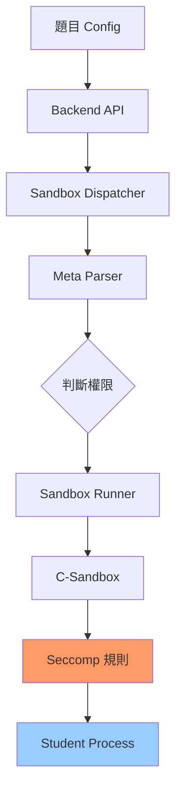

# File System Access Control 完整指南

本文檔說明 Normal-OJ 的檔案系統存取控制（File System Access Control）機制，包括配置方式、技術實作細節和使用範例。

## 📋 目錄

- [概述](#概述)
- [配置方式](#配置方式)
- [技術原理](#技術原理)
- [Seccomp 限制機制](#seccomp-限制機制)
- [使用範例](#使用範例)
- [安全性考量](#安全性考量)
- [疑難排解](#疑難排解)

---

## 概述

### 功能說明

File System Access Control 允許題目管理者精確控制學生程式碼的檔案 I/O 權限，包括：

- **讀取權限** (`allowRead`): 控制是否允許使用 `fopen("file.txt", "r")` 讀取檔案
- **寫入權限** (`allowWrite`): 控制是否允許使用 `fopen("file.txt", "w")` 寫入檔案

### 應用場景

**允許檔案讀取的題目：**
- 資料處理題：需要讀取大型測資檔案
- 檔案解析題：分析 CSV、JSON 等格式
- 資料結構題：從檔案載入初始資料

**允許檔案寫入的題目：**
- 檔案操作題：要求學生建立或修改檔案
- 資料持久化題：將結果寫入檔案供後續驗證
- 日誌輸出題：要求生成特定格式的日誌檔案

### 預設行為

**未設定時的預設值：**
- ✅ `allowRead`: `true` (允許讀檔)
- ❌ `allowWrite`: `false` (禁止寫檔)

**向後相容：**
- 現有題目無需修改，行為維持不變
- Stdin/Stdout 輸入輸出**不受影響**（已被重定向）

> [!IMPORTANT]
> **測資讀取不受 allowRead 影響**
> 
> 測資透過 stdin 重定向傳遞，在 seccomp 載入之前就已完成。因此：
> - `allowRead=false` **不會**阻止 `scanf()`, `cin`, `input()` 讀取測資
> - **只會**阻止直接開啟檔案的操作（`fopen("file.txt", "r")`）
> - 題目的正常輸入輸出功能完全不受影響

---

## 配置方式

### 題目層級配置

在題目設定的 `config.fileSystemAccessRestriction` 中配置：

```json
{
  "config": {
    "fileSystemAccessRestriction": {
      "allowRead": true,
      "allowWrite": false
    }
  }
}
```

### 配置選項

| 選項 | 型別 | 預設值 | 說明 |
|------|------|--------|------|
| `allowRead` | boolean | `true` | 允許使用 `fopen()` 以唯讀模式開啟檔案 |
| `allowWrite` | boolean | `false` | 允許使用 `fopen()` 以寫入模式開啟檔案 |

### 權限組合

| allowRead | allowWrite | 學生程式可以... | 適用場景 |
|-----------|------------|----------------|----------|
| `true` | `false` | 只能讀檔 | **預設**，資料讀取題 |
| `true` | `true` | 可讀可寫 | 檔案操作題 |
| `false` | `false` | 不能讀寫檔案¹ | 純計算題 |
| `false` | `true` | ⚠️ 不合理 | 自動轉為 (false, false) |

¹ **注意**: 即使 `allowRead=false`，學生程式仍可透過 `scanf()`/`cin`/`input()` 讀取測資（stdin），只是不能開啟其他檔案。

> [!NOTE]
> `allowWrite=true` 時會自動啟用 `allowRead=true`，因為寫入操作通常需要讀取能力。

### 透過前端設定

1. 進入題目編輯頁面 (`/course/:name/problem/:id/edit`)
2. 找到 **File System Access Control** 區塊
3. 勾選所需權限：
   - ☑️ Allow Read Files (`fopen "r"`)
   - ☐ Allow Write Files (`fopen "w"`)

---

## 技術原理

### 架構概覽



### 資料流程

1. **Backend 儲存**: 題目 config 儲存在 MongoDB
2. **Dispatcher 讀取**: 透過 `/problem/<id>/meta` API 取得完整配置
3. **Meta 解析**: `dispatcher/meta.py` 解析 `fileSystemAccessRestriction`
4. **參數傳遞**: Dispatcher → Sandbox.py → C-Sandbox
5. **Seccomp 載入**: C-Sandbox 根據參數設定 syscall 過濾規則
6. **執行限制**: 學生程式的 `open()`/`openat()` syscall 受到限制

---

## Seccomp 限制機制

### 什麼是 Seccomp？

Seccomp (Secure Computing Mode) 是 Linux 核心提供的安全機制，可以**過濾系統調用（syscall）**，防止程式執行危險操作。

### 檔案操作的關鍵 Syscall

| Syscall | C 函式 | 功能 |
|---------|--------|------|
| `open` | `fopen()`, `open()` | 開啟檔案 |
| `openat` | `openat()` | 相對路徑開啟檔案 |
| `read` | `fread()`, `read()` | 讀取資料 |
| `write` | `fwrite()`, `write()` | 寫入資料 |
| `close` | `fclose()`, `close()` | 關閉檔案 |

### Open Flags 解析

`open()` syscall 的第二個參數（flags）決定開啟模式：

```c
int fd = open(const char *pathname, int flags, ...);
```

**常見 Flags：**

| Flag | 值 | 說明 | fopen 對應 |
|------|-----|------|-----------|
| `O_RDONLY` | 0 | 唯讀 | `"r"` |
| `O_WRONLY` | 1 | 唯寫 | `"w"`, `"a"` |
| `O_RDWR` | 2 | 讀寫 | `"r+"`, `"w+"` |
| `O_CREAT` | 64 | 建立檔案 | `"w"` 模式 |
| `O_TRUNC` | 512 | 清空檔案 | `"w"` 模式 |

**範例：**
```c
fopen("file.txt", "r")  → open("file.txt", O_RDONLY)
fopen("file.txt", "w")  → open("file.txt", O_WRONLY|O_CREAT|O_TRUNC)
fopen("file.txt", "r+") → open("file.txt", O_RDWR)
```

---

## Seccomp 規則實作

### C/C++ 規則 (Whitelist 模式)

**位置**: `C-Sandbox-2025Team1/rule.h` - `c_cpp_rules()`

**策略**: 預設**拒絕所有** (`SCMP_ACT_KILL`)，只允許白名單中的 syscall

#### 1. 禁止所有檔案操作 (`allowRead=false`)

```c
if (!allow_read_file) {
    // 不添加 open/openat 到白名單
    // → 所有 fopen() 都會被 KILL
}
```

**效果：**
```c
fopen("file.txt", "r");  // ❌ 程式被 KILL (SIGSYS)
fopen("file.txt", "w");  // ❌ 程式被 KILL
```

#### 2. 只允許讀檔 (`allowRead=true, allowWrite=false`)

```c
if (allow_read_file && !allow_write_file) {
    // 允許 open，但 flags 不能包含 O_WRONLY 或 O_RDWR
    seccomp_rule_add(ctx, SCMP_ACT_ALLOW, SCMP_SYS(open), 1,
        SCMP_CMP(1, SCMP_CMP_MASKED_EQ, O_WRONLY | O_RDWR, 0));
    seccomp_rule_add(ctx, SCMP_ACT_ALLOW, SCMP_SYS(openat), 1,
        SCMP_CMP(2, SCMP_CMP_MASKED_EQ, O_WRONLY | O_RDWR, 0));
}
```

**技術解析：**

`SCMP_CMP_MASKED_EQ` 檢查位元遮罩：
```c
SCMP_CMP(1, SCMP_CMP_MASKED_EQ, O_WRONLY | O_RDWR, 0)
//       ^  ^                   ^                 ^
//       參數1  遮罩比較          遮罩: 0b11         期望值: 0
```

**判斷邏輯：**
```
(flags & (O_WRONLY | O_RDWR)) == 0  → 允許
(flags & (O_WRONLY | O_RDWR)) != 0  → 拒絕（KILL）
```

**效果：**
```c
fopen("file.txt", "r");   // ✅ flags=O_RDONLY(0)  → (0 & 3) == 0 → 允許
fopen("file.txt", "w");   // ❌ flags=O_WRONLY(1)  → (1 & 3) != 0 → KILL
fopen("file.txt", "r+");  // ❌ flags=O_RDWR(2)    → (2 & 3) != 0 → KILL
fopen("file.txt", "a");   // ❌ flags=O_WRONLY(1)  → (1 & 3) != 0 → KILL
```

#### 3. 允許讀寫 (`allowRead=true, allowWrite=true`)

```c
if (allow_read_file && allow_write_file) {
    // 無條件允許 open/openat
    seccomp_rule_add(ctx, SCMP_ACT_ALLOW, SCMP_SYS(open), 0);
    seccomp_rule_add(ctx, SCMP_ACT_ALLOW, SCMP_SYS(openat), 0);
    // 允許 dup/dup2/dup3 (用於檔案描述符操作)
    seccomp_rule_add(ctx, SCMP_ACT_ALLOW, SCMP_SYS(dup), 0);
    seccomp_rule_add(ctx, SCMP_ACT_ALLOW, SCMP_SYS(dup2), 0);
    seccomp_rule_add(ctx, SCMP_ACT_ALLOW, SCMP_SYS(dup3), 0);
}
```

**效果：**
```c
fopen("file.txt", "r");   // ✅ 允許
fopen("file.txt", "w");   // ✅ 允許
fopen("file.txt", "r+");  // ✅ 允許
fopen("file.txt", "a");   // ✅ 允許
```

---

### Python 規則 (Blacklist 模式)

**位置**: `C-Sandbox-2025Team1/rule.h` - `general_rules()`

**策略**: 預設**允許所有** (`SCMP_ACT_ALLOW`)，只禁止黑名單中的 syscall

#### 1. 禁止所有檔案操作 (`allowRead=false`)

```c
if (!allow_read_file) {
    // 禁止所有 open/openat
    seccomp_rule_add(ctx, SCMP_ACT_KILL, SCMP_SYS(open), 0);
    seccomp_rule_add(ctx, SCMP_ACT_KILL, SCMP_SYS(openat), 0);
}
```

**效果：**
```python
open("file.txt", "r")  # ❌ 程式被 KILL
open("file.txt", "w")  # ❌ 程式被 KILL
```

#### 2. 只允許讀檔 (`allowRead=true, allowWrite=false`)

```c
if (allow_read_file && !allow_write_file) {
    // 禁止 O_WRONLY
    seccomp_rule_add(ctx, SCMP_ACT_KILL, SCMP_SYS(open), 1,
        SCMP_CMP(1, SCMP_CMP_MASKED_EQ, O_WRONLY, O_WRONLY));
    // 禁止 O_RDWR
    seccomp_rule_add(ctx, SCMP_ACT_KILL, SCMP_SYS(open), 1,
        SCMP_CMP(1, SCMP_CMP_MASKED_EQ, O_RDWR, O_RDWR));
    // openat 同理
}
```

**技術解析：**

檢查 flags 是否**包含**特定位元：
```c
SCMP_CMP(1, SCMP_CMP_MASKED_EQ, O_WRONLY, O_WRONLY)
//       ^  ^                   ^         ^
//       參數1  遮罩比較          遮罩: 1   期望值: 1
```

**判斷邏輯：**
```
(flags & O_WRONLY) == O_WRONLY  → 拒絕 (KILL)
(flags & O_RDWR) == O_RDWR      → 拒絕 (KILL)
其他                            → 允許 (預設)
```

**效果：**
```python
open("file.txt", "r")   # ✅ flags=O_RDONLY → 不符合任何 KILL 規則 → 允許
open("file.txt", "w")   # ❌ flags 包含 O_WRONLY → KILL
open("file.txt", "r+")  # ❌ flags 包含 O_RDWR → KILL
open("file.txt", "a")   # ❌ flags 包含 O_WRONLY → KILL
```

#### 3. 允許讀寫 (`allowRead=true, allowWrite=true`)

```c
if (allow_read_file && allow_write_file) {
    // 不添加任何 open/openat 的禁止規則
    // → 預設 ALLOW 模式允許所有操作
}
```

**效果：**
```python
open("file.txt", "r")   # ✅ 允許
open("file.txt", "w")   # ✅ 允許
open("file.txt", "r+")  # ✅ 允許
```

---

## 讀寫範圍限制

### 工作目錄隔離

**RLIMIT_FSIZE** 限制寫入總量：

```c
// sandbox.c Line 224-230
if (output_limit)
{
    struct rlimit lim;
    lim.rlim_cur = output_limit;  // 1GB (1073741824 bytes)
    lim.rlim_max = output_limit;
    setrlimit(RLIMIT_FSIZE, &lim);
}
```

**效果：**
```c
FILE *f = fopen("big.txt", "w");
for (long i = 0; i < 2000000000; i++) {
    fputc('A', f);  // 超過 1GB 時觸發 SIGXFSZ → OLE (Output Limit Exceeded)
}
```

### Interactive Mode 特殊機制

在 Interactive Mode 中，student 和 teacher 程式有**各自的工作目錄**和**獨立的權限設定**。

#### 目錄隔離

```python
# runner/interactive_orchestrator.py
env_student["PWD"] = "/src"           # Student 工作目錄
env_teacher["PWD"] = str(teacher_dir) # Teacher 工作目錄
```

#### 權限配置

**從配置檔讀取** (`interactive_orchestrator.py` Line 266-267):
```python
student_allow_read = bool(cfg.get("studentAllowRead", False))   # 預設: False
student_allow_write = bool(cfg.get("studentAllowWrite", False)) # 預設: False
```

**應用權限**:
```python
_setup_secure_permissions(
    teacher_dir=teacher_dir,
    student_dir=student_dir,
    teacher_uid=teacher_uid,
    student_uid=student_uid,
    sandbox_gid=sandbox_gid,
    student_allow_read=student_allow_read,    # 控制 student 可否讀檔
    student_allow_write=student_allow_write,  # 控制 student 可否寫檔
)
```

#### Teacher 的特殊能力

**✅ Teacher 可以寫入 Student 目錄：**

```c
// Teacher 程式 (Teacher_file.c)
int main() {
    // 1. 讀取測資
    FILE *fp = fopen("testcase.in", "r");
    int n;
    fscanf(fp, "%d", &n);
    fclose(fp);
    
    // 2. 準備資料並寫入 Student 可存取的位置
    FILE *data = fopen("/src/prepared_data.txt", "w");
    fprintf(data, "%d\n", n * 2);
    fclose(data);
    
    // 3. 與 Student 互動...
    printf("%d\n", n);  // 透過 pipe 傳送
    fflush(stdout);
    
    return 0;
}
```

```c
// Student 程式 (main.c)
int main() {
    // 1. 讀取 Teacher 準備的資料檔案
    FILE *f = fopen("prepared_data.txt", "r");  // ✅ 可讀取（Teacher 寫入的）
    int data;
    fscanf(f, "%d", &data);
    fclose(f);
    
    // 2. 從 pipe 讀取
    int n;
    scanf("%d", &n);
    
    // 處理並輸出...
    return 0;
}
```

**權限總結：**

| 操作 | Teacher | Student |
|------|---------|--------|
| 讀取 teacher 目錄檔案 | ✅ | ❌ (權限 0o701) |
| 寫入 teacher 目錄檔案 | ✅ | ❌ |
| 讀取 student 目錄檔案 | ✅ | ✅/❌ (取決於 studentAllowRead) |
| 寫入 student 目錄檔案 | ✅ | ✅/❌ (取決於 studentAllowWrite) |
| 讀取測資 (testcase.in) | ✅ | ❌ (Teacher 專用) |
| 寫入 Check_Result | ✅ | ❌ |

> [!NOTE]
> **Interactive Mode 的檔案共享機制**
> 
> Teacher 可以作為「資料提供者」：
> 1. Teacher 讀取測資並處理
> 2. Teacher 將處理後的資料寫入 `/src/data.txt`
> 3. Student 讀取 `/src/data.txt` 使用
> 
> 這允許設計「Teacher 準備資料，Student 處理」的題型。

---

## 使用範例

### 範例 1：資料讀取題

**題目需求**：從 `input.txt` 讀取數字並計算總和。

**配置：**
```json
{
  "fileSystemAccessRestriction": {
    "allowRead": true,
    "allowWrite": false
  }
}
```

**學生程式 (C)：**
```c
#include <stdio.h>
int main() {
    FILE *f = fopen("input.txt", "r");
    if (!f) return 1;
    
    int sum = 0, num;
    while (fscanf(f, "%d", &num) == 1) {
        sum += num;
    }
    fclose(f);
    
    printf("%d\n", sum);
    return 0;
}
```

**預期結果：** ✅ AC（允許讀檔）

---

### 範例 2：檔案寫入題

**題目需求**：將排序結果寫入 `output.txt`。

**配置：**
```json
{
  "fileSystemAccessRestriction": {
    "allowRead": true,
    "allowWrite": true
  }
}
```

**學生程式 (Python)：**
```python
data = list(map(int, input().split()))
data.sort()

with open("output.txt", "w") as f:
    for num in data:
        f.write(f"{num}\n")

print("Done")
```

**預期結果：** ✅ AC（允許寫檔）

---

### 範例 3：惡意寫檔攻擊

**配置：** 預設 (禁止寫檔)

**學生程式 (C)：**
```c
#include <stdio.h>
int main() {
    // 嘗試寫入大量檔案填滿磁碟
    for (int i = 0; i < 10000; i++) {
        char filename[32];
        sprintf(filename, "hack_%d.txt", i);
        FILE *f = fopen(filename, "w");
        if (f) {
            fprintf(f, "malicious content");
            fclose(f);
        }
    }
    return 0;
}
```

**預期結果：** ❌ RE (Runtime Error - SIGSYS)

**原因：** 第一次 `fopen(filename, "w")` 時，`open()` syscall 被 seccomp 攔截並 KILL。

---

## 安全性考量

### 1. Seccomp 在核心層攔截

Seccomp 在**Linux 核心層**過濾 syscall，學生程式**無法繞過**。

**無效的繞過嘗試：**
```c
// ❌ 使用內嵌組合語言直接調用 syscall
asm("mov $2, %rax; syscall");  // 仍被 seccomp 攔截

// ❌ 透過其他語言庫
system("echo 'hack' > file.txt");  // system() 也被禁止

// ❌ 使用 Python ctypes
import ctypes
libc = ctypes.CDLL("libc.so.6")
libc.open("file.txt", 1)  // 最終仍調用 open() syscall → 被攔截
```

### 2. Stdin/Stdout 不受影響

> [!IMPORTANT]
> **測資輸入機制與檔案讀取的根本差異**

學生程式的標準輸入輸出在**進入 seccomp 前**已被重定向，不受限制影響。

#### 執行順序（sandbox.c）

```c
// 步驟 1: 重定向 stdin/stdout (Line 244-284)
if (strlen(file_stdin))
{
    int fd = open(file_stdin, O_RDONLY);  // ← Sandbox 本身開啟測資檔
    dup2(fd, STDIN_FILENO);               // ← 重定向到 fd 0 (stdin)
    close(fd);
}

if (strlen(file_stdout))
{
    int fd = open(file_stdout, O_WRONLY | O_CREAT, ...);
    dup2(fd, STDOUT_FILENO);              // ← 重定向到 fd 1 (stdout)
    close(fd);
}

// 步驟 2: 載入 seccomp 規則 (Line 290-297)
if (!compile) {
    c_cpp_rules(program, allow_write, allow_read, allow_network_access);
    // ↑ 此時才啟用檔案開啟限制
}

// 步驟 3: 執行學生程式
execvp(program, program_argv);
// → 學生程式看到的 stdin/stdout 已經是測資檔案，不需要再 open()
```

#### 為什麼測資讀取不受影響？

**技術原因：**
1. Sandbox 進程（root 權限）開啟測資檔案 → **不受 seccomp 限制**
2. 透過 `dup2()` 複製檔案描述符到 stdin/stdout
3. 學生程式透過 `read(0, ...)` / `write(1, ...)` 操作 fd 0/1 → **不需要調用 open() syscall**
4. Seccomp 只過濾 `open()`/`openat()` syscall，不影響已存在的 fd

**實際效果對比：**

| 操作 | Syscall | allowRead=false 時 |
|------|---------|-------------------|
| `scanf("%d", &n)` | `read(0, ...)` | ✅ **正常運作** |
| `cin >> n` | `read(0, ...)` | ✅ **正常運作** |
| `input()` (Python) | `read(0, ...)` | ✅ **正常運作** |
| `fopen("file.txt", "r")` | `open("file.txt", O_RDONLY)` | ❌ **被 KILL** |
| `fopen("/dev/stdin", "r")` | `open("/dev/stdin", O_RDONLY)` | ❌ **被 KILL** |

**結論：**
```c
// ✅ 這些操作永遠可用（不受 allowRead 影響）
scanf("%d", &n);            // 讀取測資
printf("%d\n", result);     // 輸出結果

// ❌ 這些操作受 allowRead 控制
FILE *f = fopen("data.txt", "r");  // 嘗試開啟其他檔案
```

### 3. 檔案大小與數量限制

**RLIMIT_FSIZE**: 1GB 總寫入量
**RLIMIT_NPROC**: 10 個行程（防止 fork bomb）

即使允許寫檔，也無法：
- 寫入超過 1GB
- 建立過多行程消耗資源

### 4. 容器隔離確保主機安全

即使學生程式破壞容器內檔案，主機不受影響：
```bash
# 容器內
rm -rf /  # ❌ 只影響容器，主機安全
```

---

## 疑難排解

### Q: `allowRead=false` 時學生程式還能讀取測資嗎？

A: **可以！** 測資透過 stdin 重定向傳遞，不受 `allowRead` 影響。

**原因：**
- Seccomp 在 stdin 重定向**之後**才載入
- 學生程式使用 `scanf()`, `cin`, `input()` 時，直接讀取 fd 0（已指向測資檔案）
- **不需要**調用 `open()` syscall，因此不受限制

**被影響的操作：**
```c
FILE *f = fopen("testdata/0000.in", "r");  // ❌ 這會被 KILL
```

**不受影響的操作：**
```c
int n;
scanf("%d", &n);  // ✅ 正常運作
```

---

### Q: 為什麼允許讀檔，但學生程式仍 RE？

A: 檢查事項：
1. 檔案是否存在於工作目錄 (`/src`)
2. 是否使用絕對路徑指向容器外
3. 檢查錯誤處理：`if (!fopen(...))` 是否正確返回

### Q: 允許寫檔，但檔案沒有被建立？

A: 可能原因：
1. 程式未正確 `fclose()`（資料未落盤）
2. 超過 1GB 限制（觸發 OLE）
3. 程式在寫入前就崩潰

### Q: 如何驗證 seccomp 規則是否生效？

A: 檢查評測結果：
```c
FILE *f = fopen("test.txt", "w");
if (!f) {
    // 如果 allowWrite=false，程式直接被 KILL，不會執行到這裡
    printf("fopen failed\n"); 
}
```

預期：
- `allowWrite=true`: 輸出 "fopen failed"（如果檔案無法建立）
- `allowWrite=false`: RE (SIGSYS)，不輸出任何內容

### Q: Interactive Mode 中 student 能讀取 teacher 檔案嗎？

A: **不能**。Teacher 目錄權限設為 0o701 (rwx-----x)，student UID 無讀取權限。

嘗試：
```c
// Student 程式
FILE *f = fopen("/teacher/main.c", "r");
```

結果：
- Unix Permission Denied (非 seccomp 攔截)
- 返回 NULL，不會 KILL 程式

---

## 相關文檔

- [SECURITY_GUIDE.md](SECURITY_GUIDE.md) - 安全機制總覽
- [CONFIG_REFERENCE.md](CONFIG_REFERENCE.md) - 配置參數參考
- [NETWORK_CONTROL_GUIDE.md](NETWORK_CONTROL_GUIDE.md) - 網路存取控制

---

**最後更新：** 2025-12-02  
**維護者：** 2025 NTNU Software Engineering Team 1

---

## 附錄：Seccomp Rule 完整範例

### C/C++ Whitelist 模式

```c
int c_cpp_rules(char *target, bool allow_write, bool allow_read, bool allow_network)
{
    scmp_filter_ctx ctx = seccomp_init(SCMP_ACT_KILL);  // 預設拒絕
    
    // 1. 必要的 syscalls (read, write, mmap, etc.)
    int syscalls[] = {SCMP_SYS(read), SCMP_SYS(write), ...};
    for (...) {
        seccomp_rule_add(ctx, SCMP_ACT_ALLOW, syscalls[i], 0);
    }
    
    // 2. 檔案開啟控制
    if (!allow_read) {
        // 完全禁止 open/openat
    } else if (!allow_write) {
        // 只允許 O_RDONLY
        seccomp_rule_add(ctx, SCMP_ACT_ALLOW, SCMP_SYS(open), 1,
            SCMP_CMP(1, SCMP_CMP_MASKED_EQ, O_WRONLY|O_RDWR, 0));
    } else {
        // 允許所有 open
        seccomp_rule_add(ctx, SCMP_ACT_ALLOW, SCMP_SYS(open), 0);
    }
    
    // 3. 網路控制
    if (allow_network) {
        seccomp_rule_add(ctx, SCMP_ACT_ALLOW, SCMP_SYS(socket), 0);
        // ...
    }
    
    seccomp_load(ctx);
    return 0;
}
```

### Python Blacklist 模式

```c
int general_rules(char *target, bool allow_write, bool allow_read)
{
    scmp_filter_ctx ctx = seccomp_init(SCMP_ACT_ALLOW);  // 預設允許
    
    // 1. 禁止危險 syscalls
    int blacklist[] = {SCMP_SYS(clone), SCMP_SYS(fork), SCMP_SYS(kill)};
    for (...) {
        seccomp_rule_add(ctx, SCMP_ACT_KILL, blacklist[i], 0);
    }
    
    // 2. 檔案開啟控制
    if (!allow_read) {
        // 完全禁止 open/openat
        seccomp_rule_add(ctx, SCMP_ACT_KILL, SCMP_SYS(open), 0);
    } else if (!allow_write) {
        // 禁止寫入相關 flags
        seccomp_rule_add(ctx, SCMP_ACT_KILL, SCMP_SYS(open), 1,
            SCMP_CMP(1, SCMP_CMP_MASKED_EQ, O_WRONLY, O_WRONLY));
        seccomp_rule_add(ctx, SCMP_ACT_KILL, SCMP_SYS(open), 1,
            SCMP_CMP(1, SCMP_CMP_MASKED_EQ, O_RDWR, O_RDWR));
    }
    // allow_write=true 時不添加規則（預設允許）
    
    seccomp_load(ctx);
    return 0;
}
```
