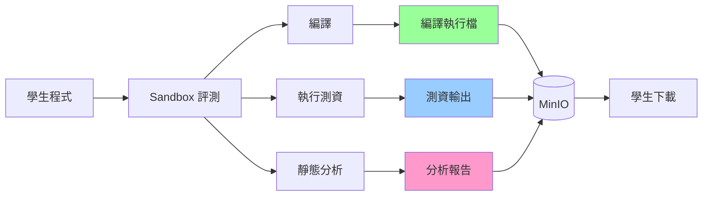

# Artifact Collection 指南

本文檔說明 Normal-OJ 的 Artifact Collection（產物收集）機制，讓學生可以下載編譯後執行檔和測資輸出等檔案。

## 📋 目錄

- [概述](#概述)
- [可收集的 Artifacts](#可收集的-artifacts)
- [配置方式](#配置方式)
- [實作狀態](#實作狀態)
- [使用範例](#使用範例)
- [技術細節](#技術細節)

---

## 概述

Artifact Collection 允許題目管理者決定學生可以下載哪些評測產生的檔案，用途包括：

- **編譯後執行檔**：讓學生下載自己編譯的程式，方便本地測試
- **測資輸出**：下載所有測試案例的輸出，幫助 debug
- **靜態分析報告**：查看詳細的程式碼分析結果



---

## 可收集的 Artifacts

### 1. Compiled Binary（編譯後執行檔）

**說明**: 編譯後的可執行檔案（C/C++ 為 binary，Python 為 .py 檔案）

**用途**:
- 學生可在本地環境執行自己的程式
- 方便使用本地測資測試
- 學習編譯過程與最佳化

**檔案格式**:
- C/C++: `main` (Linux binary)
- Python: `main.py`

**檔案大小限制**: 通常 < 10 MB

---

### 2. Test Case Outputs（測資輸出）

**說明**: 所有測試案例的標準輸出 (stdout) 打包成 ZIP

**用途**:
- 比對自己的輸出與標準答案
- Debug WA (Wrong Answer) 問題
- 了解測試案例的特性

**打包結構**:
```
submission_01HQABC_task_0.zip
├── case_0_output.txt
├── case_1_output.txt
├── case_2_output.txt
└── ...
```

**檔案大小限制**: 根據題目 output_limit 設定

---

### 3. Static Analysis Report（靜態分析報告）

**說明**: 程式碼靜態分析的詳細報告

**用途**:
- 查看被禁用的函式或標頭檔
- 了解程式碼風格問題
- 學習更好的編程習慣

**存取方式**: 獨立 API `/submission/<id>/static-analysis`

**詳見**: [STATIC_ANALYSIS.md](STATIC_ANALYSIS.md)

---

## 配置方式

### 題目層級配置

在題目的 `config.artifactCollection` 中設定：

```json
{
  "config": {
    "artifactCollection": {
      "compiledBinary": true,
      "testcaseOutput": true
    }
  }
}
```

### 配置選項

| 選項 | 型別 | 預設值 | 說明 |
|------|------|--------|------|
| `compiledBinary` | boolean | `false` | 是否允許下載編譯後執行檔 |
| `testcaseOutput` | boolean | `false` | 是否允許下載測資輸出 |

### 透過題目編輯頁面設定

1. 前往題目編輯頁 (`/course/:name/problem/:id/edit`)
2. 在 **Configuration** Section
3. 找到 **Artifact Collection** 區塊
4. 勾選要允許的產物類型

---

## 實作狀態

> ⚠️ **重要**: 根據 Sandbox/TODO.md，Artifact Collection 功能尚未完全實作

### 已完成

- ✅ Backend: `config.artifactCollection` 資料結構
- ✅ Frontend: 題目編輯頁面設定欄位
- ✅ API: `/submission/<id>/artifact/compiledBinary` 端點定義
- ✅ API: `/submission/<id>/artifact/task/<task_index>` 端點定義

### 待完成

- ❌ Sandbox: 編譯後 binary 上傳至 MinIO
- ❌ Sandbox: 測資輸出打包成 ZIP
- ❌ Dispatcher: 依 config 決定產物收集邏輯
- ❌ Backend: 產物下載權限驗證（避免跨使用者存取）

### 預計實作

請參考 `Sandbox/TODO.md` 的「產物收集」章節。

---

## 使用範例

### 學生使用流程

#### 1. 提交程式碼

```http
POST /submission
{
  "token": "<JWT_TOKEN>",
  "problemId": 123,
  "languageType": 1
}

PUT /submission/<id>
Content-Type: multipart/form-data

code: [main.cpp file]
```

#### 2. 查看提交結果

```http
GET /submission/<id>?token=<TOKEN>
```

**回應**:
```json
{
  "status": "ok",
  "data": {
    "submissionId": "01HQABC...",
    "status": 1,  // WA
    "score": 60,
    "artifacts": {
      "compiledBinary": "submissions/01HQABC.../main",
      "taskOutputs": [
        "submissions/01HQABC.../task_0.zip"
      ]
    }
  }
}
```

#### 3. 下載 Compiled Binary

```http
GET /submission/<id>/artifact/compiledBinary?token=<TOKEN>
```

**回應**: Binary 檔案下載

#### 4. 下載測資輸出

```http
GET /submission/<id>/artifact/task/0?token=<TOKEN>
```

**回應**: `task_0.zip` 檔案下載

---

## 技術細節

### Sandbox 流程（預計實作）

#### 1. 編譯階段

```python
# dispatcher/dispatcher.py
def handle_compile(submission_id, meta):
    # 編譯程式
    result = runner.compile(...)
    
    if result.status == 'AC' and meta.config.artifact_collection.compiled_binary:
        # 上傳 binary 到 MinIO
        binary_path = f"submissions/{submission_id}/main"
        minio_client.upload(
            bucket='noj',
            object_name=binary_path,
            file_path=workspace / 'main'
        )
        
        # 記錄路徑
        submission_artifacts['compiledBinary'] = binary_path
```

#### 2. 執行階段

```python
# dispatcher/dispatcher.py
def handle_execute(submission_id, task_index, meta):
  for case_index in range(case_count):
        result = runner.execute(...)
        
        if meta.config.artifact_collection.testcase_output:
            # 保存輸出
            outputs.append({
                'case': case_index,
                'stdout': result.stdout
            })
    
    # 完成後打包
    if meta.config.artifact_collection.testcase_output:
        zip_path = create_task_output_zip(submission_id, task_index, outputs)
        
        # 上傳到 MinIO
        minio_client.upload(
            bucket='noj',
            object_name=f"submissions/{submission_id}/task_{task_index}.zip",
            file_path=zip_path
        )
```

#### 3. 完成回報

```python
# dispatcher/dispatcher.py
def on_submission_complete(submission_id, tasks):
    payload = {
        'tasks': tasks,
        'artifacts': {
            'compiledBinary': submission_artifacts.get('compiledBinary'),
            'taskOutputs': task_output_paths
        }
    }
    
    # 回報給 Backend
    backend_client.post(f'/submission/{submission_id}/complete', json=payload)
```

### Backend 儲存

```python
# mongo/submission.py
class Submission(Document):
    # ... 其他欄位
    
    # Artifacts
    compiled_binary_path: str  # MinIO 路徑
    task_output_paths: list    # [str], 各 task 的輸出 ZIP 路徑
```

### 下載權限驗證

```python
# model/submission.py
@submission_api.route('/<submission_id>/artifact/compiledBinary')
@login_required
def download_compiled_binary(user, submission: Submission):
    # 驗證權限
    if submission.user_id != user.username and not user.is_teacher():
        return {'status': 'err', 'msg': 'Permission denied'}, 403
    
    # 檢查是否允許下載
    problem = Problem(submission.problem_id)
    if not problem.config.get('artifactCollection', {}).get('compiledBinary'):
        return {'status': 'err', 'msg': 'Artifact not available'}, 404
    
    # 從 MinIO 下載
    file_obj = minio_client.get_object(
        bucket='noj',
        object_name=submission.compiled_binary_path
    )
    
    return send_file(file_obj, as_attachment=True, download_name='main')
```

---

## 安全性考量

### 1. 權限驗證

- **擁有者限制**: 只有提交者本人可以下載
- **教師權限**: 教師可下載所有學生的 artifacts
- **跨使用者隔離**: 防止透過猜測 submission_id 下載他人檔案

### 2. 檔案大小限制

- **Compiled Binary**: 限制 < 50 MB
- **Task Outputs**: 依題目 output_limit 限制
- **總大小**: 單一 submission 所有 artifacts < 100 MB

### 3. 惡意檔案防護

- **病毒掃描**: 編譯後執行檔可能包含惡意程式（未來考慮）
- **沙箱執行**: 提醒學生在隔離環境執行下載的 binary

### 4. 儲存成本

- **過期清理**: Artifacts 保留 30 天後自動刪除
- **配額管理**: 每位使用者 artifacts 總大小限制

---

## 前端整合

### 提交詳情頁面

```vue
<template>
  <div class="submission-details">
    <h2>Submission #{{ submission.submissionId }}</h2>
    
    <!-- Artifacts Section -->
    <div v-if="hasArtifacts" class="artifacts-section">
      <h3>Downloads</h3>
      
      <a 
        v-if="submission.artifacts.compiledBinary"
        :href="downloadUrl('compiledBinary')"
        class="download-btn"
      >
        <Icon name="download" />
        Download Compiled Binary
      </a>
      
      <div v-if="submission.artifacts.taskOutputs">
        <h4>Test Case Outputs</h4>
        <a 
          v-for="(path, index) in submission.artifacts.taskOutputs"
          :key="index"
          :href="downloadUrl('task', index)"
          class="download-btn"
        >
          <Icon name="download" />
          Download Task {{ index }} Outputs
        </a>
      </div>
    </div>
  </div>
</template>

<script setup lang="ts">
import { computed } from 'vue'

const props = defineProps<{ submission: Submission }>()

const hasArtifacts = computed(() => 
  props.submission.artifacts?.compiledBinary ||
  props.submission.artifacts?.taskOutputs?.length > 0
)

function downloadUrl(type: string, index?: number) {
  const base = `/submission/${props.submission.submissionId}/artifact`
  if (type === 'compiledBinary') {
    return `${base}/compiledBinary?token=${userStore.token}`
  } else if (type === 'task') {
    return `${base}/task/${index}?token=${userStore.token}`
  }
}
</script>
```

---

## 疑難排解

### Q: 為什麼看不到下載按鈕？

A: 檢查事項：
1. 題目是否開啟 `artifactCollection` 設定
2. 提交是否已完成評測
3. Sandbox 是否成功上傳 artifacts 到 MinIO

### Q: 下載按鈕顯示 404

A: 可能原因：
1. Sandbox 未實作 artifact 上傳（目前狀態）
2. MinIO 路徑錯誤
3. 檔案已過期被清理

### Q: 可以下載其他人的 artifacts 嗎？

A: 不行，系統會驗證權限：
- 學生只能下載自己的
- 教師可下載課程內所有學生的

---

## 相關文檔

- [API_REFERENCE.md](API_REFERENCE.md) - API 參考
- [STATIC_ANALYSIS.md](STATIC_ANALYSIS.md) - 靜態分析
- [CONFIG_REFERENCE.md](CONFIG_REFERENCE.md) - 配置參考
- [Sandbox/TODO.md](../Sandbox/TODO.md) - 實作待辦事項

---

**最後更新：** 2025-11-29  
**維護者：** 2025 NTNU Software Engineering Team 1

---

## 附錄：ZIP 檔案結構範例

### Task Output ZIP

```
submission_01HQABCDEF_task_0.zip
├── case_0_output.txt       # 第一個測試案例輸出
│   內容: "42\n"
├── case_1_output.txt       # 第二個測試案例輸出
│   內容: "100\n200\n"
├── case_2_output.txt
└── ...
```

### 未來可能擴展

未來可能加入更多 artifacts：

- **Compiler Output**: 編譯器的詳細訊息
- **Memory Profile**: 記憶體使用分析
- **Performance Stats**: 執行時間分析
- **Coverage Report**: 程式碼覆蓋率報告（針對 functionOnly 模式）
