# Checker & Scoring 指南

本文檔說明如何在 Normal-OJ 中開發和使用自訂 Checker 與 Scoring Script，為題目設計靈活的評測與計分機制。

## 📋 目錄

- [概述](#概述)
- [Checker 機制](#checker-機制)
  - [預設 Checker](#預設-checker)
  - [自訂 Checker](#自訂-checker)
  - [Interactive Mode Checker](#interactive-mode-checker)
- [Scoring Script](#scoring-script)
  - [預設計分](#預設計分)
  - [自訂計分腳本](#自訂計分腳本)
- [範例](#範例)
- [最佳實踐](#最佳實踐)

---

## 概述

Normal-OJ 的評測系統分為兩個階段：

1. **Checker 階段**：驗證學生程式的輸出是否正確
2. **Scoring 階段**：根據測試結果計算最終分數

```mermaid
graph LR
    A[學生程式執行] --> B[產生輸出]
    B --> C[Checker 檢查]
    C --> D{結果}
    D -->|AC/WA/...| E[Scoring 計分]
    E --> F[最終分數]
```



---

## Checker 機制

### 預設 Checker

預設 Checker 使用**逐行字串比對**，忽略行尾空白與檔案尾空行。

**比對規則：**
1. 移除每行尾端的空白字元
2. 移除檔案結尾的空行
3. 逐行比較學生輸出與標準答案

**適用場景：**
- 答案唯一且格式固定
- 不需要容錯處理
- 簡單的輸入輸出題目

---

### 自訂 Checker

當題目需要更複雜的答案驗證邏輯時（如浮點數誤差、多重解答、特殊格式），可使用自訂 Checker。

#### Checker 規範

**檔案名稱：** `checker.py`

**執行環境：** Python 3

**輸入參數：**
Checker 會以命令列參數接收以下檔案路徑：
```python
import sys

input_file = sys.argv[1]      # 測資輸入檔 (ssttnn.in)
output_file = sys.argv[2]     # 學生輸出檔 (output.txt)
answer_file = sys.argv[3]     # 標準答案檔 (ssttnn.out)
```

**輸出要求：**
Checker 必須在執行完畢後輸出判定結果到 stdout，格式如下：

```
STATUS: <status>
MESSAGE: <message>
```

**Status 值：**
- `AC` - Accepted（答案正確）
- `WA` - Wrong Answer（答案錯誤）

**範例輸出：**
```
STATUS: AC
MESSAGE: All test cases passed
```
或
```
STATUS: WA
MESSAGE: Expected 42 but got 43 on line 3
```

#### Checker 模板

```python
#!/usr/bin/env python3
import sys

def check(input_file, output_file, answer_file):
    """
    自訂 Checker 邏輯
    
    Args:
        input_file: 測資輸入檔路徑
        output_file: 學生輸出檔路徑
        answer_file: 標準答案檔路徑
    
    Returns:
        tuple: (status, message)
               status: "AC" 或 "WA"
               message: 詳細訊息
    """
    try:
        # 讀取檔案
        with open(input_file, 'r') as f:
            input_data = f.read()
        
        with open(output_file, 'r') as f:
            output_data = f.read()
        
        with open(answer_file, 'r') as f:
            answer_data = f.read()
        
        # 在這裡實作您的檢查邏輯
        # 範例：簡單的字串比對
        if output_data.strip() == answer_data.strip():
            return "AC", "Correct answer"
        else:
            return "WA", "Output does not match expected answer"
    
    except Exception as e:
        return "WA", f"Checker error: {str(e)}"

if __name__ == "__main__":
    if len(sys.argv) != 4:
        print("STATUS: WA")
        print("MESSAGE: Invalid checker arguments")
        sys.exit(1)
    
    input_file = sys.argv[1]
    output_file = sys.argv[2]
    answer_file = sys.argv[3]
    
    status, message = check(input_file, output_file, answer_file)
    
    print(f"STATUS: {status}")
    print(f"MESSAGE: {message}")
```

#### 進階範例：浮點數比對

```python
def check_float_array(input_file, output_file, answer_file, epsilon=1e-6):
    """檢查浮點數陣列，允許誤差"""
    with open(output_file, 'r') as f:
        output_nums = list(map(float, f.read().split()))
    
    with open(answer_file, 'r') as f:
        answer_nums = list(map(float, f.read().split()))
    
    if len(output_nums) != len(answer_nums):
        return "WA", f"Expected {len(answer_nums)} numbers, got {len(output_nums)}"
    
    for i, (out, ans) in enumerate(zip(output_nums, answer_nums)):
        if abs(out - ans) > epsilon:
            return "WA", f"Number {i+1}: expected {ans}, got {out} (diff={abs(out-ans)})"
    
    return "AC", "All numbers within tolerance"
```

#### 上傳 Checker

在題目編輯頁面：
1. 開啟「Custom Checker」選項
2. 上傳 `checker.py` 檔案
3. Sandbox 會在評測時自動使用您的 Checker

---

### Interactive Mode Checker

Interactive 模式中，Checker 由教師程式負責，透過 `Check_Result` 檔案回報結果。

**Check_Result 格式：**
```
STATUS: AC
MESSAGE: Correct solution with optimal steps
```

詳見 [INTERACTIVE_MODE_FLOW.md](INTERACTIVE_MODE_FLOW.md)。

> **注意：** Interactive 模式下無法使用 Custom Checker（`checker.py`），判定邏輯必須在教師程式中實作。

---

## Scoring Script

### 預設計分

預設計分機制：
1. **Subtask 計分**：每個 subtask 內所有 case 都 AC 才得分
2. **總分計算**：所有 subtask 分數總和

**範例：**
```
Subtask 1: 3 cases, 30 分
Subtask 2: 5 cases, 40 分
Subtask 3: 2 cases, 30 分

學生結果：
- Subtask 1: 全 AC → 30 分
- Subtask 2: 1 個 WA → 0 分
- Subtask 3: 全 AC → 30 分

總分 = 30 + 0 + 30 = 60 分
```

---

### 自訂計分腳本

當需要更複雜的計分邏輯時（如部分給分、加權計分、時間加分），可使用自訂 Scoring Script。

#### Scoring Script 規範

**檔案名稱：** `score.py`

**執行環境：** Python 3

**輸入：** JSON 格式的評測結果（透過 stdin）

**輸入 JSON Schema：**
```json
{
  "submissionId": "01HQABCDEF123456789",
  "problemId": 123,
  "languageType": 1,
  "tasks": [
    {
      "taskIndex": 0,
      "taskScore": 30,
      "caseCount": 3,
      "results": [
        {
          "caseIndex": 0,
          "status": "AC",
          "runTime": 15,
          "memoryUsage": 2048
        },
        {
          "caseIndex": 1,
          "status": "AC",
          "runTime": 20,
          "memoryUsage": 2560
        },
        {
          "caseIndex": 2,
          "status": "WA",
          "runTime": 18,
          "memoryUsage": 2304
        }
      ],
      "subtaskScore": 0
    }
  ],
  "totalScore": 0,
  "staticAnalysis": {
    "status": "success",
    "violations": []
  },
  "lateSeconds": 0,
  "stats": {
    "maxRunTime": 20,
    "avgRunTime": 17.67,
    "sumRunTime": 53,
    "maxMemory": 2560,
    "avgMemory": 2304,
    "sumMemory": 6912
  },
  "checkerArtifacts": {
    "checkResult": "path/to/Check_Result"
  }
}
```

**輸出：** JSON 格式的計分結果（透過 stdout）

**輸出 JSON Schema：**
```json
{
  "score": 85,
  "message": "Good performance! -5 for late submission, +10 bonus for efficiency",
  "breakdown": {
    "subtasks": [30, 40, 30],
    "latePenalty": -5,
    "efficiencyBonus": 10
  }
}
```

#### Scoring Script 模板

```python
#!/usr/bin/env python3
import sys
import json

def calculate_score(data):
    """
    自訂計分邏輯
    
    Args:
        data: dict, 包含評測結果的完整資料
    
    Returns:
        dict: 計分結果
              {
                  "score": int,
                  "message": str,
                  "breakdown": dict (optional)
              }
    """
    total_score = data['totalScore']  # 預設計分結果
    message = "Default scoring"
    
    # 在這裡實作您的計分邏輯
    # 範例：遲交扣分
    late_seconds = data.get('lateSeconds', 0)
    if late_seconds > 0:
        late_days = late_seconds / 86400
        penalty = int(late_days * 10)  # 每天扣 10 分
        total_score = max(0, total_score - penalty)
        message = f"Late submission: -{penalty} points"
    
    return {
        "score": total_score,
        "message": message
    }

if __name__ == "__main__":
    try:
        # 從 stdin 讀取 JSON
        data = json.load(sys.stdin)
        
        # 計算分數
        result = calculate_score(data)
        
        # 輸出結果
        print(json.dumps(result, ensure_ascii=False))
    
    except Exception as e:
        # 錯誤處理：回傳預設分數
        print(json.dumps({
            "score": 0,
            "message": f"Scoring error: {str(e)}"
        }))
        sys.exit(1)
```

#### 進階範例：部分給分

```python
def calculate_score(data):
    """部分給分：每個 case 都給分"""
    total_score = 0
    breakdown = []
    
    for task in data['tasks']:
        task_score = task['taskScore']
        case_count = task['caseCount']
        case_score = task_score / case_count
        
        # 計算該 subtask 的分數
        subtask_earned = 0
        for result in task['results']:
            if result['status'] == 'AC':
                subtask_earned += case_score
        
        total_score += subtask_earned
        breakdown.append({
            "taskIndex": task['taskIndex'],
            "earned": subtask_earned,
            "total": task_score
        })
    
    return {
        "score": int(total_score),
        "message": "Partial credit awarded",
        "breakdown": breakdown
    }
```

#### 進階範例：時間效率加分

```python
def calculate_score(data):
    """根據執行效率給予加分"""
    base_score = data['totalScore']
    
    # 如果全對，檢查效率
    if base_score == 100:
        max_time = data['stats']['maxRunTime']
        
        # 時間低於 100ms 給加分
        if max_time < 100:
            bonus = min(10, int((100 - max_time) / 10))
            return {
                "score": min(100, base_score + bonus),
                "message": f"Efficiency bonus: +{bonus} points",
                "breakdown": {
                    "base": base_score,
                    "bonus": bonus,
                    "maxTime": max_time
                }
            }
    
    return {
        "score": base_score,
        "message": "Standard scoring"
    }
```

#### 上傳 Scoring Script

在題目編輯頁面：
1. 開啟「Custom Scoring」選項
2. 上傳 `score.py` 檔案
3. Sandbox 會在評測完成後執行您的 Scoring Script

---

## 範例

### 範例 1：圖論題目（多解）

某些圖論題目可能有多個正確答案，需要自訂 Checker 驗證答案的正確性而非完全匹配。

**checker.py:**
```python
def check_graph_path(input_file, output_file, answer_file):
    """檢查路徑是否有效（不要求與標準答案相同）"""
    # 讀取圖的結構
    with open(input_file, 'r') as f:
        n, m = map(int, f.readline().split())
        edges = []
        for _ in range(m):
            u, v = map(int, f.readline().split())
            edges.append((u, v))
    
    # 讀取學生的路徑
    with open(output_file, 'r') as f:
        path = list(map(int, f.read().split()))
    
    # 驗證路徑是否有效
    if len(path) == 0:
        return "WA", "Empty path"
    
    # 建立鄰接表
    graph = {i: [] for i in range(1, n+1)}
    for u, v in edges:
        graph[u].append(v)
        graph[v].append(u)
    
    # 檢查每一步是否相鄰
    for i in range(len(path) - 1):
        if path[i+1] not in graph[path[i]]:
            return "WA", f"Invalid edge: {path[i]} -> {path[i+1]}"
    
    # 檢查是否從起點到終點
    if path[0] != 1 or path[-1] != n:
        return "WA", "Path must start at 1 and end at n"
    
    return "AC", "Valid path found"
```

### 範例 2：最佳化題目（時間效率計分）

**score.py:**
```python
def calculate_score(data):
    """根據解題速度給分"""
    if data['totalScore'] < 100:
        return {
            "score": data['totalScore'],
            "message": "Not all test cases passed"
        }
    
    # 全對的情況下，根據執行時間給分
    max_time = data['stats']['maxRunTime']
    
    if max_time <= 100:
        score = 100
        tier = "Excellent"
    elif max_time <= 500:
        score = 90
        tier = "Good"
    elif max_time <= 1000:
        score = 80
        tier = "Acceptable"
    else:
        score = 70
        tier = "Slow"
    
    return {
        "score": score,
        "message": f"{tier} performance (max time: {max_time}ms)",
        "breakdown": {
            "tier": tier,
            "maxTime": max_time
        }
    }
```

### 範例 3：競賽模式（AC 計數）

**score.py:**
```python
def calculate_score(data):
    """競賽模式：只計算 AC 的 case 數量"""
    ac_count = 0
    total_count = 0
    
    for task in data['tasks']:
        for result in task['results']:
            total_count += 1
            if result['status'] == 'AC':
                ac_count += 1
    
    # 分數 = AC 數量
    score = ac_count
    
    return {
        "score": score,
        "message": f"{ac_count}/{total_count} test cases passed",
        "breakdown": {
            "ac": ac_count,
            "total": total_count
        }
    }
```

---

## 最佳實踐

### Checker 開發建議

1. **錯誤處理**
   - 始終使用 try-except 捕獲異常
   - 檔案不存在時應回傳 WA 而非崩潰
   - 提供清晰的錯誤訊息

2. **效率考量**
   - Checker 會在每個測試案例執行，應保持高效
   - 避免過於複雜的演算法
   - 大檔案使用串流讀取

3. **訊息品質**
   - WA 時應指出錯誤位置（行號、數值等）
   - 訊息簡潔明瞭，幫助學生 debug
   - 避免洩漏標準答案

4. **測試**
   - 在本地充分測試 Checker
   - 測試邊界情況（空輸出、格式錯誤等）
   - 確保正確答案能通過

### Scoring Script 開發建議

1. **穩定性**
   - 必須處理所有可能的輸入
   - 發生錯誤時應有合理的降級策略
   - 確保總是輸出有效的 JSON

2. **公平性**
   - 計分規則應事前告知學生
   - 避免過於複雜或不透明的計分
   - 考慮邊界情況的處理

3. **除錯**
   - 使用 breakdown 提供詳細的計分細節
   - message 應說明計分邏輯
   - 本地測試時可使用範例 JSON

4. **效能**
   - Scoring 在所有測試完成後執行一次
   - 可以進行較複雜的計算
   - 避免無限迴圈或過長執行時間

### 安全性注意事項

> **警告：** Checker 和 Scoring Script 在 Sandbox 環境執行，但仍需注意安全

1. **不要執行外部命令**
   ```python
   # 危險！不要這樣做
   os.system("rm -rf /")
   subprocess.call(["dangerous_command"])
   ```

2. **限制檔案存取**
   - 只讀取參數提供的檔案
   - 不要寫入或修改系統檔案

3. **資源限制**
   - Checker 和 Scoring 有時間和記憶體限制
   - 避免建立大量物件或無限迴圈

4. **不要依賴外部套件**
   - 只使用 Python 標準函式庫
   - 避免 `import` 非標準模組

---

## 疑難排解

### Checker 常見問題

**Q: Checker 顯示「Invalid checker arguments」**

A: 檢查 `sys.argv` 長度，確保正確讀取三個參數

**Q: 所有測試都顯示 WA，但本地測試正常**

A: 檢查檔案路徑、編碼、換行符號是否正確

**Q: Checker 超時**

A: 優化演算法，避免 O(n²) 以上的複雜度

### Scoring Script 常見問題

**Q: Scoring 沒有執行**

A: 檢查是否正確上傳 `score.py` 並開啟 Custom Scoring

**Q: 分數顯示為 0**

A: 檢查 JSON 輸出格式是否正確，使用 `json.dumps` 確保格式

**Q: 無法讀取 staticAnalysis 資料**

A: 使用 `.get()` 方法處理可能不存在的欄位

---

## 相關文檔

- [API_REFERENCE.md](API_REFERENCE.md) - Backend API 參考
- [INTERACTIVE_MODE_FLOW.md](INTERACTIVE_MODE_FLOW.md) - Interactive 模式說明
- [CONFIG_REFERENCE.md](CONFIG_REFERENCE.md) - 題目配置參考

---

**最後更新：** 2025-11-29  
**維護者：** 2025 NTNU Software Engineering Team 1
