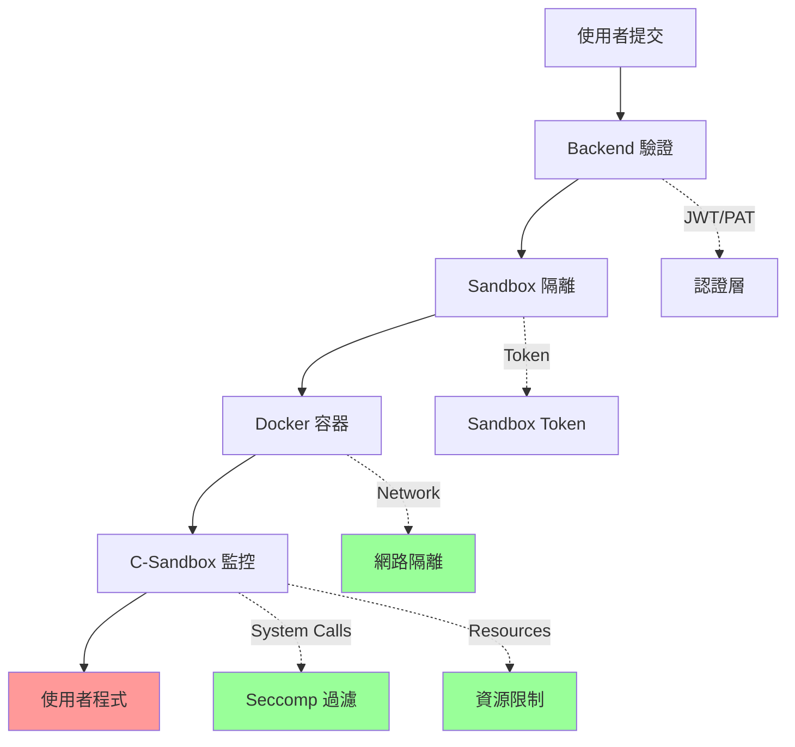

# Normal-OJ 安全性指南

本文檔詳細說明 Normal-OJ 系統的安全機制、風險評估與最佳實踐，確保評測環境的隔離性與資料安全。

## 📋 目錄

- [安全架構概覽](#安全架構概覽)
- [C-Sandbox 安全機制](#c-sandbox-安全機制)
- [Docker 容器隔離](#docker-容器隔離)
- [Interactive 模式安全](#interactive-模式安全)
- [網路安全](#網路安全)
- [認證與授權](#認證與授權)
- [資料安全](#資料安全)
- [已知風險與緩解](#已知風險與緩解)
- [安全檢查清單](#安全檢查清單)

---

## 安全架構概覽

Normal-OJ 採用多層防禦策略，確保使用者程式無法危害系統或存取未授權資源。



### 防禦層級

| 層級 | 機制 | 功能 |
|------|------|------|
| **應用層** | JWT/PAT 認證 | 防止未授權存取 |
| **網路層** | Docker network_mode=none | 預設完全隔離網路 |
| **容器層** | Docker 隔離 | 檔案系統、PID、IPC 隔離 |
| **系統呼叫層** | Seccomp + ptrace | 阻擋危險系統呼叫 |
| **資源層** | rlimit | 限制時間、記憶體、輸出 |

---

## C-Sandbox 安全機制

C-Sandbox 是執行使用者程式的底層沙箱，位於 `C-Sandbox-2025Team1` 專案。

### 系統呼叫過濾（Seccomp）

**機制：** 使用 Linux Seccomp-BPF 與 ptrace 監控並過濾系統呼叫

**白名單策略：** 只允許安全的系統呼叫，定義在 `rule.h`

#### 允許的系統呼叫（範例）

```c
// rule.h (簡化版)
static int allowed_syscalls[] = {
    __NR_read,
    __NR_write,
    __NR_open,     // 受限的檔案開啟
    __NR_close,
    __NR_brk,
    __NR_mmap,
    __NR_munmap,
    __NR_exit,
    __NR_exit_group,
    // ... 其他安全的系統呼叫
};
```

#### 阻擋的危險系統呼叫

| 系統呼叫 | 原因 |
|----------|------|
| `fork`, `clone`, `vfork` | 防止建立子行程 |
| `execve`, `execveat` | 防止執行其他程式 |
| `socket`, `connect`, `bind` | 防止網路存取（除非明確允許） |
| `ptrace` | 防止偵錯或注入其他行程 |
| `kill`, `tkill` | 防止終止其他行程 |
| `mount`, `umount` | 防止掛載檔案系統 |
| `reboot`, `kexec_load` | 防止重啟系統 |
| `iopl`, `ioperm` | 防止直接存取硬體 |

#### 監控流程

```c
while (1) {
    ptrace(PTRACE_CONT, pid, NULL, NULL);
    wait4(pid, &status, WSTOPPED, &usage);
    
    long syscall = ptrace(PTRACE_PEEKUSER, pid, ORIG_RAX * 8, NULL);
    
    if (!is_allowed(syscall)) {
        // 阻擋並回傳 RE (Runtime Error)
        kill(pid, SIGKILL);
        return RESULT_RE;
    }
}
```

---

### 資源限制（rlimit）

**機制：** 使用 `setrlimit` 限制資源使用

```c
// Time limit (CPU time)
struct rlimit rlim_cpu = {time_limit / 1000, time_limit / 1000};
setrlimit(RLIMIT_CPU, &rlim_cpu);

// Memory limit
struct rlimit rlim_mem = {memory_limit * 1024, memory_limit * 1024};
setrlimit(RLIMIT_AS, &rlim_mem);

// Output limit
struct rlimit rlim_fsize = {output_limit, output_limit};
setrlimit(RLIMIT_FSIZE, &rlim_fsize);

// Process limit (防止 fork bomb)
struct rlimit rlim_nproc = {1, 1};
setrlimit(RLIMIT_NPROC, &rlim_nproc);
```

**限制項目：**
- `RLIMIT_CPU` - CPU 時間（秒）
- `RLIMIT_AS` - 虛擬記憶體（bytes）
- `RLIMIT_FSIZE` - 檔案寫入大小
- `RLIMIT_NPROC` - 行程數量（通常設為 1）

---

### 降權執行

```c
// 降至低權限使用者
setgid(1450);
setuid(1450);
```

**效果：**
- 無法存取系統檔案（如 `/etc/passwd`）
- 無法綁定低於 1024 的 Port
- 無法終止其他使用者的行程

---

## Docker 容器隔離

### 檔案系統隔離

**唯讀掛載：**
```yaml
volumes:
  - ./Sandbox:/workspace:ro  # 唯讀
  - ./submissions:/submissions  # 讀寫（僅 submission 目錄）
```

**工作目錄限制：**
- 使用者程式只能存取 `/workspace` 和 `/submissions/{id}`
- 無法存取其他 submission 的目錄

---

### 網路隔離

**預設模式：** `network_mode: none`

```yaml
services:
  sandbox:
    network_mode: none  # 完全無網路
```

**效果：**
- 無法連線到外部網路
- 無法連線到其他容器
- 只有 `localhost` 可用（用於 Local Service）

**啟用網路時：**
- 透過 `networkAccessRestriction` 設定
- 使用 iptables 實作白名單/黑名單
- 詳見 [NETWORK_CONTROL_GUIDE.md](NETWORK_CONTROL_GUIDE.md)

---

### PID 隔離

**效果：**
- 容器內的 PID 從 1 開始
- 無法看到或影響 Host 的行程
- 無法看到其他容器的行程

---

### IPC 隔離

**效果：**
- 無法透過共享記憶體、訊號、訊息佇列與其他行程通訊
- 每個容器有獨立的 IPC namespace

---

## Interactive 模式安全

Interactive 模式讓教師與學生程式互動，但也引入額外風險。詳細流程見 [INTERACTIVE_MODE_FLOW.md](INTERACTIVE_MODE_FLOW.md)。

### 權限差異

| 項目 | 教師程式 | 學生程式 |
|------|----------|----------|
| **寫檔** | ✅ 允許（`SANDBOX_ALLOW_WRITE=1`） | ❌ 禁止 |
| **讀檔** | ✅ 允許 | ⚠️ 受限（只能讀自己的檔案） |
| **Seccomp** | 放寬（允許 `open/openat/ioctl`） | 嚴格 |
| **工作目錄** | `/workspace/teacher` | `/workspace/src` |

### 安全配置

**Interactive 模式配置：** `.config/interactive.json`

```json
{
  "outputLimitBytes": 67108864,      // 64 MB
  "maxTeacherNewFiles": 500          // 教師最多建立 500 個檔案
}
```

### 已知風險與緩解

#### 1. 雙向 FIFO 阻塞

**風險：** 教師惡意輸出大量資料或不讀取輸入，導致學生程式阻塞

**緩解：**
- ✅ 已設定 `output_limit` = 64MB（`RLIMIT_FSIZE`）
- ✅ 已設定整體 TLE 限制
- ⚠️ **建議**：實作流量節流（throttling）

#### 2. 教師可寫檔

**風險：** 教師程式可在 `/workspace/teacher` 寫入，可能占滿磁碟

**緩解：**
- ✅ 已設定 `RLIMIT_FSIZE` = 64MB
- ✅ 已限制檔案數量 ≤ 500
- ⚠️ **建議**：實作磁碟配額（quota）管理

#### 3. 學生讀檔風險

**風險：** 學生雖禁止寫檔，但仍可讀取 `/workspace/src` 內容

**緩解：**
- ✅ 測資僅放在 `/workspace/teacher/testcase.in`
- ✅ 評測後立即刪除 `testcase.in`
- ⚠️ **注意**：避免在學生可見路徑留下敏感資料

#### 4. Seccomp 放寬範圍

**風險：** 教師 allowed `open/openat/ioctl/dup`，若路徑未限制可能讀取 bind mount

**緩解：**
- ✅ 工作目錄掛載僅限 `/workspace`
- ✅ 其他系統目錄維持唯讀或不可見
- ⚠️ **建議**：路徑白名單限制（如只允許 `/workspace/teacher/*`）

#### 5. 網路/IPC 隔離

**風險：** `network_mode=none` 已設定，但未加額外 namespace 硬化

**緩解：**
- ✅ 預設無網路存取
- ⚠️ **建議**：若未來允許 Local Service，需重新審視網路/IPC 隔離

#### 6. 輸出限制

**風險：** 64MB 的 output limit 可能仍過大

**緩解：**
- ✅ 已設定，但可調整為更小值
- ⚠️ **建議**：根據題目需求調整，並監控異常輸出

#### 7. 共享鏡像風險

**風險：** 基底工具鏈/libseccomp 若有漏洞，惡意程式可能利用

**緩解：**
- ⚠️ **建議**：
  - 定期更新鏡像（`apt update && apt upgrade`）
  - 最小化安裝（只裝必要工具）
  - 追蹤 CVE 漏洞

#### 8. `SANDBOX_ALLOW_WRITE` 環境變數

**風險：** 依賴環境變數控制權限，可能誤設

**緩解：**
- ✅ 學生端已強制移除此環境變數
- ⚠️ **建議**：改為命令列旗標或白名單機制，並記錄來源以供稽核

---

### 測試覆蓋

**測試檔案：** `Sandbox/tests/test_interactive.py`

**覆蓋情境：**
- ✅ AC/WA 判定
- ✅ 缺少或非法 `Check_Result`
- ✅ `teacherFirst` 切換
- ✅ FIFO → `/dev/fd` fallback
- ✅ 學生寫檔被 seccomp 阻擋（C/Python）
- ✅ 教師可寫檔
- ✅ 師/生 TLE
- ✅ `RLIMIT_FSIZE` 觸發
- ✅ 大量檔案觸發 CE（超過 500）
- ✅ `testcase.in` 注入與清除
- ✅ 教師編譯失敗
- ✅ `teacherLang` 覆寫

---

## 網路安全

詳見 [NETWORK_CONTROL_GUIDE.md](NETWORK_CONTROL_GUIDE.md)。

### 預設策略

**完全隔離：** `network_mode: none`

### 啟用網路時的風險

1. **DDoS 攻擊** - 向外部服務發送大量請求
2. **資料洩漏** - 上傳測資或答案到外部
3. **惡意連線** - 透過白名單 Domain 作為跳板
4. **Port 掃描** - 掃描內部網路

### 緩解措施

- ✅ 使用 Whitelist 模式
- ⚠️ **建議**：
  - 流量速率限制（rate limiting）
  - 監控異常連線行為
  - 記錄所有網路請求

---

## 認證與授權

### Backend 認證

#### JWT Token

**生成：** 使用 `JWT_SECRET` 簽章

```python
token = jwt.encode({
    'username': user.username,
    'exp': datetime.utcnow() + timedelta(days=JWT_EXP)
}, JWT_SECRET, algorithm='HS256')
```

**驗證：** `@login_required` 裝飾器

**風險：**
- `JWT_SECRET` 洩漏 → 所有 Token 可偽造
- Token 無法撤銷（直到過期）

**最佳實踐：**
- ✅ 使用強隨機 `JWT_SECRET`（≥256 bits）
- ✅ 定期輪替 `JWT_SECRET`
- ⚠️ **建議**：實作 Token 黑名單（Redis）

#### Personal Access Token (PAT)

**生成：** 隨機 token 存入 MongoDB

```python
token = secrets.token_urlsafe(32)
```

**優點：** 可撤銷、可設定權限範圍（scopes）

**使用場景：** API 自動化、CI/CD

---

### Sandbox Token

**機制：** Sandbox 與 Backend 之間使用共享 Token（`SANDBOX_TOKEN`）

```python
if not secrets.compare_digest(token, SANDBOX_TOKEN):
    return "invalid token", 403
```

**風險：**
- Token 洩漏 → 任何人可偽裝 Sandbox
- 所有 Sandbox 共用同一 Token

**最佳實踐：**
- ✅ 使用 `secrets.compare_digest` 防止 timing attack
- ⚠️ **建議**：每個 Sandbox instance 使用不同 Token

---

### Redis Token 驗證（Submission）

**流程：**
1. Backend 在送交 Submission 時生成隨機 token 存入 Redis
2. Sandbox 完成後攜帶該 token 呼叫 `/submission/<id>/complete`
3. Backend 驗證 token 是否匹配

**保護：** 防止未授權的結果回報

---

## 資料安全

### MinIO 物件存儲

**用途：** 儲存測資、提交程式、編譯後執行檔、靜態分析報告

**權限控制：**
- Backend 透過 `MINIO_ACCESS_KEY` / `MINIO_SECRET_KEY` 存取
- 學生無法直接存取 MinIO

**風險：**
- 金鑰洩漏 → 所有檔案可被存取
- Bucket 設定錯誤 → 公開存取

**最佳實踐：**
- ✅ 使用環境變數儲存金鑰
- ✅ MinIO Bucket 設為私有
- ⚠️ **建議**：啟用 MinIO 加密（at-rest encryption）

---

### MongoDB 資料庫

**用途：** 儲存使用者、題目、提交記錄

**風險：**
- NoSQL Injection
- 未授權存取

**保護：**
- ✅ 使用 MongoEngine ORM（防止 injection）
- ✅ MongoDB 認證啟用
- ⚠️ **建議**：定期備份、加密傳輸（TLS）

---

### 敏感資訊管理

**環境變數：** 儲存於 `.secret/` 或 Docker Compose 環境

```bash
# .secret/.env
JWT_SECRET=...
MINIO_ACCESS_KEY=...
MINIO_SECRET_KEY=...
SANDBOX_TOKEN=...
```

**最佳實踐：**
- ✅ `.secret/` 加入 `.gitignore`
- ✅ 生產環境使用 Docker Secrets 或 Vault
- ⚠️ **避免**：硬編碼在程式碼中

---

## 已知風險與緩解

### 高風險

| 風險 | 影響 | 緩解狀態 |
|------|------|----------|
| **系統呼叫繞過** | 執行危險操作 | ✅ Seccomp 白名單 |
| **資源耗盡** | DoS 攻擊 | ✅ rlimit 限制 |
| **容器逃逸** | 影響 Host | ⚠️ 依賴 Docker 安全性 |
| **網路攻擊** | 資料洩漏/DDoS | ⚠️ 網路控制開發中 |

### 中風險

| 風險 | 影響 | 緩解狀態 |
|------|------|----------|
| **Interactive 模式權限** | 教師程式濫用權限 | ⚠️ 部分限制，需加強 |
| **Token 洩漏** | 未授權存取 | ✅ 使用環境變數 |
| **測資洩漏** | 學生取得答案 | ✅ 權限控制 |

### 低風險

| 風險 | 影響 | 緩解狀態 |
|------|------|----------|
| **Timing Attack** | Token 破解 | ✅ `secrets.compare_digest` |
| **XSS/CSRF** | 前端攻擊 | ⚠️ 需檢視前端安全 |

---

## 安全檢查清單

### 部署前檢查

- [ ] 所有環境變數已設定且儲存在安全位置
- [ ] `JWT_SECRET`使用強隨機值（≥256 bits）
- [ ] MinIO Bucket 設為私有
- [ ] MongoDB 啟用認證
- [ ] Docker 版本為最新穩定版
- [ ] C-Sandbox 已正確建置並測試
- [ ] 網路預設為 `network_mode: none`
- [ ] Sandbox Token 已設定且足夠複雜

### 定期維護

- [ ] 每月更新 Docker 映像
- [ ] 每季檢查 CVE 漏洞
- [ ] 定期備份 MongoDB 與 MinIO
- [ ] 檢視日誌中的異常行為
- [ ] 測試 Sandbox 安全機制（透過測試案例）
- [ ] 審查新增的題目網路設定

### 事件回應

**發現安全漏洞時：**
1. 立即停用受影響功能
2. 通知相關人員
3. 分析影響範圍
4. 修補漏洞並測試
5. 記錄事件並改進流程

---

## 安全更新

**追蹤來源：**
- Docker CVE: https://www.docker.com/blog/tag/security/
- Linux Kernel: https://www.kernel.org/category/releases.html
- Python: https://www.python.org/news/security/

**更新策略：**
- 關鍵漏洞：立即修補
- 一般漏洞：每月更新
- 功能更新：每季評估

---

## 相關文檔

- [ARCHITECTURE.md](ARCHITECTURE.md) - 系統架構
- [INTERACTIVE_MODE_FLOW.md](INTERACTIVE_MODE_FLOW.md) - Interactive 模式
- [NETWORK_CONTROL_GUIDE.md](NETWORK_CONTROL_GUIDE.md) - 網路控制
- [C-Sandbox rule.h](../C-Sandbox-2025Team1/rule.h) - 系統呼叫規則

---

**最後更新：** 2025-11-29  
**維護者：** 2025 NTNU Software Engineering Team 1

---

## 聯絡方式

**安全問題回報：** security@noj.tw （若有設定）

請勿在公開 Issue 中揭露安全漏洞，應透過私密管道回報。
