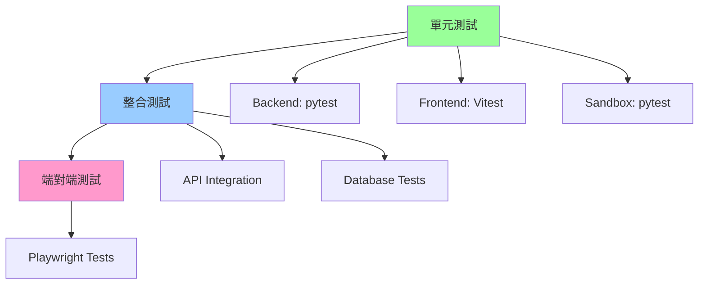

# Normal-OJ 測試指南

本文檔說明 Normal-OJ 系統的測試架構、測試方法與最佳實踐，確保程式碼品質與系統穩定性。

## 📋 目錄

- [測試架構概覽](#測試架構概覽)
- [Backend 測試](#backend-測試)
- [Frontend 測試](#frontend-測試)
- [Sandbox 測試](#sandbox-測試)
- [整合測試](#整合測試)
- [CI/CD 測試流程](#cicd-測試流程)
- [測試覆蓋率](#測試覆蓋率)
- [最佳實踐](#最佳實踐)

---

## 測試架構概覽

Normal-OJ 採用多層次測試策略：



### 測試類型

| 類型 | 範圍 | 工具 | 執行頻率 |
|------|------|------|----------|
| **單元測試** | 個別函式/類別 | pytest, Vitest | 每次 commit |
| **整合測試** | 多個模組交互 | pytest, Playwright | 每次 PR |
| **端對端測試** | 完整使用者流程 | Playwright | 部署前 |
| **效能測試** | 負載與壓力 | 手動 | 定期 |

---

## Backend 測試

### 環境設定

```bash
cd Back-End

# 安裝依賴
poetry install

# 執行所有測試
poetry run pytest

# 執行特定測試檔案
poetry run pytest tests/test_submission.py

# 執行特定測試
poetry run pytest tests/test_auth.py::test_login_success

# 查看測試覆蓋率
poetry run pytest --cov=.
```

### 測試結構

```
Back-End/tests/
├── conftest.py          # pytest 配置與 fixtures
├── test_auth.py         # 認證測試
├── test_problem.py      # 題目管理測試
├── test_submission.py   # 提交評測測試
├── test_course.py       # 課程管理測試
└── test_user.py         # 使用者管理測試
```

### Fixtures

**conftest.py：**
```python
import pytest
from app import app
from mongo import User, Problem, Submission

@pytest.fixture
def client():
    """Flask test client"""
    app.config['TESTING'] = True
    with app.test_client() as client:
        yield client

@pytest.fixture
def admin_token(client):
    """取得 admin token"""
    response = client.post('/auth/session', json={
        'username': 'first_admin',
        'password': 'firstpasswordforadmin'
    })
    return response.json['data']['token']

@pytest.fixture
def test_problem():
    """建立測試題目"""
    problem = Problem.add_problem(
        problem_name='Test Problem',
        courses=['Public'],
        owner='first_admin'
    )
    yield problem
    problem.delete()
```

### 測試範例

#### 1. API 端點測試

```python
def test_login_success(client):
    """測試成功登入"""
    response = client.post('/auth/session', json={
        'username': 'first_admin',
        'password': 'firstpasswordforadmin'
    })
    
    assert response.status_code == 200
    assert response.json['status'] == 'ok'
    assert 'token' in response.json['data']

def test_login_failure(client):
    """測試登入失敗"""
    response = client.post('/auth/session', json={
        'username': 'invalid_user',
        'password': 'wrong_password'
    })
    
    assert response.status_code == 403
    assert response.json['status'] == 'err'
```

#### 2. 資料庫操作測試

```python
def test_create_problem(admin_token):
    """測試建立題目"""
    problem = Problem.add_problem(
        problem_name='Unit Test Problem',
        courses=['Public'],
        owner='first_admin'
    )
    
    assert problem.problem_id is not None
    assert problem.problem_name == 'Unit Test Problem'
    
    # 清理
    problem.delete()

def test_submission_flow(client, admin_token, test_problem):
    """測試完整提交流程"""
    # 1. 建立提交
    response = client.post('/submission', json={
        'token': admin_token,
        'languageType': 1,
        'problemId': test_problem.problem_id
    })
    
    assert response.status_code == 200
    submission_id = response.json['data']['submissionId']
    
    # 2. 上傳程式碼
    from io import BytesIO
    code = BytesIO(b'int main() { return 0; }')
    response = client.put(f'/submission/{submission_id}', data={
        'token': admin_token,
        'code': (code, 'main.cpp')
    })
    
    assert response.status_code == 200
```

#### 3. Mock 外部服務

```python
from unittest.mock import patch

def test_sandbox_submission(client, admin_token, test_problem):
    """測試送交到 Sandbox（Mock）"""
    with patch('model.submission.requests.post') as mock_post:
        # Mock Sandbox 回應
        mock_post.return_value.status_code = 200
        mock_post.return_value.json.return_value = {
            'status': 'ok',
            'msg': 'ok',
            'data': 'ok'
        }
        
        # 建立並送交提交
        submission = Submission.add_submission(...)
        submission.send()
        
        # 驗證呼叫
        assert mock_post.called
        assert '/submit/' in mock_post.call_args[0][0]
```

### 測試最佳實踐

1. **獨立性**：每個測試應該獨立，不依賴其他測試的結果
2. **可重複性**：測試應該可以重複執行且結果一致
3. **清理**：使用 fixtures 或 teardown 清理測試資料
4. **命名**：使用描述性的測試名稱（`test_<功能>_<情境>`）
5. **斷言**：每個測試應有明確的斷言

---

## Frontend 測試

### 環境設定

```bash
cd new-front-end

# 安裝依賴
pnpm install

# 執行單元測試（如有）
pnpm test

# 執行 E2E 測試
pnpm exec playwright test

# 互動式 UI 模式
pnpm exec playwright test --ui

# 查看測試報告
pnpm exec playwright show-report
```

### Playwright 測試結構

```
new-front-end/tests/
├── auth.spec.ts         # 認證流程測試
├── problem.spec.ts      # 題目瀏覽測試
├── submission.spec.ts   # 提交流程測試
└── fixtures.ts          # 共用 fixtures
```

### Playwright 測試範例

#### 1. 登入測試

```typescript
// tests/auth.spec.ts
import { test, expect } from '@playwright/test';

test('successful login', async ({ page }) => {
  await page.goto('http://localhost:8080/login');
  
  // 填寫登入表單
  await page.fill('[data-testid="username"]', 'first_admin');
  await page.fill('[data-testid="password"]', 'firstpasswordforadmin');
  await page.click('[data-testid="login-button"]');
  
  // 驗證登入成功
  await expect(page).toHaveURL('/courses');
  await expect(page.locator('[data-testid="user-menu"]')).toBeVisible();
});

test('failed login with wrong password', async ({ page }) => {
  await page.goto('http://localhost:8080/login');
  
  await page.fill('[data-testid="username"]', 'first_admin');
  await page.fill('[data-testid="password"]', 'wrongpassword');
  await page.click('[data-testid="login-button"]');
  
  // 驗證錯誤訊息
  await expect(page.locator('.error-message')).toContainText('Login Failed');
});
```

#### 2. 提交流程測試

```typescript
// tests/submission.spec.ts
import { test, expect } from '@playwright/test';
import { loginAsAdmin } from './fixtures';

test('submit code to problem', async ({ page }) => {
  await loginAsAdmin(page);
  
  // 前往題目頁面
  await page.goto('/problem/1');
  
  // 上傳程式碼
  await page.click('[data-testid="submit-button"]');
  await page.setInputFiles('[data-testid="code-upload"]', 'tests/fixtures/solution.cpp');
  await page.click('[data-testid="confirm-submit"]');
  
  // 驗證提交成功
  await expect(page.locator('.success-toast')).toContainText('Submitted');
  
  // 前往提交列表
  await page.goto('/submissions');
  await expect(page.locator('.submission-list').first()).toBeVisible();
});
```

#### 3. 視覺回歸測試

```typescript
test('problem page screenshot', async ({ page }) => {
  await page.goto('/problem/1');
  await expect(page).toHaveScreenshot('problem-page.png');
});
```

### Playwright 配置

**playwright.config.ts：**
```typescript
import { defineConfig } from '@playwright/test';

export default defineConfig({
  testDir: './tests',
  timeout: 30000,
  retries: 2,
  use: {
    baseURL: 'http://localhost:8080',
    screenshot: 'only-on-failure',
    video: 'retain-on-failure',
  },
  projects: [
    {
      name: 'chromium',
      use: { browserName: 'chromium' },
    },
    {
      name: 'firefox',
      use: { browserName: 'firefox' },
    },
  ],
});
```

---

## Sandbox 測試

### 環境設定

```bash
cd Sandbox

# 執行所有測試
pytest

# 執行特定測試
pytest tests/test_dispatcher.py

# 查看覆蓋率
pytest --cov=dispatcher --cov=runner

# 查看詳細輸出
pytest -v -s
```

### 測試結構

```
Sandbox/tests/
├── conftest.py              # pytest 配置
├── test_dispatcher.py       # Dispatcher 測試
├── test_runner.py           # Runner 測試
├── test_static_analysis.py  # 靜態分析測試
├── test_interactive.py      # Interactive 模式測試
├── test_build_strategy.py   # Build Strategy 測試
└── fixtures/                # 測試資料
    ├── test_code/
    └── test_problems/
```

### 測試範例

#### 1. Dispatcher 測試

```python
# tests/test_dispatcher.py
import pytest
from dispatcher.dispatcher import Dispatcher

@pytest.fixture
def dispatcher():
    """建立 Dispatcher 實例"""
    return Dispatcher('.config/dispatcher.json.example')

def test_compile_need(dispatcher, tmp_path):
    """測試 compile_need 判斷"""
    meta = {
        'language': 0,  # C
        'buildStrategy': 'compile'
    }
    assert dispatcher.compile_need(meta) == True
    
    meta['language'] = 2  # Python
    assert dispatcher.compile_need(meta) == False

def test_prepare_submission_dir(dispatcher, tmp_path):
    """測試 submission 目錄準備"""
    submission_id = 'test_submission_001'
    meta = {...}
    source_file = open('tests/fixtures/test_code/main.cpp', 'rb')
    
    dispatcher.prepare_submission_dir(
        root_dir=str(tmp_path),
        submission_id=submission_id,
        meta=meta,
        source=source_file,
        testdata='/path/to/testdata'
    )
    
    # 驗證目錄結構
    submission_dir = tmp_path / submission_id
    assert submission_dir.exists()
    assert (submission_dir / 'src' / 'common' / 'main.cpp').exists()
    assert (submission_dir / 'meta.json').exists()
```

#### 2. Static Analysis 測試

```python
# tests/test_static_analysis.py
def test_analyze_c_code_success():
    """測試 C 程式碼靜態分析（通過）"""
    code = '''
    #include <stdio.h>
    int main() {
        printf("Hello\\n");
        return 0;
    }
    '''
    rules = {
        'model': 'whitelist',
        'headers': ['stdio.h']
    }
    
    result = run_static_analysis(code, 'c', rules)
    assert result['status'] == 'success'

def test_analyze_c_code_violation():
    """測試 C 程式碼靜態分析（違規）"""
    code = '''
    #include <stdlib.h>
    int main() {
        system("ls");  # 違規
        return 0;
    }
    '''
    rules = {
        'model': 'blacklist',
        'functions': ['system']
    }
    
    result = run_static_analysis(code, 'c', rules)
    assert result['status'] == 'failure'
    assert 'system' in result['message']
```

#### 3. Interactive 模式測試

```python
# tests/test_interactive.py
def test_interactive_ac():
    """測試 Interactive 模式 AC"""
    # 學生程式：Echo
    student_code = '''
    #include <stdio.h>
    int main() {
        int n;
        scanf("%d", &n);
        printf("%d\\n", n);
        return 0;
    }
    '''
    
    # 教師程式：驗證 Echo
    teacher_code = '''
    #include <stdio.h>
    #include <stdlib.h>
    int main() {
        printf("42\\n");
        fflush(stdout);
        int response;
        scanf("%d", &response);
        
        FILE *f = fopen("Check_Result", "w");
        if (response == 42) {
            fprintf(f, "STATUS: AC\\nMESSAGE: Correct\\n");
        } else {
            fprintf(f, "STATUS: WA\\nMESSAGE: Wrong\\n");
        }
        fclose(f);
        return 0;
    }
    '''
    
    result = run_interactive_test(student_code, teacher_code)
    assert result['status'] == 'AC'

def test_interactive_student_write_blocked():
    """測試學生程式寫檔被阻擋"""
    student_code = '''
    #include <stdio.h>
    int main() {
        FILE *f = fopen("hack.txt", "w");  # 應被阻擋
        if (f) fprintf(f, "hacked");
        return 0;
    }
    '''
    
    result = run_interactive_test(student_code, teacher_code)
    assert result['status'] == 'RE'  # Runtime Error
```

---

## 整合測試

### API 整合測試

測試 Backend 與 Sandbox 的整合：

```python
# tests/test_integration.py
def test_full_submission_flow(client, sandbox_mock):
    """測試完整提交評測流程"""
    # 1. 建立題目
    problem = Problem.add_problem(...)
    
    # 2. 建立提交
    submission = Submission.add_submission(
        problem_id=problem.problem_id,
        user_id='test_user',
        language=1
    )
    
    # 3. Mock Sandbox 回應
    with patch('requests.post') as mock_post:
        mock_post.return_value.status_code = 200
        submission.send()
    
    # 4. Mock Sandbox 回報結果
    result = {
        'tasks': [{'status': 0, 'score': 100, ...}]
    }
    submission.process_result(result)
    
    # 5. 驗證結果
    assert submission.status == 0  # AC
    assert submission.score == 100
```

### 資料庫整合測試

```python
def test_mongodb_operations():
    """測試 MongoDB 操作"""
    # 建立
    user = User.signup(username='test', password='pass', email='test@test.com')
    assert user.username == 'test'
    
    # 查詢
    found = User('test')
    assert found.username == 'test'
    
    # 更新
    user.update(active=True)
    assert User('test').active == True
    
    # 刪除
    user.delete()
    assert User('test') is None
```

---

## CI/CD 測試流程

### GitHub Actions 配置

**.github/workflows/test.yml：**
```yaml
name: Tests

on:
  push:
    branches: [ main ]
  pull_request:
    branches: [ main ]

jobs:
  backend-tests:
    runs-on: ubuntu-latest
    services:
      mongodb:
        image: mongo:6
        ports:
          - 27017:27017
    
    steps:
      - uses: actions/checkout@v3
      
      - name: Set up Python
        uses: actions/setup-python@v4
        with:
          python-version: '3.11'
      
      - name: Install dependencies
        run: |
          cd Back-End
          pip install poetry
          poetry install
      
      - name: Run tests
        run: |
          cd Back-End
          poetry run pytest --cov=. --cov-report=xml
      
      - name: Upload coverage
        uses: codecov/codecov-action@v3

  frontend-tests:
    runs-on: ubuntu-latest
    
    steps:
      - uses: actions/checkout@v3
      
      - name: Setup Node.js
        uses: actions/setup-node@v3
        with:
          node-version: '20'
      
      - name: Install pnpm
        run: npm install -g pnpm
      
      - name: Install dependencies
        run: |
          cd new-front-end
          pnpm install
      
      - name: Run Playwright tests
        run: |
          cd new-front-end
          pnpm exec playwright install --with-deps
          pnpm exec playwright test
      
      - name: Upload test results
        if: always()
        uses: actions/upload-artifact@v3
        with:
          name: playwright-report
          path: new-front-end/playwright-report/

  sandbox-tests:
    runs-on: ubuntu-latest
    
    steps:
      - uses: actions/checkout@v3
      
      - name: Set up Python
        uses: actions/setup-python@v4
        with:
          python-version: '3.11'
      
      - name: Install dependencies
        run: |
          cd Sandbox
          pip install -r requirements.txt
          pip install pytest pytest-cov
      
      - name: Run tests
        run: |
          cd Sandbox
          pytest --cov=dispatcher --cov=runner
```

---

## 測試覆蓋率

### Backend 覆蓋率

```bash
cd Back-End
poetry run pytest --cov=model --cov=mongo --cov-report=html
open htmlcov/index.html
```

**目標：**
- 整體覆蓋率：≥ 80%
- 關鍵模組（auth, submission, problem）：≥ 90%

### Frontend 覆蓋率

```bash
cd new-front-end
pnpm exec playwright test --reporter=html
pnpm exec playwright show-report
```

**目標：**
- 主要使用者流程覆蓋：100%
- 邊界情況覆蓋：≥ 70%

### Sandbox 覆蓋率

```bash
cd Sandbox
pytest --cov=dispatcher --cov=runner --cov-report=term-missing
```

**目標：**
- Dispatcher 核心邏輯：≥ 90%
- Runner 執行邏輯：≥ 85%

---

## 最佳實踐

### 1. 測試金字塔

```
    /\
   /  \  E2E Tests (少量)
  /____\
 /      \ Integration Tests (適量)
/__________\ Unit Tests (大量)
```

- **單元測試**：快速、大量、隔離
- **整合測試**：驗證模組交互
- **E2E 測試**：驗證關鍵流程

### 2. 測試命名規範

```python
# Good
def test_login_with_valid_credentials_returns_token():
    ...

def test_login_with_invalid_password_returns_403():
    ...

# Bad
def test_1():
    ...

def test_login():
    ...
```

### 3. AAA 模式

```python
def test_example():
    # Arrange（準備）
    user = User.signup(...)
    
    # Act（執行）
    result = user.login('password')
    
    # Assert（驗證）
    assert result is not None
```

### 4. 使用 Fixtures

```python
@pytest.fixture
def sample_problem():
    problem = Problem.add_problem(...)
    yield problem
    problem.delete()  # 清理

def test_with_fixture(sample_problem):
    assert sample_problem.problem_id is not None
```

### 5. Parametrize 測試

```python
@pytest.mark.parametrize('status_code,status_name', [
    (0, 'AC'),
    (1, 'WA'),
    (2, 'RE'),
    (3, 'TLE'),
])
def test_status_mapping(status_code, status_name):
    assert get_status_name(status_code) == status_name
```

---

## 相關文檔

- [DEPLOYMENT_GUIDE.md](DEPLOYMENT_GUIDE.md) - 部署指南
- [ARCHITECTURE.md](ARCHITECTURE.md) - 系統架構
- [API_REFERENCE.md](API_REFERENCE.md) - API 參考

---

**最後更新：** 2025-11-29  
**維護者：** 2025 NTNU Software Engineering Team 1
