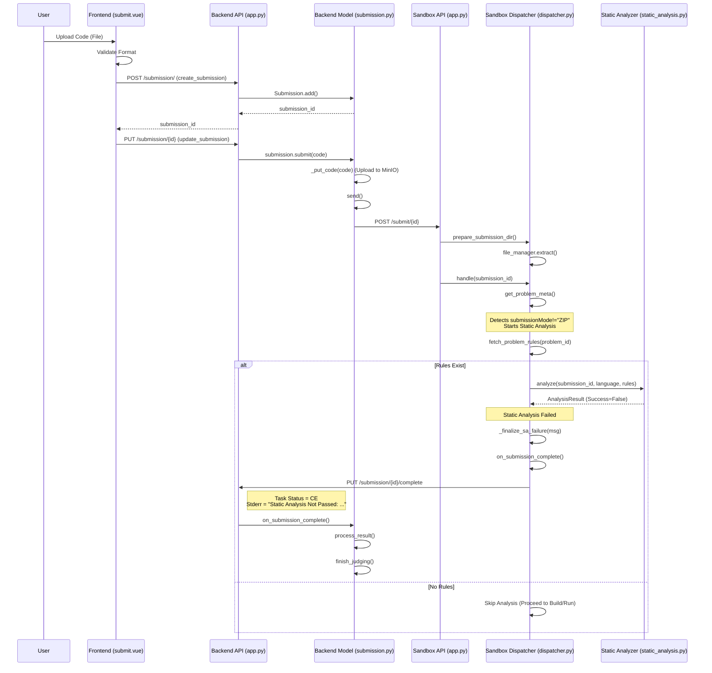

# Static Analysis Failure Flow

## Key Steps for Failure
1.  **Dispatcher**: Checks if `submissionMode` is NOT ZIP.
2.  **Dispatcher**: Fetches problem rules.
3.  **StaticAnalyzer**: Runs analysis. If it returns `is_success() == False`:
    *   **Dispatcher**: Logs warning.
    *   **Dispatcher**: Calls `_finalize_sa_failure`.
    *   **Result Construction**: Creates a result with `status="CE"` and `stderr` containing the failure message.
    *   **Early Return**: Skips build and execution queues.
    *   **Completion**: Immediately calls `on_submission_complete` to report back to Backend.
