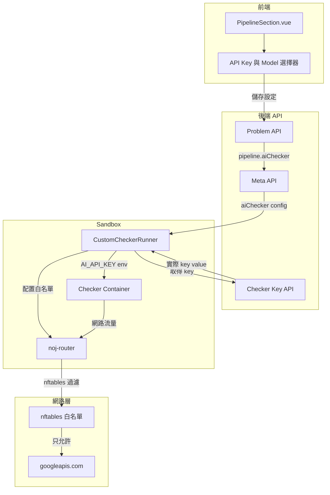
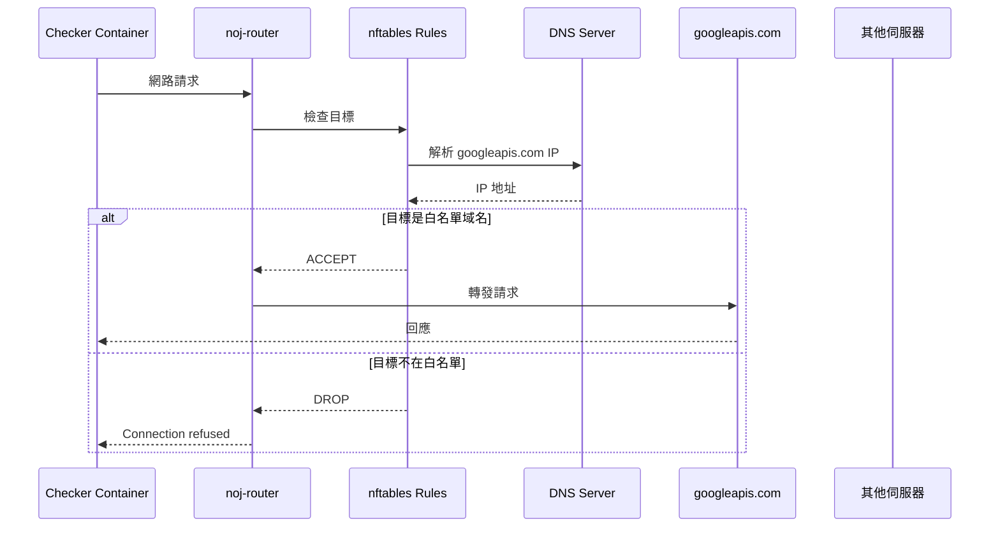
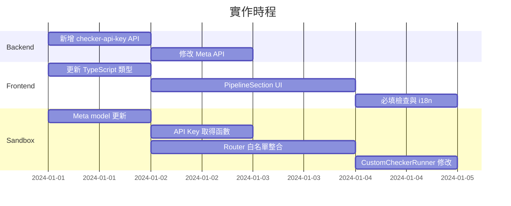

# Custom Checker AI 功能整合計劃

## 架構概述



## 資料流

1. 老師在前端開啟 AI Checker，選擇 API Key 和 Model
2. 設定儲存到 Problem 的 `config.aiChecker` 欄位
3. Sandbox 從 Meta API 取得 `aiChecker` 設定
4. Sandbox 透過新 API 取得實際的 API Key 值
5. 啟動 Router 容器，配置硬編碼白名單（僅允許 googleapis.com）
6. 在 Docker 容器中設定 `AI_API_KEY` 環境變數，共享 Router 網路

---

## 安全性分析與方案

### 潛在安全風險

| 風險 | 說明 | 緩解措施 |

|------|------|----------|

| 資料外洩 | 惡意 checker 將測資、答案、其他學生程式碼傳到外部伺服器 | 硬編碼白名單，只允許 googleapis.com |

| API Key 洩漏 | checker 將 AI_API_KEY 環境變數傳出 | 僅 googleapis.com 可連，無法傳到攻擊者伺服器 |

| 攻擊跳板 | checker 容器被用於攻擊內網或外部 | 白名單限制 + 現有容器隔離機制 |

| 惡意程式下載 | 從外部下載並執行惡意程式 | 白名單限制 + 現有 tmpfs noexec 設定 |

### 採用方案：硬編碼白名單

**原理**：在 Sandbox 程式碼中硬編碼 Google AI API 的域名白名單，任何其他網路連線都會被拒絕。

**白名單域名**：

- `generativelanguage.googleapis.com` - Google AI Studio / Gemini API
- `aiplatform.googleapis.com` - Vertex AI（備用）

**優點**：

- 安全性最高：即使 checker 程式碼嘗試連線其他伺服器也會失敗
- 實作簡單：複用現有 Router + nftables 機制
- 無需額外 UI：老師不需額外設定，減少誤操作

**網路過濾流程**：



---

## 可複用的現有功能

### AiApiKey 類別 - [Back-End/mongo/ai/models.py](Back-End/mongo/ai/models.py)

```python
# 根據 ID 取得 API Key（可直接取得 key_value）
AiApiKey.get_key_by_id(key_id)  # 返回 engine.AiApiKey 文件，有 .key_value 屬性

# 取得課程的所有活動 API Keys
AiApiKey.get_active_keys_by_course_name(course_name)

# 取得 API Key 列表（前端顯示用，包含 masked value）
AiApiKey.get_list_by_course(course_name)
```

### 現有 API 端點 - [Back-End/model/course.py](Back-End/model/course.py)

```python
# GET /course/<course_name>/ai/key - 取得課程的 API Key 列表
# 前端已經有 api.AIVTuber.getCourseKeys() 調用此端點
```

---

## 1. Backend 修改

### 1.1 資料模型 - 無需修改 engine.py

Problem 的 `config` 已經是 DictField，可以直接儲存 aiChecker 設定：

```python
# config 中新增（無需改 schema，直接存入 DictField）：
{
    "aiChecker": {
        "enabled": bool,           # 是否啟用 AI Checker
        "apiKeyId": str,           # 選擇的 API Key ID（ObjectId string）
        "model": str               # 選擇的 Model 名稱
    }
}
```

### 1.2 新增 API 端點 - [Back-End/model/problem.py](Back-End/model/problem.py)

新增 Sandbox 專用的 API Key 取得端點（複用 `AiApiKey.get_key_by_id`）：

```python
@problem_api.route('/<int:problem_id>/checker-api-key', methods=['GET'])
@Request.args('token: str')
def get_checker_api_key(token: str, problem_id: int):
    # 1. 驗證 Sandbox token
    if sandbox.find_by_token(token) is None:
        return HTTPError('Invalid sandbox token', 401)
    
    # 2. 取得 problem 的 aiChecker 設定
    problem = Problem(problem_id)
    ai_checker = (problem.config or {}).get('aiChecker', {})
    if not ai_checker.get('enabled'):
        return HTTPError('AI Checker not enabled', 404)
    
    api_key_id = ai_checker.get('apiKeyId')
    if not api_key_id:
        return HTTPError('API Key not configured', 404)
    
    # 3. 複用現有 AiApiKey.get_key_by_id 取得實際 key value
    key_doc = AiApiKey.get_key_by_id(api_key_id)
    if not key_doc or not key_doc.is_active:
        return HTTPError('API Key not found or inactive', 404)
    
    # 4. 驗證 Key 屬於題目所屬課程
    # ...
    
    return HTTPResponse(data={'apiKey': key_doc.key_value})
```

### 1.3 修改 Meta API - [Back-End/model/problem.py](Back-End/model/problem.py)

在 `get_meta()` 函數（約 1027-1089 行）中增加 `aiChecker` 設定回傳：

```python
# 在 meta dict 中新增：
ai_checker_cfg = config_payload.get('aiChecker', {})
meta['aiChecker'] = {
    'enabled': bool(ai_checker_cfg.get('enabled')),
    # 注意：不回傳 apiKeyId，只回傳 enabled 狀態
}
```

---

## 2. Frontend 修改

### 2.1 類型定義 - [new-front-end/src/types/problem.d.ts](new-front-end/src/types/problem.d.ts)

在 `ProblemConfigExtra` 中新增（因為 aiChecker 存在 config 中）：

```typescript
interface ProblemConfigExtra {
  // ... 現有欄位
  aiChecker?: {
    enabled: boolean;
    apiKeyId?: string;
    model?: string;
  };
}
```

### 2.2 PipelineSection.vue - [new-front-end/src/components/Problem/Admin/Sections/PipelineSection.vue](new-front-end/src/components/Problem/Admin/Sections/PipelineSection.vue)

在 Custom Checker 區塊（約 832-912 行）中新增 AI 功能：

1. 新增 "啟用 AI" toggle（僅當 customChecker 開啟時顯示）
2. 開啟後顯示：

   - **API Key 下拉選單**（**複用** `api.AIVTuber.getCourseKeys()`）
   - **Model 下拉選單**（可用選項：gemini-2.5-flash、gemini-flash-lite-latest 等）

3. 必填檢查（啟用 AI 時 API Key 必填）

### 2.3 API 整合 - 完全複用現有 API

```typescript
// 已存在於 new-front-end/src/models/api.ts (約 418-430 行)
api.AIVTuber.getCourseKeys(courseName)  // 返回課程的 API Key 列表
```

前端邏輯：

- 當用戶開啟 AI Checker 時，調用 `getCourseKeys` 取得可選 Key 列表
- 若課程無 Key，顯示提示讓老師先去課程設定頁新增

### 2.4 i18n 翻譯檔

- [new-front-end/src/i18n/zh-tw.json](new-front-end/src/i18n/zh-tw.json)
- [new-front-end/src/i18n/en.json](new-front-end/src/i18n/en.json)

---

## 3. Sandbox 修改

### 3.1 Meta 解析 - [Sandbox/dispatcher/meta.py](Sandbox/dispatcher/meta.py)

在 `Meta` model 中新增 `aiChecker` 欄位。

### 3.2 新增 API Key 取得函數 - [Sandbox/dispatcher/testdata.py](Sandbox/dispatcher/testdata.py)

```python
def fetch_checker_api_key(problem_id: int) -> Optional[str]:
    """從 Backend 取得 checker 用的 API Key"""
```

### 3.3 CustomCheckerRunner 修改 - [Sandbox/runner/custom_checker_runner.py](Sandbox/runner/custom_checker_runner.py)

目前第 44 行設定 `network_mode="none"`，完全禁用網路。需要修改：

1. 新增 `env` 參數支援環境變數
2. 新增 `enable_network` 參數控制網路存取
3. **硬編碼白名單**：只允許連接 Google AI API
```python
# 硬編碼白名單域名（安全性考量，不允許動態配置）
AI_CHECKER_WHITELIST_URLS = [
    "generativelanguage.googleapis.com",  # Google AI Studio / Gemini API
    "aiplatform.googleapis.com",          # Vertex AI（備用）
]

@dataclass
class CustomCheckerRunner:
    # ... 現有欄位
    env: dict | None = None           # 新增：環境變數
    enable_network: bool = False      # 新增：是否啟用網路（AI Checker 用）
    
    _router_container_id: str | None = None  # 內部使用：Router 容器 ID

    def run(self) -> Dict[str, str]:
        # ...
        if self.enable_network:
            # 使用 Router 容器做網路白名單過濾
            network_mode = self._setup_ai_checker_network()
        else:
            network_mode = "none"
        
        host_config = client.create_host_config(
            binds=binds,
            network_mode=network_mode,
            mem_limit=f"{max(self.mem_limit_kb,0)}k",
            tmpfs={"/tmp": "rw,noexec,nosuid"},
        )
        
        container = client.create_container(
            image=self.image,
            command=command,
            working_dir="/workspace",
            host_config=host_config,
            environment=self.env or {},  # 傳入環境變數
        )
        
        try:
            # ... 執行邏輯
        finally:
            # 清理 Router 容器
            if self._router_container_id:
                self._cleanup_router()
    
    def _setup_ai_checker_network(self) -> str:
        """
        為 AI Checker 設定受限網路（硬編碼白名單）
        複用現有 Router 機制，但配置固定的白名單
        """
        # 1. 建立 Router 容器，配置白名單
        router_config = {
            "model": "white",  # 白名單模式
            "urls": AI_CHECKER_WHITELIST_URLS,  # 硬編碼，不從外部讀取
            "ips": [],
        }
        
        # 2. 啟動 Router（參考 network_control.py 的實作）
        router_id = self._create_router_container(router_config)
        self._router_container_id = router_id
        
        # 3. 返回 network_mode，讓 checker 共享 router 的網路
        return f"container:{router_id}"
    
    def _create_router_container(self, config: dict) -> str:
        """
        建立 Router 容器（複用 network_router 映像檔）
        """
        # 環境變數配置 nftables 規則
        environment = {
            "MODEL": config["model"],
            "URLS": ",".join(config["urls"]),
            "IPS": "",
        }
        
        # 建立並啟動 Router 容器
        # ...
        return router_container_id
    
    def _cleanup_router(self):
        """清理 Router 容器"""
        # 停止並移除 Router 容器
        # ...
```


### 3.3.1 現有 Router 機制分析 - [Sandbox/network_router/entrypoint.sh](Sandbox/network_router/entrypoint.sh)

現有 Router 已支援白名單模式，關鍵邏輯：

```bash
# 白名單模式（MODEL=white）
if [ "$MODEL" = "white" ]; then
    # 預設拒絕所有
    nft add rule inet filter output drop
    
    # 只允許白名單 URL 解析後的 IP
    for url in ${URLS//,/ }; do
        resolved_ip=$(getent hosts "$url" | awk '{print $1}')
        nft add rule inet filter output ip daddr "$resolved_ip" accept
    done
fi
```

**複用方式**：

- 直接使用 `noj-router` 映像檔
- 透過環境變數 `MODEL=white` 和 `URLS=generativelanguage.googleapis.com` 配置
- Checker 容器使用 `network_mode=container:{router_id}` 共享網路

### 3.3.2 安全機制總結

| 層級 | 機制 | 說明 |

|------|------|------|

| 程式碼層 | 硬編碼白名單 | `AI_CHECKER_WHITELIST_URLS` 常數，無法被動態修改 |

| 網路層 | nftables 規則 | Router 容器內的防火牆，在 kernel 層級過濾 |

| 容器層 | 網路隔離 | Checker 容器無獨立網路，必須經過 Router |

| 執行層 | tmpfs noexec | 禁止在 /tmp 執行下載的程式 |

### 3.4 Custom Checker 調用修改 - [Sandbox/dispatcher/custom_checker.py](Sandbox/dispatcher/custom_checker.py)

在 `run_custom_checker_case()` 函數中：

1. 從 meta 取得 `aiChecker.enabled` 設定
2. 若啟用，調用 `fetch_checker_api_key()` 取得 API Key
3. 建立 `CustomCheckerRunner` 時傳入環境變數和網路設定
```python
def run_custom_checker_case(
    # ... 現有參數
    meta: Meta,
) -> CustomCheckerResult:
    # 檢查是否啟用 AI Checker
    ai_checker_enabled = meta.ai_checker and meta.ai_checker.get('enabled', False)
    
    # 準備環境變數
    env = {}
    enable_network = False
    
    if ai_checker_enabled:
        # 從 Backend 取得實際的 API Key
        api_key = fetch_checker_api_key(meta.problem_id)
        if api_key:
            env["AI_API_KEY"] = api_key
            env["AI_MODEL"] = meta.ai_checker.get('model', 'gemini-2.5-flash')
            enable_network = True  # 只有取得 Key 才開網路
    
    runner = CustomCheckerRunner(
        image=...,
        workspace_dir=...,
        time_limit_ms=...,
        mem_limit_kb=...,
        env=env if env else None,
        enable_network=enable_network,
    )
    
    return runner.run()
```


---

## 4. 驗證規則

### 前端驗證

- 當 `config.aiChecker.enabled = true` 時：
  - `apiKeyId` 為必填
  - 前端顯示錯誤提示若未選擇 API Key
  - API Key 下拉選單為空時，顯示「請先至課程設定新增 API Key」

### 後端驗證

- 儲存 Problem 時驗證：
  - 若 `aiChecker.enabled = true` 但 `apiKeyId` 為空，回傳 400 錯誤
  - 驗證 `apiKeyId` 對應的 Key 存在且屬於該課程

### Sandbox 驗證

- 取得 API Key 時驗證：
  - Token 驗證（確保是合法的 Sandbox 請求）
  - Key 存在且處於 active 狀態
  - Key 屬於題目所屬課程

---

## 5. Custom Checker 使用範例

老師可以在 `custom_checker.py` 中這樣使用 AI：

```python
import os
import json
import urllib.request

def check(student_output: str, expected_output: str, student_code: str) -> dict:
    api_key = os.environ.get("AI_API_KEY")
    model = os.environ.get("AI_MODEL", "gemini-2.5-flash")
    
    if not api_key:
        # 沒有 AI Key，使用傳統比對
        return {"verdict": "AC" if student_output.strip() == expected_output.strip() else "WA"}
    
    # 使用 AI 評分
    prompt = f"""
    請評估以下學生程式碼的品質：
    
    學生程式碼：
    {student_code}
    
    學生輸出：
    {student_output}
    
    預期輸出：
    {expected_output}
    
    請給出 0-100 的分數並說明理由。
    """
    
    # 呼叫 Gemini API
    url = f"https://generativelanguage.googleapis.com/v1beta/models/{model}:generateContent?key={api_key}"
    data = {"contents": [{"parts": [{"text": prompt}]}]}
    
    req = urllib.request.Request(url, data=json.dumps(data).encode(), headers={"Content-Type": "application/json"})
    response = urllib.request.urlopen(req)
    result = json.loads(response.read())
    
    # 解析 AI 回應並決定 verdict
    # ...
    
    return {"verdict": "AC", "score": 85, "message": "程式碼品質良好"}
```

---

## 6. 實作順序建議



**建議優先順序**：

1. Backend API（其他模組依賴）
2. Sandbox Meta + API Key 取得
3. Frontend UI + 驗證
4. Sandbox Runner + 網路白名單
5. 整合測試